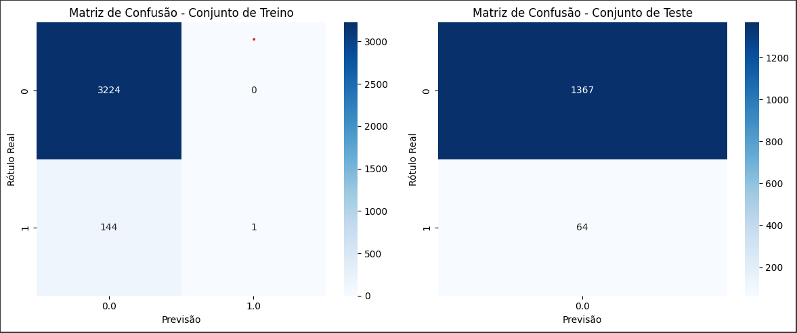

# Análise de dados em PySpark

## Proposta geral do trabalho
- Refazer utilizando a API do PySpark as análises presentes no projeto de Infraestrutura Hadoop.
- Desenvolver um projeto de Machine Learning utilizando Spark MLlib em um notebook, com as seguintes etapas:
    - Contextualização dos dados e do problema, bem como algoritmo e/ou técnica utilizados (regressão linear, regressão logística, clusterização, etc.) 
    - Tratamento e limpeza dos dados de forma documentada
    - Divisão dos dados entre dois conjuntos: treino e teste
    - Treinar o modelo e apresentar as métricas de desempenho
    - Aplicar o modelo na base de teste, comparando o desempenho com a base de treino
    - Propor sugestões para próximos passos

## Consideração inicial
Considerando a facilidade da replicação do projeto, optei por desenvolver os notebooks no Google Colab (https://colab.research.google.com/).<br>
Basta realizar o upload do notebook (e de arquivos adicionais quando aplicável) e executar. 

## Análise de dados em PySpark
Para recriar as análises realizados no projeto de Infraestrutura Hadoop ([referência](../infraestrutura_hadoop/README.md)), criei um notebook Jupyter documentado, que pode ser encontrado [aqui](./notebooks/01_analise_dados_spark.ipynb).<br>
É necessário realizar o upload do arquivo bash `scripts/download_and_extract.sh` ([referência](./scripts/download_and_extract.sh)), responsável pelo download e a extração dos arquivos utilizados.

## Machine Learning com Spark MLlib
Utilizei o algotirmo de regressão logística nos dados do Stroke Prediction Dataset, com o intuito de prever a presença de AVC com base nas características dos pacientes.
O notebook pode ser encontrado [aqui](./notebooks/02_machine_learning_mllib.ipynb).

Abaixo, trago as métricas de performance e as sugestões para próximos passos, a fim de facilitar a conferência dos critérios avaliativos do trabalho:

```
Métricas para o conjunto de treino:
Acurácia: 0.9573
Precisão: 0.9591
Revocação: 0.9573
F1-Score: 0.9366

Métricas para o conjunto de teste:
Acurácia: 0.9553
Precisão: 0.9126
Revocação: 0.9553
F1-Score: 0.9334
```
As métricas do conjunto de treino mostram desempenho ligeiramente superior ao do conjunto de teste, com acurácia de 95,73%, precisão de 95,91%, revocação de 95,73% e F1-score de 93,66%.<br>
Em comparação, o conjunto de teste apresenta acurácia de 95,53%, precisão de 91,26%, revocação de 95,53% e F1-score de 93,34%. A diferença na precisão sugere um leve sobreajuste no conjunto de treino, embora a acurácia e a revocação permaneçam próximas, indicando boa generalização do modelo para novos dados.<br>
Para utilização em produção, essas métricas são promissoras, mas é fundamental monitorar o desempenho do modelo ao longo do tempo e implementar estratégias de reavaliação e re-treinamento para garantir sua eficácia na identificação de pacientes em risco de AVC em ambientes dinâmicos.



No conjunto de treino, o modelo apresenta boa performance na detecção da classe negativa, com 3224 verdadeiros negativos, mas tem dificuldades em identificar a classe positiva, com apenas 1 verdadeiro positivo e 144 falsos negativos, indicando um viés em favor da classe negativa.<br>
No conjunto de teste, a situação é ainda mais preocupante, já que não há verdadeiros positivos e o número de falsos negativos chega a 64, evidenciando que o modelo não generaliza bem para novos dados e sugere sobreajuste (overfitting) ao conjunto de treino.

Possíveis causas:
- Desbalanceamento de classes: 
    - A presença desigual de instâncias entre classes pode levar o modelo a favorecer a classe maior, resultando em baixa detecção da classe menor.
- Complexidade do modelo:
    - Modelos excessivamente complexos para a quantidade de dados disponíveis podem causar sobreajuste.
- Falta de dados relevantes:
    - A ausência de características significativas pode dificultar a distinção entre classes.

Estratégias para melhorar os resultados (sugestão para próximos passos):
- Reamostragem dos Dados:
    - Técnicas como under-sampling ou over-sampling (ex: SMOTE) podem equilibrar as classes.
- Ajuste de Hiperparâmetros:
    - Validação cruzada pode ser usada para otimizar hiperparâmetros e melhorar a performance.
- Feature Engineering:
    - Adicionar novas características e remover irrelevantes pode ajudar na distinção entre classes.
- Modelos Diferentes:
    - Testar algoritmos como Random Forest ou Gradient Boosting pode ser benéfico para dados desbalanceados.
- Ajustar o Limite de Decisão:
    - Modificar o limite de decisão pode aumentar a sensibilidade da classe positiva, melhorando a revocação.
- Aumento de Dados:
    - Coletar mais dados, especialmente da classe positiva, pode fortalecer a robustez do modelo.