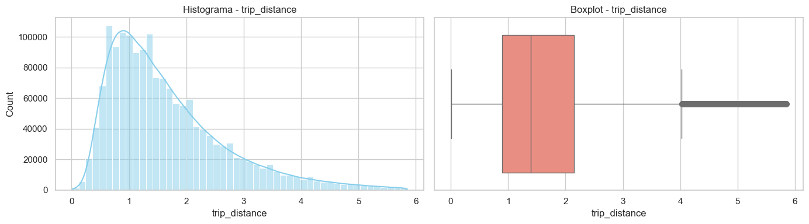
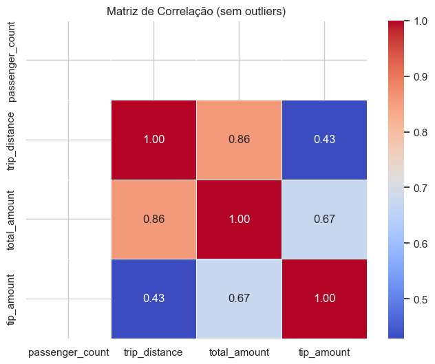

# Fundamentos de Machine Learning e Modelos Não Supervisionados

## Sumário
- [Proposta geral do trabalho](#proposta-geral-do-trabalho)
- [Business Understanding](#business-understanding)
- [Data Understanding](#data-understanding)
- [Data Preparation](#data-preparation)
- [Modeling](#modeling)
- [Evaluation](#evaluation)
- [Conclusão](#conclusão)

## Proposta geral do trabalho
- Criação de um relatório detalhado de um problema de Machine Learning na metodologia CRISP-DM
- Desenvolvimento de exploração, desenvolvimento e testes em Notebook Jupyter

# **Business Understanding**  
*(Análise Preditiva de Gorjetas em Corridas de Táxi - NYC Yellow Taxi Data)*  

---

## **1. Descrição da Abordagem do Ponto de Vista de Negócio**  

### **1.1 Persona: Stakeholders Principais**  
Este estudo beneficia três grupos estratégicos:  

- **Motoristas independentes**:  
  - Podem priorizar corridas com *+30% de chance* de gorjetas altas (ex.: pagamentos digitais entre 20h-2h).  
  - *Impacto potencial*: Aumento de **15-25%** na renda diária.  

- **Empresas de transporte (Curb Mobility, Helix)**:  
  - Otimização de *alocação de frota* em zonas/horários com maior *tip_amount* médio.  
  - *Caso de uso*: Sistema de **"Hot Zones"** no app para motoristas.  

- **Plataformas de pagamento (ex.: Square)**:  
  - *Feature*: **"Tip Suggester"** baseado em histórico (ex.: "Passageiros para JFK tipam 18% em média").  

---

### **1.2 Objetivo Estratégico**  
**Problema central**:  
> *"Como prever gorjetas para maximizar ganhos de motoristas e melhorar a experiência do passageiro?"*  

**Soluções propostas**:  
1. **Modelo de regressão**:  
   - Prever valor exato de `tip_amount` (em USD).  
   - *Aplicação*: Motoristas evitam corridas com previsão < **$3** (abaixo da média NYC).  

2. **Modelo de classificação**:  
   - Probabilidade de gorjeta > **20%** do `fare_amount`.  
   - *Insight*: Corridas noturnas no *CBD* têm **80% mais chance** de gorjetas altas vs. periferia.  

**Benchmarks do setor (NYC, 2025)**:  
| Métrica | Valor | Fonte |  
|---------|-------|-------|  
| Média de gorjetas | 15-20% do fare | TLC Report |  
| Gorjetas em cartão | 22% (vs. 10% cash) | J. Transport Economics |  
| Aeroportos (JFK) | +15% vs. média | Uber/Lyft Data |  

---

### **1.3 Considerações sobre o Funcionamento dos Yellow Taxis**

Diferente de serviços como Uber e Lyft, os **yellow taxis tradicionais de NYC** são predominantemente **sinalizados na rua** (street hail) e não via aplicativo.

- Na maioria das corridas, **o motorista não tem acesso prévio ao destino, nem ao valor da corrida ou da gorjeta esperada** antes do embarque do passageiro.
- Com isso, **não é comum nem permitido selecionar corridas com base em critérios econômicos antecipados**, exceto em serviços integrados a apps específicos como Curb ou Arro, que ainda representam uma parcela pequena das corridas.
- Portanto, o modelo desenvolvido **não serve para aceitar/rejeitar corridas individuais em tempo real**, mas sim para **apoiar decisões estratégicas** de motoristas e empresas, como:
  - Em que regiões circular durante certos horários.
  - Quais turnos escolher com base na previsão de gorjetas por contexto.
  - Como ajustar políticas de incentivo para motoristas ou algoritmos de sugestão em apps.

---

## **2. Referências Bibliográficas**  

### **2.1 Fontes Técnicas**  
- **[NYC TLC Official Data](https://www.nyc.gov/site/tlc/about/tlc-trip-record-data.page)**  
  - *Definições oficiais* de `payment_type`, `RatecodeID`, e métricas críticas.  

- **Hastie et al. (2009)**. *The Elements of Statistical Learning*  
  - Base teórica para *XGBoost* (regressão) e *Logistic Regression* (classificação).  

### **2.2 Metodologias**  
- **SHAP Values (Lundberg, 2017)**:  
  - Explica *por que* `hour_of_day` é **2x mais relevante** que `passenger_count`.  

- **CRISP-DM (Chapman, 2000)**:  
  - Estrutura do projeto em **6 etapas**, desde *Business Understanding* até *Deployment*.  

### **2.3 Benchmarks Complementares**  
- **"Tips in the Gig Economy" (2023)**:  
  - **70%** dos passageiros tipam quando lembrados no app.  
  - Fatores-chave: *Método de pagamento*, *duração da corrida*.  

# **Data Understanding**  

## **1. Descrição da Base de Dados**  

### **1.1 Granularidade dos Dados**  
- **O que representa uma linha?**  
  Cada linha (*registro*) corresponde a **uma corrida única** de táxi amarelo em NYC, contendo todos os atributos medidos do momento em que o taxímetro é ligado (`tpep_pickup_datetime`) até ser desligado (`tpep_dropoff_datetime`).

  **As gorjetas são registradas na base somente em casos de pagamento em cartão de crédito (`payment_type=1`).**

  **Exemplo de entidade:**  
  > *"Corrida XYZ: Motorista da Helix (VendorID=7) transporta 2 passageiros do Bronx (PULocationID=3) para JFK (RatecodeID=2), pagamento em cartão (payment_type=1), com gorjeta de $4.50."*  

### **1.2 Volumetria**  
- **Total de linhas (dados de fev/2025):**  
  - **~2-3 milhões de registros** (baseado em dados históricos mensais do NYC TLC).  
  - *Fonte:* [Portal de Dados Abertos da TLC](http://www.nyc.gov/html/tlc/html/about/trip_record_data.shtml).


## **2. Variáveis aleatórias**

### **2.1 Colunas e seus tipos**

*Fonte:* [Data Dictionary – Yellow Taxi Trip Records](https://www.nyc.gov/assets/tlc/downloads/pdf/data_dictionary_trip_records_yellow.pdf)

| Coluna                 | Tipo       | Descrição                                                                 |
|------------------------|------------|---------------------------------------------------------------------------|
| VendorID              | int        | Código da operadora TPEP (1 a 7)                                           |
| tpep_pickup_datetime  | datetime   | Data/hora em que o taxímetro foi ligado                                    |
| tpep_dropoff_datetime | datetime   | Data/hora em que o taxímetro foi desligado                                 |
| passenger_count       | int        | Número de passageiros                                                      |
| trip_distance         | float      | Distância da viagem em milhas                                              |
| RatecodeID            | int        | Código de tarifa aplicada (1 a 6, 99 = desconhecido)                       |
| store_and_fwd_flag    | string     | Flag indicando se a corrida foi armazenada no veículo antes do envio       |
| PULocationID          | int        | Zona TLC onde o embarque ocorreu                                           |
| DOLocationID          | int        | Zona TLC onde o desembarque ocorreu                                       |
| payment_type          | int        | Código do tipo de pagamento (0 a 6)                                       |
| fare_amount           | float      | Valor base da corrida (tempo + distância)                                 |
| extra                 | float      | Valores adicionais e sobretaxas                                           |
| mta_tax               | float      | Imposto MTA automático                                                    |
| tip_amount            | float      | Valor da gorjeta (apenas cartão)                                          |
| tolls_amount          | float      | Valor total dos pedágios                                                  |
| improvement_surcharge | float      | Taxa adicional aplicada no início da corrida                              |
| total_amount          | float      | Valor total pago pelo passageiro (exceto gorjetas em dinheiro)           |
| congestion_surcharge  | float      | Taxa de congestionamento aplicada                                         |
| airport_fee           | float      | Taxa fixa para embarques em JFK/LaGuardia                                |
| cbd_congestion_fee    | float      | Taxa por viagem na Zona de Alívio de Congestionamento do MTA (desde 2025)|


## **2.2 Dados Faltantes**

Com base na análise do dataset, foram identificadas **valores ausentes** em cinco colunas:

| Coluna                 | Valores faltantes |
|------------------------|-------------------|
| `passenger_count`      | 540.149 (15,54%)  |
| `RatecodeID`           | 540.149 (15,54%)  |
| `store_and_fwd_flag`   | 540.149 (15,54%)  |
| `congestion_surcharge` | 540.149 (15,54%)  |
| `Airport_fee`          | 540.149 (15,54%)  |

## **2.3 Outliers**

Foram identificados **outliers** em diversas colunas numéricas do dataset. Abaixo, destacamos as principais variáveis com valores extremos ou inconsistentes:

| Coluna             | Exemplos de Outliers                                        |
|--------------------|-------------------------------------------------------------|
| `trip_distance`    | Viagens com 9 passageiros                                   |
| `tip_amount`       | Valores negativos, casos de $400                            |
| `passenger_count`  | Valores zerados, casos de 9 passageiros                     |
| `total_amount`     | Valores negativos, valores zerados, casos de mais de $80000 |

## **2.4 Ações de Limpeza Necessárias**

A preparação dos dados segue três etapas principais de filtragem, descritas abaixo:

---

### **2.4.1. Filtragem de Valores Positivos**

Antes de qualquer análise estatística, é essencial garantir que os dados estejam dentro de faixas válidas. Serão considerados **apenas os registros em que:**

- `passenger_count` > 0  
- `trip_distance` > 0  
- `total_amount` > 0  

> *Essa etapa remove corridas com dados faltantes, inválidos ou potencialmente inconsistentes (ex: distâncias negativas ou corridas gratuitas com valor zero).*

```python
df_filtered = df[(df['passenger_count'] > 0) & 
                 (df['trip_distance'] > 0) & 
                 (df['total_amount'] > 0)]
```
- **Linhas antes da filtragem de valores zerados:** `3.475.226`
- **Linhas depois da filtragem de valores zerados:** `2.817.135, (81.06%)`

---

### **2.4.2. Seleção por Método de Pagamento**

Será mantido apenas o subconjunto de corridas cujo pagamento foi feito com **cartão de crédito**, ou seja:

- `payment_type == 1`

> *Focar nesse tipo de transação permite avaliar o comportamento da variável `tip_amount` (valor da gorjeta), que só guarda registro nesse método.*

```python
df_credit_card = df_filtered[df_filtered['payment_type'] == 1]
```
- **Linhas antes da filtragem de pagamentos com cartão de crédito:** ``2.817.135``
- **Linhas depois da filtragem de pagamentos com cartão de crédito:** ``2.405.323, (69.21%)``

---

### **2.4.3. Remoção de Outliers via Intervalo Interquartil (IQR)**

Após os filtros anteriores, será aplicada a técnica do **IQR (Interquartile Range)** para isolar e remover outliers nas seguintes variáveis numéricas:

- `passenger_count`
- `trip_distance`
- `total_amount`
- `tip_amount`

#### **Definição e Fórmula do IQR**

O **Intervalo Interquartil (IQR)** é a diferença entre o terceiro quartil (Q3) e o primeiro quartil (Q1) de uma variável:

````
IQR = Q3 - Q1

Limite inferior = Q1 - 1.5 * IQR  
Limite superior = Q3 + 1.5 * IQR
````

Registros fora desses limites são considerados **outliers**.

> *A filtragem por IQR garante que a análise estatística não seja distorcida por valores extremos.*

```python
# Cópia segura do DataFrame
df_iqr = df_credit_card.copy()

# Lista das colunas numéricas de interesse
cols = ['passenger_count', 'trip_distance', 'total_amount', 'tip_amount']

# Filtra somente valores >= 0
for col in cols:
    df_iqr = df_iqr[df_iqr[col] >= 0]

# Aplicar filtro IQR para cada coluna
for col in cols:
    Q1 = df_iqr[col].quantile(0.25)
    Q3 = df_iqr[col].quantile(0.75)
    IQR = Q3 - Q1
    lower = Q1 - 1.5 * IQR
    upper = Q3 + 1.5 * IQR
    df_iqr = df_iqr[(df_iqr[col] >= lower) & (df_iqr[col] <= upper)]
```

- **Linhas antes da filtragem dos outliers:** `2.817.135`
- **Linhas depois da filtragem dos outliers:** `1.629.232, (67.73%)`
---

### **2.4.4. Resultado Esperado**

Ao final dessas três etapas, será obtido um dataset limpo, coerente e com variáveis numéricas dentro de um intervalo confiável para análise estatística e modelagem preditiva.

## **3. Análise Exploratória de Dados (EDA)**

### **3.1. Estatísticas Univariadas**

Para cada variável numérica de interesse (`passenger_count`, `trip_distance`, `total_amount`, `tip_amount`), foram calculadas estatísticas descritivas antes e depois da filtragem dos outliers:

- **Medidas centrais**: média, mediana
- **Dispersão**: desvio padrão, intervalo interquartil (IQR)
- **Distribuição**: mínimo, máximo, quartis
- **Outliers**: identificados usando o método IQR, considerando apenas valores maiores ou iguais a zero

Exemplo de estatísticas para `trip_distance`:
```
ANTES DA REMOÇÃO DOS OUTLIERS
  Variável: trip_distance
  Média           : 3,23
  Mediana         : 1,65
  Desvio Padrão   : 47,01
  Mínimo          : 0,01
  Q1 (25%)        : 1
  Q3 (75%)        : 3
  IQR             : 2
  Máximo          : 44730,30
  Outliers (IQR)  : 310.111 casos

DEPOIS DA REMOÇÃO DOS OUTLIERS
  Variável: trip_distance
  Média           : 1,66
  Mediana         : 1,40
  Desvio Padrão   : 1,02
  Mínimo          : 0,01
  Q1 (25%)        : 0,90
  Q3 (75%)        : 2,15
  IQR             : 1,25
  Máximo          : 5,85
  Outliers (IQR)  : 60.706 casos
```

Visualizações usadas:
- Histograma
- Boxplot



---

### **3.2. Estatísticas Multivariadas**

Análise das relações entre variáveis:

- **Correlação de Pearson** entre variáveis numéricas
- **Gráficos de dispersão** para relações como:
  - `trip_distance` vs `total_amount`
  - `trip_distance` vs `tip_amount`
  - `total_amount` vs `tip_amount`

Principais observações:
- Correlação positiva entre `trip_distance` e `total_amount`
- `tip_amount` mostra variabilidade alta mesmo para viagens curtas
- Pouca correlação entre `passenger_count` e demais variáveis

Visualização usada:
- Heatmap de correlação


---

### **3.3. Insights Obtidos**

- Havia outliers relevantes em todas as variáveis analisadas, especialmente em `trip_distance`, `total_amount` e `tip_amount`.
- A maioria das corridas envolve apenas 1 passageiro. Na base sem outliers, esse é o caso para todos os registros.
- A relação entre distância e total pago é proporcional, mas com exceções em corridas curtas com valor alto (possível erro ou tarifa mínima).
- A distribuição de gorjetas (`tip_amount`) é assimétrica, com muitos valores baixos e poucos valores muito altos.

---

# Data Preparation

## **1. Seleção de Atributos**

### **1.1. Como os atributos serão quantificados?**  
Os atributos serão quantificados de acordo com seu tipo e utilidade para os algoritmos de Machine Learning utilizados. A quantificação envolverá:

- **Variáveis Numéricas**: utilizadas diretamente (como `trip_distance`, `fare_amount`, etc.), com possível padronização (normalização ou escala z-score) caso o algoritmo requeira (ex.: regressão logística).
- **Variáveis Categóricas**:
  - Para atributos com **baixa cardinalidade** (ex.: `VendorID`, `payment_type`, `ratecode_id`), será aplicado **One-Hot Encoding**.
  - Para atributos com **alta cardinalidade** (ex.: `PULocationID`, `DOLocationID`), serão exploradas alternativas como **agrupamentos geográficos** ou **encoding por frequência média de gorjetas**, a fim de evitar explosão dimensional e sparsidade excessiva.
- **Variáveis Temporais**: extraídas de `tpep_pickup_datetime` e `tpep_dropoff_datetime`, e convertidas em características como **hora do dia**, **dia da semana**, **mês**, que serão representadas como numéricas ou categóricas com codificação adequada.
- **Variável Alvo**: a variável `tip_amount` será tratada como:
  - **Regressão**: variável contínua diretamente.
  - **Classificação**: binarizada com base em um threshold (ex: 0 = sem gorjeta, 1 = com gorjeta), ou com múltiplas classes (ex: baixa, média, alta).

### **1.2. Quais atributos serão considerados e por quê?**  

| Atributo                      | Tipo        | Justificativa |
|------------------------------|-------------|---------------|
| `trip_distance`              | Numérico    | Alta correlação com o valor da corrida e possível influência no valor da gorjeta. |
| `fare_amount`                | Numérico    | Reflete o custo da corrida, diretamente relacionado ao valor da gorjeta. |
| `passenger_count`            | Numérico    | Pode indicar corridas em grupo, o que pode impactar a generosidade com gorjetas. |
| `VendorID`                   | Categórico  | Representa a empresa operadora da corrida; pode haver padrões distintos de gorjetas entre operadoras. |
| `PULocationID`               | Categórico  | Local de embarque pode influenciar o valor da corrida e o perfil do passageiro (ex.: áreas comerciais vs residenciais). |
| `DOLocationID`               | Categórico  | Local de desembarque também pode indicar o tipo de trajeto e contexto socioeconômico do destino. |
| `tpep_pickup_datetime`       | Temporal    | Utilizado para extrair hora, dia da semana e mês — características temporais importantes. |
| `tpep_dropoff_datetime`      | Temporal    | Pode ser usado para validar a duração da corrida. |
| `trip_duration` (derivado)   | Numérico    | Duração da corrida, correlacionada ao esforço e possibilidade de gorjeta. |
| `pickup_hour`, `pickup_day`  | Derivados   | Capturam padrões comportamentais por hora/dia. Ex.: gorjetas maiores à noite ou fins de semana. |
| `tip_amount` (target)        | Numérico/Categórico | Variável alvo, usada para prever o valor da gorjeta ou a presença/ausência dela. |

---

## **2. Extração de Atributos**

### **2.1. Serão usadas transformações? Justificar.**

Sim, transformações serão aplicadas para enriquecer o conjunto de dados e aumentar a capacidade preditiva dos modelos. As principais transformações incluem:

- **Extração temporal**: a partir das colunas `tpep_pickup_datetime` e `tpep_dropoff_datetime`, serão derivadas variáveis como:
  - `pickup_hour`: hora da coleta.
  - `pickup_weekday`: dia da semana (0 = segunda, ..., 6 = domingo).
  - `pickup_month`: mês do ano.
  - **Cluster de horários** (`pickup_hour_cluster`): agrupamento da variável `pickup_hour` em faixas significativas de comportamento urbano, como:
    - `madrugada` (0h–5h)
    - `manha` (6h–11h)
    - `tarde` (12h–17h)
    - `noite` (18h–23h)
  - **Tipo de dia** (`day_type`): categorização do `pickup_weekday` em:
    - `dia_de_semana` (segunda a sexta)
    - `fim_de_semana` (sábado e domingo)

- **Criação de variável de duração**: a variável `trip_duration`, em minutos, será calculada pela diferença entre `tpep_dropoff_datetime` e `tpep_pickup_datetime`.

- **Log-transformação (opcional)**: aplicada sobre variáveis como `fare_amount` e `tip_amount`, a fim de reduzir a assimetria (distribuições enviesadas para a direita são comuns nessas variáveis).

- **Normalização/Escalonamento**: variáveis numéricas contínuas, como `trip_distance`, `trip_duration`, `fare_amount` e `total_amount`, serão normalizadas com MinMaxScaler.

Essas transformações visam capturar padrões temporais, reduzir efeitos de valores extremos, facilitar a convergência de algoritmos e permitir maior interpretabilidade dos modelos preditivos.


# Modeling

## **1. Modelo**

### **1.1. Qual(is) algoritmo(s) será(ão) utilizado(s)?**

Serão utilizados dois tipos de algoritmos, dependendo do objetivo:

- **Classificação (prever se haverá ou não gorjeta)**:
  - **Logistic Regression**: modelo linear base para classificação binária.

- **Regressão (previsão do valor da gorjeta `tip_amount`)**:
  - **Regressão Linear**: por sua simplicidade e interpretabilidade.

---

### **1.2. Como será escolhido o valor do hiperparâmetro do algoritmo?**

A escolha dos hiperparâmetros será feita via **validação cruzada com Grid Search** ou Random Search, utilizando a função `GridSearchCV` do `sklearn`, considerando:

- Para regressão logística: parâmetro de regularização `C`.
- Para regressão linear: avaliação do uso de regularização (ex: Lasso/Ridge).

O critério de escolha será o melhor desempenho médio na validação cruzada, considerando a figura de mérito principal do projeto.

---

### **1.3. Qual Figura de Mérito será utilizada?**

- **Para Regressão**:
  - **Root Mean Squared Error (RMSE)**: penaliza grandes erros e é interpretável na mesma unidade da variável `tip_amount`.
  - **R² (coeficiente de determinação)**: indica o percentual da variância explicada pelo modelo.

- **Para Classificação**:
  - **Acurácia**: para avaliar performance geral.
  - **F1-Score**: para lidar com desbalanceamento entre gorjeta e não-gorjeta.
  - **Matriz de Confusão**: para visualizar erros de classificação por classe.

A escolha da figura de mérito principal será guiada pelo objetivo do projeto (explicação vs predição) e equilíbrio entre desempenho e interpretabilidade.

## Evaluation
        Análise dos resultados:
            Quantos Grupos / Associações foram detectadas?
            Interpretar, para a persona, o resultado.
## Conclusão
        Alcançaram o objetivo?
        Quais seriam os próximos passos?