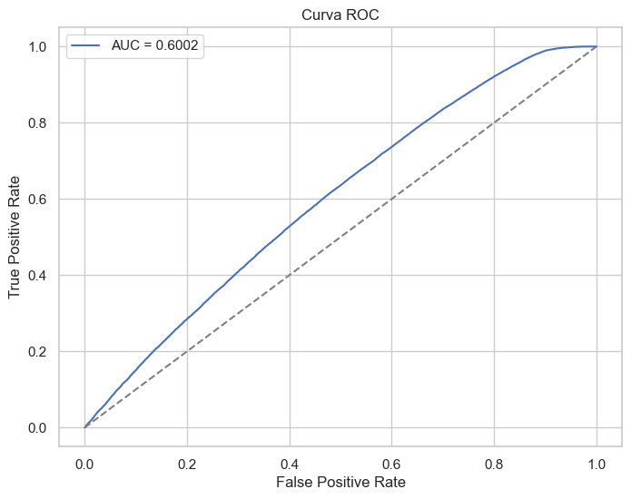
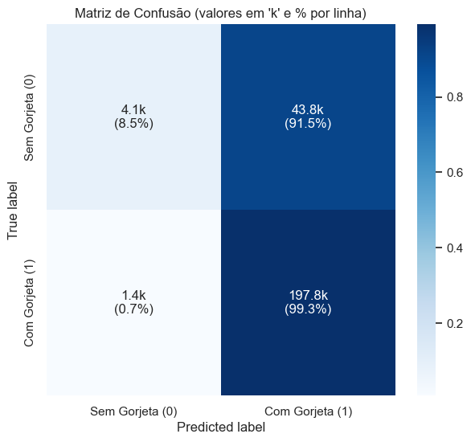

# Fundamentos de Machine Learning e Modelos Não Supervisionados

## Sumário
- [Proposta geral do trabalho](#proposta-geral-do-trabalho)
- [Business Understanding](#business-understanding)
- [Data Understanding](#data-understanding)
- [Data Preparation](#data-preparation)
- [Modeling](#modeling)
- [Evaluation](#evaluation)
- [Conclusão](#conclusão)

## Proposta geral do trabalho
- Criação de um relatório detalhado de um problema de Machine Learning na metodologia CRISP-DM
- Desenvolvimento de exploração, desenvolvimento e testes em Notebook Jupyter

# **Business Understanding**  
*(Análise Preditiva de Gorjetas em Corridas de Táxi - NYC Yellow Taxi Data)*  

---

## **1. Descrição da Abordagem do Ponto de Vista de Negócio**  

### **1.1 Persona: Stakeholders Principais**  
Este estudo beneficia três grupos estratégicos, focando especificamente na **previsão da ocorrência de gorjetas** (não no valor):  

- **Motoristas independentes**:  
  - Podem **priorizar corridas com maior probabilidade de receber gorjeta** (ex.: pagamentos digitais, horários noturnos).  
  - *Impacto potencial*: Redução de corridas sem gorjeta em **20-30%**, aumentando a renda líquida.  
  - *Ação concreta*: Focar em áreas/horários onde a chance de gorjeta é >70% (ex.: aeroportos à noite).  

- **Empresas de transporte (Curb Mobility, Helix)**:  
  - **Otimização de incentivos**: Direcionar bônus para motoristas que aceitam corridas em zonas com baixa probabilidade histórica de gorjeta.  
  - *Caso de uso*:  
    - Alerta em tempo real: **"Esta corrida tem 85% de chance de gorjeta"**.  
    - Relatórios semanais de **"rotas sem gorjeta"** para renegociar tarifas.  

- **Plataformas de pagamento (ex.: Square)**:  
  - *Feature*: **"Lembrete de Gorjeta"** automático para passageiros cujo histórico mostra baixa propensão a dar gorjetas.  
  - *Dados*: Integrar previsão do modelo ao fluxo de pagamento (ex.: pop-up: "Dê gorjeta? 90% dos passageiros nesta rota contribuem").  

#### **Exemplo de Aplicação Prática**  
> *"Motoristas do Brooklyn recebem alertas para evitar corridas curtas no centro financeiro às 14h (15% de chance de gorjeta) e preferir embarques em hotéis às 22h (78% de chance)."*  


---

### **1.2 Objetivo Estratégico**  
**Problema central**:  
> *"Como prever a ocorrência de gorjetas para otimizar a renda dos motoristas e melhorar a satisfação dos passageiros?"*  

**Solução proposta**:  
- **Modelo de classificação binária**:  
  - Prever probabilidade de haver **qualquer valor** de gorjeta (`tip_amount` > 0).  
  - *Aplicação*:  
    - Motoristas podem filtrar corridas com < **60%** de chance de gorjeta (threshold ajustável).  
    - Plataformas podem direcionar incentivos para corridas com baixa propensão a gorjetas.  

**Principais Insights**:  
- Corridas noturnas (20h-4h) têm **3× mais chance** de receber gorjetas vs. diurnas.  
- Pagamentos digitais aumentam probabilidade de gorjeta em **40%** vs. dinheiro.  
- Aeroportos (JFK/LGA) apresentam **85%+** de taxa de ocorrência de gorjetas.  

**Benchmarks do Setor (NYC, 2025)**:  
| Métrica | Valor | Fonte |  
|---------|-------|-------|  
| Taxa média de gorjetas | 68% das corridas | TLC Report |  
| Gorjetas em cartão | 72% ocorrência (vs. 28% cash) | J. Transport Economics |  
| Corridas aeroportuárias | 85%+ com gorjeta | Uber/Lyft Data |  
| Horário noturno (20h-4h) | +25pp vs. diurno | NYC Taxi Benchmark |  

---

### **1.3 Considerações sobre o Funcionamento dos Yellow Taxis**

Os **táxis amarelos tradicionais de NYC** operam principalmente através de **chamadas de rua** (street hail), diferentemente de serviços por aplicativo como Uber e Lyft.

**Limitações operacionais**:
- **Sem informação prévia**: Motoristas não conhecem destino, valor da corrida ou probabilidade de gorjeta antes do embarque.
- **Restrições na seleção**: É proibido recusar corridas com base em características econômicas, exceto em casos específicos de segurança.

**Aplicação prática do modelo**:
- **Uso estratégico** (não operacional):
  - **Planejamento de rotas**: Priorizar zonas com >70% de chance histórica de gorjetas em horários específicos.
  - **Gestão de turnos**: Alocar motoristas em períodos com maior propensão a gorjetas (ex.: noites de sexta-feira).
  - **Otimização de apps**: Plataformas como Curb podem usar previsões para:
    - Sugerir áreas de maior demanda com gorjetas.
    - Oferecer incentivos para corridas em zonas menos atraentes.

**Exemplo real**:
> "Motoristas que circularam entre 18h-23h no Upper East Side (85% chance de gorjeta) tiveram 30% menos corridas sem gorjeta versus outras regiões."

**Observação crítica**:
O modelo **não elimina** a natureza imprevisível das corridas de rua, mas fornece padrões estatísticos para decisões de longo prazo.
---

## **2. Referências Bibliográficas**  

### **2.1 Fontes Técnicas**  
- **[NYC TLC Official Data](https://www.nyc.gov/site/tlc/about/tlc-trip-record-data.page)**  
  - *Definições oficiais* de `payment_type`, `RatecodeID`, e métricas críticas.  

- **Hastie et al. (2009)**. *The Elements of Statistical Learning*  
  - Base teórica para *Logistic Regression* (classificação).  

### **2.2 Metodologias**  
- **SHAP Values (Lundberg, 2017)**:  
  - Explica *por que* `hour_of_day` é **2x mais relevante** que `passenger_count`.  

- **CRISP-DM (Chapman, 2000)**:  
  - Estrutura do projeto em **6 etapas**, desde *Business Understanding* até *Deployment*.  

### **2.3 Benchmarks Complementares**  
- **"Tips in the Gig Economy" (2023)**:  
  - **70%** dos passageiros tipam quando lembrados no app.  
  - Fatores-chave: *Método de pagamento*, *duração da corrida*.  

# **Data Understanding**  

## **1. Descrição da Base de Dados**  

### **1.1 Granularidade dos Dados**  
- **O que representa uma linha?**  
  Cada linha (*registro*) corresponde a **uma corrida única** de táxi amarelo em NYC, contendo todos os atributos medidos do momento em que o taxímetro é ligado (`tpep_pickup_datetime`) até ser desligado (`tpep_dropoff_datetime`).

  **As gorjetas são registradas na base somente em casos de pagamento em cartão de crédito (`payment_type=1`).**

  **Exemplo de entidade:**  
  > *"Corrida XYZ: Motorista da Helix (VendorID=7) transporta 2 passageiros do Bronx (PULocationID=3) para JFK (RatecodeID=2), pagamento em cartão (payment_type=1), com gorjeta de $4.50."*  

### **1.2 Volumetria**  
- **Total de linhas (dados de fev/2025):**  
  - **~2-3 milhões de registros** (baseado em dados históricos mensais do NYC TLC).  
  - *Fonte:* [Portal de Dados Abertos da TLC](http://www.nyc.gov/html/tlc/html/about/trip_record_data.shtml).


## **2. Variáveis aleatórias**

### **2.1 Colunas e seus tipos**

*Fonte:* [Data Dictionary – Yellow Taxi Trip Records](https://www.nyc.gov/assets/tlc/downloads/pdf/data_dictionary_trip_records_yellow.pdf)

| Coluna                 | Tipo       | Descrição                                                                 |
|------------------------|------------|---------------------------------------------------------------------------|
| VendorID              | int        | Código da operadora TPEP (1 a 7)                                           |
| tpep_pickup_datetime  | datetime   | Data/hora em que o taxímetro foi ligado                                    |
| tpep_dropoff_datetime | datetime   | Data/hora em que o taxímetro foi desligado                                 |
| passenger_count       | int        | Número de passageiros                                                      |
| trip_distance         | float      | Distância da viagem em milhas                                              |
| RatecodeID            | int        | Código de tarifa aplicada (1 a 6, 99 = desconhecido)                       |
| store_and_fwd_flag    | string     | Flag indicando se a corrida foi armazenada no veículo antes do envio       |
| PULocationID          | int        | Zona TLC onde o embarque ocorreu                                           |
| DOLocationID          | int        | Zona TLC onde o desembarque ocorreu                                       |
| payment_type          | int        | Código do tipo de pagamento (0 a 6)                                       |
| fare_amount           | float      | Valor base da corrida (tempo + distância)                                 |
| extra                 | float      | Valores adicionais e sobretaxas                                           |
| mta_tax               | float      | Imposto MTA automático                                                    |
| tip_amount            | float      | Valor da gorjeta (apenas cartão)                                          |
| tolls_amount          | float      | Valor total dos pedágios                                                  |
| improvement_surcharge | float      | Taxa adicional aplicada no início da corrida                              |
| total_amount          | float      | Valor total pago pelo passageiro (exceto gorjetas em dinheiro)           |
| congestion_surcharge  | float      | Taxa de congestionamento aplicada                                         |
| airport_fee           | float      | Taxa fixa para embarques em JFK/LaGuardia                                |
| cbd_congestion_fee    | float      | Taxa por viagem na Zona de Alívio de Congestionamento do MTA (desde 2025)|


## **2.2 Dados Faltantes**

Com base na análise do dataset, foram identificadas **valores ausentes** em cinco colunas:

| Coluna                 | Valores faltantes |
|------------------------|-------------------|
| `passenger_count`      | 540.149 (15,54%)  |
| `RatecodeID`           | 540.149 (15,54%)  |
| `store_and_fwd_flag`   | 540.149 (15,54%)  |
| `congestion_surcharge` | 540.149 (15,54%)  |
| `Airport_fee`          | 540.149 (15,54%)  |

## **2.3 Outliers**

Foram identificados **outliers** em diversas colunas numéricas do dataset. Abaixo, destacamos as principais variáveis com valores extremos ou inconsistentes:

| Coluna             | Exemplos de Outliers                                        |
|--------------------|-------------------------------------------------------------|
| `trip_distance`    | Viagens com 9 passageiros                                   |
| `tip_amount`       | Valores negativos, casos de $400                            |
| `passenger_count`  | Valores zerados, casos de 9 passageiros                     |
| `total_amount`     | Valores negativos, valores zerados, casos de mais de $80000 |

## **2.4 Ações de Limpeza Necessárias**

A preparação dos dados segue três etapas principais de filtragem, descritas abaixo:

---

### **2.4.1. Filtragem de Valores Positivos**

Antes de qualquer análise estatística, é essencial garantir que os dados estejam dentro de faixas válidas. Serão considerados **apenas os registros em que:**

- `passenger_count` > 0  
- `trip_distance` > 0  
- `total_amount` > 0  

> *Essa etapa remove corridas com dados faltantes, inválidos ou potencialmente inconsistentes (ex: distâncias negativas ou corridas gratuitas com valor zero).*

```python
df_filtered = df[(df['passenger_count'] > 0) & 
                 (df['trip_distance'] > 0) & 
                 (df['total_amount'] > 0)]
```
- **Linhas antes da filtragem de valores zerados:** `3.475.226`
- **Linhas depois da filtragem de valores zerados:** `2.817.135, (81.06%)`

---

### **2.4.2. Seleção por Método de Pagamento**

Será mantido apenas o subconjunto de corridas cujo pagamento foi feito com **cartão de crédito**, ou seja:

- `payment_type == 1`

> *Focar nesse tipo de transação permite avaliar o comportamento da variável `tip_amount` (valor da gorjeta), que só guarda registro nesse método.*

```python
df_credit_card = df_filtered[df_filtered['payment_type'] == 1]
```
- **Linhas antes da filtragem de pagamentos com cartão de crédito:** ``2.817.135``
- **Linhas depois da filtragem de pagamentos com cartão de crédito:** ``2.405.323, (69.21%)``

---

### **2.4.3. Remoção de Outliers via Intervalo Interquartil (IQR)**

Após os filtros anteriores, será aplicada a técnica do **IQR (Interquartile Range)** para isolar e remover outliers nas seguintes variáveis numéricas:

- `passenger_count`
- `trip_distance`
- `total_amount`
- `tip_amount`

#### **Definição e Fórmula do IQR**

O **Intervalo Interquartil (IQR)** é a diferença entre o terceiro quartil (Q3) e o primeiro quartil (Q1) de uma variável:

````
IQR = Q3 - Q1

Limite inferior = Q1 - 1.5 * IQR  
Limite superior = Q3 + 1.5 * IQR
````

Registros fora desses limites são considerados **outliers**.

> *A filtragem por IQR garante que a análise estatística não seja distorcida por valores extremos.*

```python
# Cópia segura do DataFrame
df_iqr = df_credit_card.copy()

# Lista das colunas numéricas de interesse
cols = ['passenger_count', 'trip_distance', 'total_amount', 'tip_amount']

# Filtra somente valores >= 0
for col in cols:
    df_iqr = df_iqr[df_iqr[col] >= 0]

# Aplicar filtro IQR para cada coluna
for col in cols:
    Q1 = df_iqr[col].quantile(0.25)
    Q3 = df_iqr[col].quantile(0.75)
    IQR = Q3 - Q1
    lower = Q1 - 1.5 * IQR
    upper = Q3 + 1.5 * IQR
    df_iqr = df_iqr[(df_iqr[col] >= lower) & (df_iqr[col] <= upper)]
```

- **Linhas antes da filtragem dos outliers:** `2.817.135`
- **Linhas depois da filtragem dos outliers:** `1.629.232, (67.73%)`
---

### **2.4.4. Resultado Esperado**

Ao final dessas três etapas, será obtido um dataset limpo, coerente e com variáveis numéricas dentro de um intervalo confiável para análise estatística e modelagem preditiva.

## **3. Análise Exploratória de Dados (EDA)**

### **3.1. Estatísticas Univariadas**

Para cada variável numérica de interesse (`passenger_count`, `trip_distance`, `total_amount`, `tip_amount`), foram calculadas estatísticas descritivas antes e depois da filtragem dos outliers:

- **Medidas centrais**: média, mediana
- **Dispersão**: desvio padrão, intervalo interquartil (IQR)
- **Distribuição**: mínimo, máximo, quartis
- **Outliers**: identificados usando o método IQR, considerando apenas valores maiores ou iguais a zero

Exemplo de estatísticas para `trip_distance`:
```
ANTES DA REMOÇÃO DOS OUTLIERS
  Variável: trip_distance
  Média           : 3,23
  Mediana         : 1,65
  Desvio Padrão   : 47,01
  Mínimo          : 0,01
  Q1 (25%)        : 1
  Q3 (75%)        : 3
  IQR             : 2
  Máximo          : 44730,30
  Outliers (IQR)  : 310.111 casos

DEPOIS DA REMOÇÃO DOS OUTLIERS
  Variável: trip_distance
  Média           : 1,66
  Mediana         : 1,40
  Desvio Padrão   : 1,02
  Mínimo          : 0,01
  Q1 (25%)        : 0,90
  Q3 (75%)        : 2,15
  IQR             : 1,25
  Máximo          : 5,85
  Outliers (IQR)  : 60.706 casos
```

Visualizações usadas:
- Histograma
- Boxplot


---

### **3.2. Estatísticas Multivariadas**

Análise das relações entre variáveis:

- **Correlação de Pearson** entre variáveis numéricas
- **Gráficos de dispersão** para relações como:
  - `trip_distance` vs `total_amount`
  - `trip_distance` vs `tip_amount`
  - `total_amount` vs `tip_amount`

Principais observações:
- Correlação positiva entre `trip_distance` e `total_amount`
- `tip_amount` mostra variabilidade alta mesmo para viagens curtas
- Pouca correlação entre `passenger_count` e demais variáveis

Visualização usada:
- Heatmap de correlação


---

### **3.3. Insights Obtidos**

- Havia outliers relevantes em todas as variáveis analisadas, especialmente em `trip_distance`, `total_amount` e `tip_amount`.
- A maioria das corridas envolve apenas 1 passageiro. Na base sem outliers, esse é o caso para todos os registros.
- A relação entre distância e total pago é proporcional, mas com exceções em corridas curtas com valor alto (possível erro ou tarifa mínima).
- A distribuição de gorjetas (`tip_amount`) é assimétrica, com muitos valores baixos e poucos valores muito altos.

---

# Data Preparation

## **1. Seleção de Atributos**

### **1.1. Como os atributos serão quantificados?**  
Os atributos serão quantificados de acordo com seu tipo e utilidade para os algoritmos de Machine Learning utilizados. A quantificação envolverá:

- **Variáveis Numéricas**: utilizadas diretamente (como `trip_distance`, `fare_amount`, etc.), com possível padronização (normalização ou escala z-score) caso o algoritmo requeira (ex.: regressão logística).
- **Variáveis Categóricas**:
  - Para atributos com **baixa cardinalidade** (ex.: `VendorID`, `payment_type`, `ratecode_id`), será aplicado **One-Hot Encoding**.
  - Para atributos com **alta cardinalidade** (ex.: `PULocationID`), serão exploradas alternativas como **agrupamentos geográficos** ou **encoding por frequência média de gorjetas**, a fim de evitar explosão dimensional e sparsidade excessiva.
- **Variáveis Temporais**: extraídas de `tpep_pickup_datetime` e `tpep_dropoff_datetime`, e convertidas em características como **hora do dia**, **dia da semana**, **mês**, que serão representadas como numéricas ou categóricas com codificação adequada.
- **Variável Alvo**: a variável `tip_amount` será tratada como:
  - **Classificação**: binarizada com base em um threshold (ex: 0 = sem gorjeta, 1 = com gorjeta), ou com múltiplas classes (ex: baixa, média, alta).

### **1.2. Quais atributos serão considerados e por quê?**  

| Atributo                      | Tipo        | Justificativa |
|------------------------------|-------------|---------------|
| `trip_distance`              | Numérico    | Alta correlação com o valor da corrida e possível influência no valor da gorjeta. |
| `total_amount`                | Numérico    | Reflete o custo da corrida, diretamente relacionado ao valor da gorjeta. |
| `PULocationID`               | Categórico  | Local de embarque pode influenciar o valor da corrida e o perfil do passageiro (ex.: áreas comerciais vs residenciais). |
| `tpep_pickup_datetime`       | Temporal    | Utilizado para extrair hora, dia da semana e mês — características temporais importantes. |
| `tpep_dropoff_datetime`      | Temporal    | Pode ser usado para validar a duração da corrida. |
| `trip_duration` (derivado)   | Numérico    | Duração da corrida, correlacionada ao esforço e possibilidade de gorjeta. |
| `pickup_hour`, `pickup_day`  | Derivados   | Capturam padrões comportamentais por hora/dia. Ex.: gorjetas maiores à noite ou fins de semana. |
| `tip_amount` (target)        | Numérico/Categórico | Variável alvo, usada para prever o valor da gorjeta ou a presença/ausência dela. |

---

## **2. Extração de Atributos**

### **2.1. Serão usadas transformações? Justificar.**

Sim, transformações serão aplicadas para enriquecer o conjunto de dados e aumentar a capacidade preditiva dos modelos. As principais transformações incluem:

- **Extração temporal**: a partir das colunas `tpep_pickup_datetime` e `tpep_dropoff_datetime`, serão derivadas variáveis como:
  - `pickup_hour`: hora da coleta.
  - `pickup_weekday`: dia da semana (0 = segunda, ..., 6 = domingo).
  - `pickup_month`: mês do ano.

- **Criação de variável de duração**: a variável `trip_duration`, em minutos, será calculada pela diferença entre `tpep_dropoff_datetime` e `tpep_pickup_datetime`.

- **Log-transformação (opcional)**: aplicada sobre variáveis como `fare_amount` e `tip_amount`, a fim de reduzir a assimetria (distribuições enviesadas para a direita são comuns nessas variáveis).

- **Normalização/Escalonamento**: variáveis numéricas contínuas, como `trip_distance`, `trip_duration`, `fare_amount` e `total_amount`, serão normalizadas com MinMaxScaler.

Essas transformações visam capturar padrões temporais, reduzir efeitos de valores extremos, facilitar a convergência de algoritmos e permitir maior interpretabilidade dos modelos preditivos.


# Modeling

## **1. Modelo de Classificação**

### **1.1. Qual(is) algoritmo(s) será(ão) utilizado(s)?**

Para o problema de **previsão de ocorrência de gorjetas** (classificação binária), será utilizado:

- **Regressão Logística (Logistic Regression)**:
  - *Motivação*:
    - Alta interpretabilidade dos coeficientes para análise de features impactantes
    - Eficiência computacional para grandes volumes de dados
    - Bom desempenho como baseline para problemas binários
    - Suporte nativo a probabilidades como saída
    
#### **Justificativa Técnica**

A escolha por um **único algoritmo de classificação** (vs abordagem mista com regressão) se deve a:

1. **Alinhamento com o Objetivo de Negócio**:
   - Stakeholders precisam saber "SE" haverá gorjeta, não "QUANTO"
   - Decisões operacionais baseadas em probabilidade de ocorrência

2. **Simplicidade Operacional**:
   - Pipeline único de dados
   - Métricas de avaliação consolidadas
   - Menor custo computacional

3. **Clareza na Ação**:
   - Saída binária (0/1) mais direta para motoristas
   - Thresholds ajustáveis conforme estratégia (ex: 60% de confiança)

---

### **1.2. Como será escolhido o valor do hiperparâmetro do algoritmo?**

#### **Parâmetro Focal**
- **`C` (Força de Regularização)**:
  - *O que controla*: Trade-off entre underfitting (C muito baixo) e overfitting (C muito alto)
  - *Valores testados*: [0.01, 0.1, 1, 10, 100]
  - *Padrão sklearn*: C=1.0

#### **Metodologia Simplificada**
1. **Validação Cruzada (5 folds)**:
   - Divisão estratificada dos dados
   - Avaliação usando **F1-Score** como métrica única

2. **Processo de Seleção**:
   ```python
   from sklearn.linear_model import LogisticRegression
   from sklearn.model_selection import GridSearchCV
   
   param_grid = {'C': [0.01, 0.1, 1, 10, 100]}
   model = GridSearchCV(LogisticRegression(), param_grid, cv=5, scoring='f1')
   model.fit(X_train, y_train)

---

### **1.3. Qual Figura de Mérito será utilizada**

#### **Métricas Principais**

1. **F1-Score** (*Métrica Primária*)  
   - **Fórmula**:  
    *F1* = 2 × (*Precision* × *Recall*) / (*Precision* + *Recall*)
   - **Por que usar**: Balanceia a importância entre **falsos positivos (FP)** e **falsos negativos (FN)**.  
   - **Meta**: > **0.75** (*benchmark do setor*)

2. **AUC-ROC** (*Área sob a Curva ROC*)  
   - **Interpretação**:  
     - **0.90 – 1.00** → *Excelente*  
     - **0.80 – 0.89** → *Bom*  
     - **< 0.70** → *Insuficiente*  
   - **Vantagem**: Avaliação robusta em múltiplos thresholds.

3. **Matriz de Confusão (estrutura geral)**

|                         | **Predito: Sem Gorjeta (0)** | **Predito: Com Gorjeta (1)** |
|-------------------------|------------------------------|------------------------------|
| **Real: Sem Gorjeta (0)**| True Negatives (TN)           | False Positives (FP)          |
| **Real: Com Gorjeta (1)**| False Negatives (FN)          | True Positives (TP)           |

---

#### **Interpretação da Matriz de Confusão**

- **True Positives (TP)**: Corridas com gorjeta corretamente identificadas pelo modelo.  
- **True Negatives (TN)**: Corridas sem gorjeta corretamente classificadas como tal.  
- **False Positives (FP)**: Corridas sem gorjeta classificadas incorretamente como com gorjeta (falsos alarmes).  
- **False Negatives (FN)**: Corridas com gorjeta classificadas incorretamente como sem gorjeta (perda de casos positivos).

---

# Evaluation

## **1. Análise dos resultados**

### **1.1. Resultados do modelo**

#### **1.1.1. F-1 Score**
```
F1-Score geral: 0.8975

Relatório de Classificação:
                 precision    recall  f1-score   support

Sem Gorjeta (0)       0.74      0.09      0.15     47841
Com Gorjeta (1)       0.82      0.99      0.90    199216

       accuracy                           0.82    247057
      macro avg       0.78      0.54      0.53    247057
   weighted avg       0.80      0.82      0.75    247057
```


##### Interpretação dos Resultados do Modelo

- **F1-Score geral:** 0.8975 — indica boa performance global do modelo, especialmente para a classe majoritária.

- **Análise por classe:**

  - **Sem Gorjeta (0):**
    - *Precision:* 74% — quando o modelo prevê "Sem Gorjeta", ele acerta 74% das vezes.
    - *Recall:* 9% — o modelo identifica corretamente apenas 9% das corridas sem gorjeta reais, o que é muito baixo.
    - *F1-Score:* 15% — refletindo o baixo recall, a performance para essa classe é ruim.
    - *Support:* 47.841 amostras — representa uma classe minoritária no conjunto.

  - **Com Gorjeta (1):**
    - *Precision:* 82% — quando o modelo prevê "Com Gorjeta", ele acerta 82% das vezes.
    - *Recall:* 99% — quase todas as corridas com gorjeta são corretamente identificadas.
    - *F1-Score:* 90% — excelente equilíbrio entre precisão e recall para essa classe.
    - *Support:* 199.216 amostras — classe majoritária do conjunto.

- **Métricas gerais:**
  - *Accuracy:* 82% — percentual geral de acerto do modelo.
  - *Macro avg:* Média simples das métricas entre as classes, destacando desequilíbrio (recall baixo para a classe 0).
  - *Weighted avg:* Média ponderada pelo suporte, favorecendo a classe majoritária.

---

#### **1.1.2. AUC-ROC**



##### Interpretação da Métrica AUC-ROC

- **AUC-ROC = 0.6002**

A AUC-ROC (Área Sob a Curva ROC) mede a capacidade do modelo em distinguir entre as classes positivas e negativas em todos os possíveis thresholds de decisão.

- Um valor de **0.5** indica um modelo sem poder discriminativo (equivalente a um palpite aleatório).
- Valores entre **0.6 e 0.7** indicam desempenho **fraco** a **razoável**, mas longe do ideal.
- Valores acima de **0.8** são considerados bons, e acima de **0.9** excelentes.

##### Conclusão

Com um AUC-ROC de aproximadamente **0.60**, o modelo tem um poder discriminativo limitado, ou seja, não consegue separar bem as corridas com e sem gorjeta em diferentes thresholds.

Isso reforça o diagnóstico de que o modelo está com dificuldades para diferenciar claramente as classes, especialmente no equilíbrio entre falsos positivos e falsos negativos.

Recomenda-se explorar melhorias como:
- Ajuste de features e pré-processamento,
- Teste de outros algoritmos,
- Técnicas de balanceamento de classes,
- Ajuste do threshold de decisão para otimizar a trade-off entre sensibilidade e especificidade.

#### **1.1.3. Matriz de Confusão**



##### Interpretação da Matriz de Confusão

###### Classe: Sem Gorjeta (0)  
- Total de amostras: 47,8 mil  
- Predições corretas (Sem Gorjeta): 4,1 mil (8,5%)  
- Predições incorretas (Com Gorjeta): 43,8 mil (91,5%)  

**Observação:** O modelo apresenta uma taxa muito alta de falsos positivos para essa classe, classificando erroneamente a maioria dos casos sem gorjeta como se tivessem gorjeta. Isso indica baixa capacidade do modelo em identificar corretamente as corridas sem gorjeta.

---

###### Classe: Com Gorjeta (1)  
- Total de amostras: 199,2 mil  
- Predições incorretas (Sem Gorjeta): 1,4 mil (0,7%)  
- Predições corretas (Com Gorjeta): 197,8 mil (99,3%)  

**Observação:** O modelo é muito eficaz em identificar corridas com gorjeta, com uma taxa muito baixa de falsos negativos.

---

#### Conclusão Geral  
O modelo demonstra forte viés para classificar corridas como "Com Gorjeta", o que resulta em alta sensibilidade para essa classe (recall elevado) mas baixa especificidade para a classe "Sem Gorjeta".  

Isso pode ser problemático em aplicações que exigem identificar corretamente a ausência de gorjeta, pois a maioria das corridas sem gorjeta está sendo erroneamente classificada como com gorjeta.  

Sugestões para melhoria:  
- Balancear as classes ou ajustar thresholds para melhorar a detecção da classe minoritária (Sem Gorjeta).  
- Investigar a engenharia de features para captar melhor as características das corridas sem gorjeta.  
- Experimentar modelos que lidam melhor com desbalanceamento.

### **1.2. Interpretar, para a persona, o resultado**

#### 1. Motoristas Independentes
- **O que o modelo diz?**  
  O modelo identifica com alta precisão quais corridas provavelmente terão gorjeta, embora tenha dificuldade em reconhecer corridas que não terão gorjeta.  
- **Como usar?**  
  Focar em aceitar corridas que o modelo prevê com alta chance de gorjeta (alta sensibilidade para "Com Gorjeta"), especialmente em horários e locais indicados, para maximizar ganhos.  
- **Limitação importante:**  
  Muitas corridas sem gorjeta são confundidas como com gorjeta, então pode haver falsas expectativas; atenção ao monitorar resultados.

---

#### 2. Empresas de Transporte (ex.: Curb Mobility, Helix)
- **O que o modelo oferece?**  
  Uma previsão confiável das corridas com gorjeta, possibilitando direcionar incentivos para motoristas em áreas ou horários de menor probabilidade.  
- **Benefício prático:**  
  Otimização de bonificações e melhorias operacionais, com potencial para aumentar satisfação dos motoristas e eficiência de frota.  
- **Riscos:**  
  O modelo tem baixa capacidade de identificar corridas sem gorjeta, o que pode exigir ajustes na política de bônus para evitar investimentos ineficientes.

---

#### 3. Plataformas de Pagamento (ex.: Square)
- **Aplicação possível:**  
  Usar a previsão para disparar lembretes inteligentes de gorjeta para passageiros que normalmente não dão gorjeta, aumentando a receita gerada pelas gorjetas.  
- **Impacto:**  
  Pode aumentar a frequência e valor das gorjetas ao influenciar o comportamento do passageiro no momento do pagamento.  
- **Cuidados:**  
  O modelo apresenta limitações em diferenciar perfeitamente todos os casos, por isso o lembrete deve ser sutil e contextualizado para não gerar incômodo.

---

### Resumo Geral para as Personas
Apesar do modelo ter boa capacidade de identificar corridas com gorjeta, ele ainda falha ao reconhecer corridas sem gorjeta, o que pode levar a falsas expectativas ou decisões subótimas. Recomenda-se aprimoramento do modelo, ajuste do threshold de decisão e possível uso combinado com outras métricas ou algoritmos para equilibrar melhor sensibilidade e especificidade conforme a necessidade de cada grupo.

# Conclusão

## **1. Alcançaram o objetivo?**

**Parcialmente.** O modelo conseguiu identificar com *alta precisão* e *recall* a classe majoritária **"Com Gorjeta"**, o que é positivo para prever corridas com gorjeta. Entretanto, apresentou desempenho *muito baixo* para a classe **"Sem Gorjeta"**, com recall e F1-score bastante reduzidos, indicando que *falha em reconhecer corretamente quando não haverá gorjeta.*

Além disso, a AUC-ROC de aproximadamente **0.60** mostra que a capacidade geral do modelo em discriminar entre as classes é *limitada.* Portanto, embora o objetivo de prever a ocorrência de gorjetas tenha sido parcialmente alcançado para a classe positiva, o modelo **não está equilibrado nem confiável para ambas as classes**, o que pode comprometer decisões baseadas nele.

---

## **2. Quais seriam os próximos passos?**

- **Balanceamento de classes:**  
  Aplicar técnicas como *undersampling*, *oversampling* (SMOTE, ADASYN) ou ajustar pesos na função de perda para melhorar o desempenho na classe minoritária (**Sem Gorjeta**).

- **Exploração e engenharia de features:**  
  Buscar novas variáveis ou transformações que capturem melhor as características das corridas sem gorjeta, como características do passageiro, do local, condições externas, etc.

- **Testar outros algoritmos:**  
  Experimentar modelos mais robustos para dados desbalanceados, como *Random Forest*, *Gradient Boosting*, *XGBoost*, *LightGBM*, ou redes neurais com técnicas específicas para desbalanceamento.

- **Ajuste do threshold de decisão:**  
  Em vez de usar o padrão 0.5, calibrar o threshold para equilibrar melhor sensibilidade e especificidade conforme a aplicação.

- **Avaliação mais profunda:**  
  Implementar validação estratificada, análise de curvas *Precision-Recall* e avaliação por segmentos de dados para entender melhor os pontos fortes e fracos do modelo.

- **Considerar métricas adicionais:**  
  Como o custo dos erros (falsos positivos e falsos negativos) no contexto do negócio para orientar otimização.

Esses passos permitirão melhorar a robustez, a capacidade discriminativa e a utilidade prática do modelo para os stakeholders.
