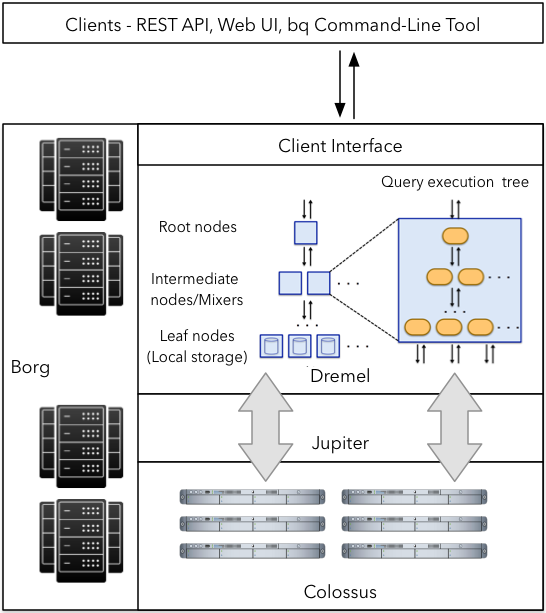
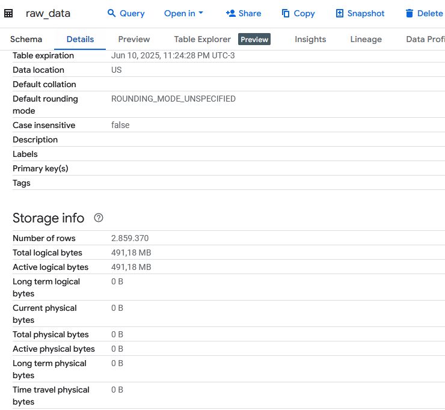
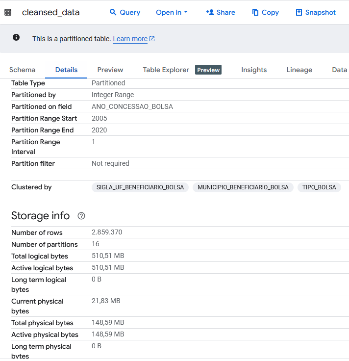
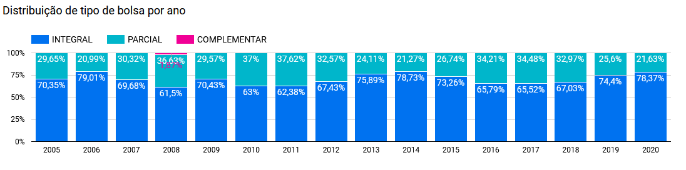
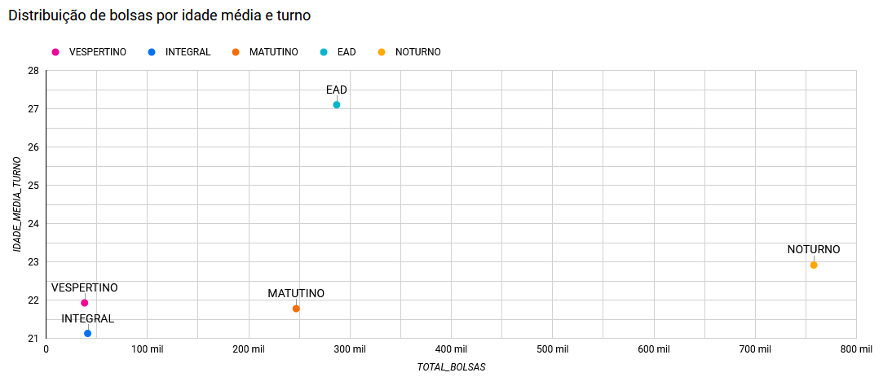

# Infraestrutura BigQuery

## Sumário
- [Conceitos Fundamentais do Google BigQuery](#conceitos-fundamentais-do-google-bigquery)
- [Arquitetura do Google BigQuery](#arquitetura-do-google-bigquery)
- [Exemplos de Uso em Bases SQL e NoSQL](#exemplos-de-uso-em-bases-sql-e-nosql)
- [Principais Benefícios do BigQuery](#principais-benefícios-do-bigquery)
- [Pipeline de Dados: Definição e Exemplos](#pipeline-de-dados-definição-e-exemplos)
- [Base de Dados Pública Brasileira](#base-de-dados-pública-brasileira)
- [Perguntas e Hipóteses sobre os Dados](#perguntas-e-hipóteses-sobre-os-dados)
- [Importação e Pré-processamento no BigQuery](#importação-e-pré-processamento-no-bigquery)
- [Pipeline de Processamento de Dados](#pipeline-de-processamento-de-dados)
- [Visualização e Análise dos Resultados](#visualização-e-análise-dos-resultados)
- [Conclusões e Validação das Hipóteses](#conclusões-e-validação-das-hipóteses)

## Conceitos Fundamentais do Google BigQuery

1. **Armazenamento Colunar**: O BigQuery organiza os dados em colunas ao invés de linhas, o que permite uma compressão mais eficiente e consultas mais rápidas quando apenas algumas colunas são necessárias para a análise.

2. **Separação Compute/Storage**: A arquitetura do BigQuery separa claramente o armazenamento (gerenciado pelo Google Cloud Storage) do processamento (executado nos servidores do Google), permitindo escalabilidade independente.

3. **SQL Dialeto Padrão**: Utiliza uma variação do SQL padrão (BigQuery SQL) que inclui extensões para análise de dados, tornando a curva de aprendizado suave para analistas familiarizados com SQL.

4. **Modelo de Cobrança por Uso**: Opera sob um modelo "pay-as-you-go" onde você paga apenas pelos dados armazenados e pelo processamento utilizado nas consultas, sem necessidade de provisionamento antecipado.

5. **Cache de Consultas**: Armazena automaticamente os resultados de consultas por ~24 horas, permitindo que execuções repetidas da mesma consulta retornem instantaneamente sem custos adicionais.

## Arquitetura do Google BigQuery

O BigQuery possui uma arquitetura distribuída que combina várias tecnologias do Google:

- **Dremel**: O mecanismo de execução de consultas que divide as operações em milhares de tarefas executadas em paralelo.
- **Colossus**: Sistema de armazenamento distribuído do Google que gerencia a persistência dos dados.
- **Borg**: Sistema de orquestração de containers que aloca recursos computacionais conforme demanda.
- **Jupiter**: Rede de alto desempenho que conecta storage e compute.



Os dados são particionados em "shards" e distribuídos pelos servidores do Google. Quando uma consulta é executada, o Dremel a decompõe em árvore de execução, onde cada nó folha processa uma parte dos dados e envia resultados parciais para os nós superiores até a consolidação final.

## Exemplos de Uso em Bases SQL e NoSQL

### Exemplo SQL (Consulta Tradicional)

```sql
-- Análise de vendas por região e produto
SELECT 
  region,
  product_category,
  SUM(sales_amount) as total_sales,
  COUNT(DISTINCT customer_id) as unique_customers
FROM 
  sales.sales_data
WHERE 
  date BETWEEN '2023-01-01' AND '2023-12-31'
GROUP BY 
  region, product_category
ORDER BY 
  total_sales DESC
LIMIT 100;
```

### Exemplo NoSQL (JSON semi-estruturado)

```sql
-- Análise de logs JSON armazenados no BigQuery
SELECT
  JSON_EXTRACT_SCALAR(log_entry, '$.user_id') as user_id,
  JSON_EXTRACT_SCALAR(log_entry, '$.event_type') as event_type,
  COUNT(*) as event_count
FROM 
  `project.dataset.app_logs`
WHERE 
  JSON_EXTRACT_SCALAR(log_entry, '$.timestamp') BETWEEN '20240101' AND '20240131'
GROUP BY 
  user_id, event_type
HAVING 
  event_count > 10;
```

## Principais Benefícios do BigQuery

1. **Escalabilidade Automática**: Capacidade de processar petabytes de dados sem necessidade de gerenciamento de infraestrutura.

2. **Desempenho**: Consultas complexas em grandes volumes de dados são executadas em segundos ou minutos.

3. **Integração com Ecossistema Google Cloud**: Conexão nativa com Google Sheets, Data Studio, Cloud Storage e outros serviços GCP.

4. **Machine Learning Integrado**: Possibilidade de criar e executar modelos de ML diretamente via SQL.

5. **Análise em Tempo Real**: Capacidade de ingerir e consultar dados em streaming.

6. **Segurança e Compliance**: Certificações de segurança líderes do setor e controles de acesso granulares.

## Pipeline de Dados: Definição e Exemplos

### O que é um Pipeline de Dados?

Um pipeline de dados é um conjunto de processos que movem, transformam e enriquecem dados de uma fonte para um destino, geralmente preparando-os para análise ou consumo. Inclui etapas como extração, transformação, validação, enriquecimento e carga (ETL/ELT).

### Exemplos de Aplicações no Dia-a-Dia

1. **Relatórios de Vendas Diários**:
   - Extração: Dados são coletados do sistema de PDV e CRM
   - Transformação: Cálculo de métricas como ticket médio, conversão
   - Carga: Dados são carregados no data warehouse
   - Visualização: Painéis atualizados automaticamente no Data Studio

2. **Monitoramento de Aplicações**:
   - Coleta: Logs de aplicações são ingeridos em tempo real
   - Processamento: Filtragem de eventos relevantes e cálculo de métricas
   - Armazenamento: Dados são persistidos no BigQuery
   - Alertas: Sistema notifica equipe sobre anomalias detectadas

## Base de Dados Pública Brasileira

### Dados do Programa Universidade para Todos (ProUni)

**Fonte**: [Dados Abertos do MEC](https://dadosabertos.mec.gov.br/prouni)

**Estrutura**:
- Formato: CSV (dados tabulares estruturados)
- Período: 2005-2020
- Tamanho: ~50MB (compactado), ~445MB descompactado
- Registros: ~2,87 milhões de bolsas concedidas
- Granularidade: cada registro corresponde a uma bolsa concedida
- Colunas principais:
  - `ANO_CONCESSAO_BOLSA`: Ano de concessão da bolsa
  - `CODIGO_EMEC_IES_BOLSA`: Código da Instituição de Ensino Superior
  - `NOME_IES_BOLSA`: Nome da instituição
  - `TIPO_BOLSA`: (Integral ou Parcial)
  - `MODALIDADE_ENSINO_BOLSA`: (Presencial ou EAD)
  - `NOME_CURSO_BOLSA`: Nome do curso da bolsa
  - `NOME_TURNO_CURSO_BOLSA`: Período do curso
  - `CPF_BENEFICIARIO_BOLSA`: CPF do beneficiário (anonimizado)
  - `SEXO_BENEFICIARIO_BOLSA`: Gênero do beneficiário
  - `RACA_BENEFICIARIO_BOLSA`: Raça/etnia declarada
  - `DT_NASCIMENTO_BENEFICIARIO`: Data de nascimento
  - `BENEFICIARIO_DEFICIENTE_FISICO`: Indicador de deficiência
  - `REGIAO_BENEFICIARIO_BOLSA`: Região do Brasil
  - `SIGLA_UF_BENEFICIARIO_BOLSA`: UF de residência
  - `MUNICIPIO_BENEFICIARIO_BOLSA`: Município de residência

## Perguntas e Hipóteses sobre os Dados

### Perguntas de Pesquisa

1. Como evoluiu a distribuição de bolsas por tipo (integral/parcial) ao longo dos anos?
2. Como é a distribuição da idade média por turno?

### Hipóteses

1. **Hipótese 1**: Bolsas integrais tornaram-se proporcionalmente mais comuns ao longo dos anos devido a mudanças nas políticas públicas.

2. **Hipótese 2**: Pessoas mais velhas tendem a ser bolsistas do turno noturno.

### Variável Derivada

Criarei a variável `TIPO_BOLSA_CATEGORIZADO` baseada no tipo de bolsa:

```sql
CASE
  WHEN TIPO_BOLSA LIKE '%PARCIAL%' THEN 'PARCIAL'
  WHEN TIPO_BOLSA LIKE '%COMPLEMENTAR%' THEN 'COMPLEMENTAR'
  WHEN TIPO_BOLSA LIKE '%INTEGRAL%' THEN 'INTEGRAL'
  ELSE 'OUTROS'
END AS TIPO_BOLSA_CATEGORIZADO,
```

## Importação e Pré-processamento no BigQuery

### source_to_raw

O arquivo [`source_to_raw.py`](./scripts/source_to_raw.py) cria Pandas DataFrames para cada arquivo `.csv`, realiza algumas tratativas e compatibilização de colunas, autentica na API do BigQuery e cria a tabela `raw_data` no dataset `PROUNI`, conforme abaixo:

```python
from google.cloud import bigquery
from google.oauth2 import service_account
import pandas as pd
import os
import time
from tqdm import tqdm  # Para barras de progresso

# Configurações
CREDENTIAL_PATH = "key.json"
DATASET_NAME = "PROUNI"
TABLE_NAME = "raw_data"
RAW_DATA_PATH = "../raw_data"

def print_header(title):
    """Imprime cabeçalho formatado"""
    print("\n" + "="*60)
    print(f" {title.upper()} ")
    print("="*60)

def authenticate_gcp(credential_path):
    """Autentica no GCP usando credenciais de service account"""
    print_header("1/4 - autenticação no gcp")
    print("🔑 Iniciando autenticação...")
    try:
        credentials = service_account.Credentials.from_service_account_file(
            credential_path,
            scopes=["https://www.googleapis.com/auth/cloud-platform"],
        )
        client = bigquery.Client(credentials=credentials, project=credentials.project_id)
        print("✅ Autenticação bem-sucedida!")
        return client
    except Exception as e:
        print(f"❌ Falha na autenticação: {str(e)}")
        raise

def create_dataset_if_not_exists(client, dataset_name):
    """Cria um dataset no BigQuery se ele não existir"""
    print_header("2/4 - verificação do dataset")
    dataset_ref = client.dataset(dataset_name)
    
    try:
        client.get_dataset(dataset_ref)
        print(f"ℹ️ Dataset {dataset_name} já existe")
    except Exception:
        print("⚠️ Dataset não encontrado. Criando novo dataset...")
        dataset = bigquery.Dataset(dataset_ref)
        dataset.location = "US"
        client.create_dataset(dataset)
        print(f"✅ Dataset {dataset_name} criado com sucesso")

def load_and_adjust(file_path):
    """Carrega e ajusta dados CSV forçando todas as colunas como strings"""
    print(f"\n📂 Processando arquivo: {os.path.basename(file_path)}")
    start_time = time.time()
    
    try:
        # Força todas as colunas como string desde a leitura
        df = pd.read_csv(file_path, encoding='iso-8859-1', sep=';', dtype=str)
        
        # Renomeia colunas
        rename_columns = {
            'ANO_CONCESSAO_BOLSA': 'ANO_CONCESSAO_BOLSA',
            'CPF_BENEFICIARIO': 'CPF_BENEFICIARIO_BOLSA',
            'SEXO_BENEFICIARIO': 'SEXO_BENEFICIARIO_BOLSA',
            'RACA_BENEFICIARIO': 'RACA_BENEFICIARIO_BOLSA',
            'DATA_NASCIMENTO': 'DT_NASCIMENTO_BENEFICIARIO',
            'REGIAO_BENEFICIARIO': 'REGIAO_BENEFICIARIO_BOLSA',
            'UF_BENEFICIARIO': 'SIGLA_UF_BENEFICIARIO_BOLSA',
            'MUNICIPIO_BENEFICIARIO': 'MUNICIPIO_BENEFICIARIO_BOLSA'
        }
        
        df = df.rename(columns=rename_columns)
        
        # Seleciona colunas comuns
        common_columns = [
            'ANO_CONCESSAO_BOLSA', 'CODIGO_EMEC_IES_BOLSA', 'NOME_IES_BOLSA',
            'TIPO_BOLSA', 'MODALIDADE_ENSINO_BOLSA', 'NOME_CURSO_BOLSA',
            'NOME_TURNO_CURSO_BOLSA', 'CPF_BENEFICIARIO_BOLSA',
            'SEXO_BENEFICIARIO_BOLSA', 'RACA_BENEFICIARIO_BOLSA',
            'DT_NASCIMENTO_BENEFICIARIO', 'BENEFICIARIO_DEFICIENTE_FISICO',
            'REGIAO_BENEFICIARIO_BOLSA', 'SIGLA_UF_BENEFICIARIO_BOLSA',
            'MUNICIPIO_BENEFICIARIO_BOLSA'
        ]
        
        # Mantém apenas colunas comuns que existem no DataFrame
        df = df[[col for col in common_columns if col in df.columns]]
        
        # Tratamento de dados
        print("🛠️ Aplicando transformações:")
        print("- Substituindo 'nan' por valores nulos")
        df = df.replace('nan', pd.NA)
        
        print("- Removendo linhas completamente vazias")
        initial_rows = len(df)
        df = df.dropna(how='all')
        removed_rows = initial_rows - len(df)
        
        elapsed_time = time.time() - start_time
        print(f"✅ Arquivo processado em {elapsed_time:.2f}s | Linhas: {len(df):,} | Linhas removidas: {removed_rows:,}")
        
        return df
    except Exception as e:
        print(f"❌ Erro ao processar arquivo {file_path}: {str(e)}")
        raise

def create_table_from_dataframe(client, dataset_name, table_name, df):
    """Cria ou substitui uma tabela no BigQuery com todos os campos como STRING"""
    print_header("4/4 - carregamento no bigquery")
    
    dataset_ref = client.dataset(dataset_name)
    table_ref = dataset_ref.table(table_name)
    
    # Configuração do job
    job_config = bigquery.LoadJobConfig(
        schema=[bigquery.SchemaField(name, "STRING") for name in df.columns],
        write_disposition=bigquery.WriteDisposition.WRITE_TRUNCATE,
        autodetect=False
    )
    
    try:
        client.get_table(table_ref)
        print(f"ℹ️ Tabela {table_name} já existente. Será sobrescrita.")
    except Exception:
        print(f"ℹ️ Criando nova tabela {table_name}")
    
    # Faz upload do DataFrame para o BigQuery
    print(f"🚀 Enviando {len(df):,} linhas para o BigQuery...")
    start_time = time.time()
    
    job = client.load_table_from_dataframe(df, table_ref, job_config=job_config)
    
    # Barra de progresso simulada
    with tqdm(total=100, desc="Progresso") as pbar:
        while not job.done():
            time.sleep(1)
            pbar.update(10)
    
    job.result()  # Aguarda a conclusão final
    
    elapsed_time = time.time() - start_time
    print(f"\n✅ Carga concluída em {elapsed_time:.2f}s")
    print(f"📊 Estatísticas finais:")
    print(f"- Linhas carregadas: {job.output_rows:,}")
    print(f"- Tabela: {dataset_name}.{table_name}")

def main():
    try:
        print_header("início do processo source_to_raw")
        start_time = time.time()
        
        # Autentica no GCP
        client = authenticate_gcp(CREDENTIAL_PATH)
        
        # Cria o dataset se não existir
        create_dataset_if_not_exists(client, DATASET_NAME)
        
        # Carrega e processa dados de todos os arquivos CSV
        print_header("3/4 - processamento dos arquivos")
        files = [os.path.join(RAW_DATA_PATH, f'pda-prouni-{year}.csv') for year in range(2005, 2020 + 1)]
        
        # Filtra apenas arquivos que realmente existem
        existing_files = [file for file in files if os.path.exists(file)]
        if not existing_files:
            raise FileNotFoundError(f"Nenhum arquivo CSV encontrado em {RAW_DATA_PATH}")
        
        print(f"🔍 Encontrados {len(existing_files)} arquivos para processar:")
        for file in existing_files:
            print(f"- {os.path.basename(file)}")
        
        # Processa arquivos com barra de progresso
        dfs = []
        for file in tqdm(existing_files, desc="Processando arquivos"):
            dfs.append(load_and_adjust(file))
        
        # Combina os DataFrames
        print("\n🔗 Combinando todos os DataFrames...")
        combined_df = pd.concat(dfs, ignore_index=True)
        
        # Garante que todos os dados sejam strings
        combined_df = combined_df.astype(str)
        
        # Cria/atualiza a tabela no BigQuery
        create_table_from_dataframe(client, DATASET_NAME, TABLE_NAME, combined_df)
        
        elapsed_time = time.time() - start_time
        print_header("processo concluído com sucesso")
        print(f"⏱ Tempo total: {elapsed_time:.2f} segundos")
        print(f"📈 Total de linhas processadas: {len(combined_df):,}")
        
    except Exception as e:
        print_header("erro no processamento")
        print(f"❌ Ocorreu um erro: {str(e)}")
        raise

if __name__ == "__main__":
    main()
```

Evidência:



### raw_to_cleansed

Já o arquivo [`raw_to_cleansed.py`](./scripts/raw_to_cleansed.py) cria a tabela pré-processada com as tipagens atribuídas, clusterização e particionamento, bem como a variável derivada citada anteriormente:

```python
from google.cloud import bigquery
from google.oauth2 import service_account
import time

CREDENTIAL_PATH = "key.json"  # Substitua pelo caminho do seu arquivo de credenciais
DATASET_NAME = "PROUNI"
SOURCE_TABLE_NAME = "raw_data"
OUTPUT_TABLE_NAME = "cleansed_data"

def authenticate_gcp(credential_path):
    """Autentica no GCP usando credenciais de service account"""
    print("\n[1/4] Iniciando autenticação no GCP...")
    try:
        credentials = service_account.Credentials.from_service_account_file(
            credential_path,
            scopes=["https://www.googleapis.com/auth/cloud-platform"],
        )
        client = bigquery.Client(credentials=credentials, project=credentials.project_id)
        print("✅ Autenticação bem-sucedida!")
        return client
    except Exception as e:
        print(f"❌ Falha na autenticação: {str(e)}")
        raise

def check_table_exists(client, dataset_name, table_name):
    """Verifica se uma tabela existe no BigQuery"""
    print(f"\nVerificando existência da tabela {dataset_name}.{table_name}...")
    try:
        table_ref = client.dataset(dataset_name).table(table_name)
        table = client.get_table(table_ref)
        print(f"ℹ️ Tabela encontrada com {table.num_rows} linhas e {len(table.schema)} colunas")
        return True
    except Exception as e:
        print(f"⚠️ Tabela não encontrada: {str(e)}")
        return False

def execute_raw_to_cleansed_transformation(client):
    """Executa a transformação de raw para cleansed usando a query SQL"""
    print("\n[2/4] Preparando transformação de dados...")
    
    # Verifica se a tabela de origem existe
    if not check_table_exists(client, DATASET_NAME, SOURCE_TABLE_NAME):
        raise Exception(f"Tabela de origem {SOURCE_TABLE_NAME} não encontrada!")
    
    print("\n[3/4] Executando transformação...")
    print("🔧 Operações que serão realizadas:")
    print("- Converter tipos de dados (datas, números)")
    print("- Particionar por ANO_CONCESSAO_BOLSA (2005-2020)")
    print("- Clusterizar por UF, Município e Tipo de Bolsa")
    print("- Adicionar coluna TIPO_BOLSA_CATEGORIZADO (parcial, complementar ou integral)")
    
    start_time = time.time()
    
    # Query SQL para transformação
    query = f"""
    CREATE OR REPLACE TABLE `{client.project}.{DATASET_NAME}.{OUTPUT_TABLE_NAME}`
    PARTITION BY RANGE_BUCKET(ANO_CONCESSAO_BOLSA, GENERATE_ARRAY(2005, 2020, 1))
    CLUSTER BY SIGLA_UF_BENEFICIARIO_BOLSA, MUNICIPIO_BENEFICIARIO_BOLSA, TIPO_BOLSA
    AS
    SELECT
      SAFE_CAST(ANO_CONCESSAO_BOLSA AS INT64) AS ANO_CONCESSAO_BOLSA,
      SAFE_CAST(CODIGO_EMEC_IES_BOLSA AS INT64) AS CODIGO_EMEC_IES_BOLSA,
      
      NOME_IES_BOLSA,
      TIPO_BOLSA,
      CASE
        WHEN TIPO_BOLSA LIKE '%PARCIAL%' THEN 'PARCIAL'
        WHEN TIPO_BOLSA LIKE '%COMPLEMENTAR%' THEN 'COMPLEMENTAR'
        WHEN TIPO_BOLSA LIKE '%INTEGRAL%' THEN 'INTEGRAL'
        ELSE 'OUTROS'
      END AS TIPO_BOLSA_CATEGORIZADO,
      CASE
        WHEN UPPER(MODALIDADE_ENSINO_BOLSA) LIKE '%DISTÂNCIA%' THEN 'EAD'
        ELSE UPPER(MODALIDADE_ENSINO_BOLSA)
      END AS MODALIDADE_ENSINO_BOLSA,
      NOME_CURSO_BOLSA,
      CASE
        WHEN UPPER(NOME_TURNO_CURSO_BOLSA) LIKE '%CURSO%' THEN 'EAD'
        ELSE UPPER(NOME_TURNO_CURSO_BOLSA)
      END AS NOME_TURNO_CURSO_BOLSA,
      CPF_BENEFICIARIO_BOLSA,
      CASE 
        WHEN UPPER(SEXO_BENEFICIARIO_BOLSA) IN ('MASCULINO', 'M') THEN 'M'
        WHEN UPPER(SEXO_BENEFICIARIO_BOLSA) IN ('FEMININO', 'F') THEN 'F'
        ELSE NULL
      END AS SEXO_BENEFICIARIO_BOLSA,
      CASE
        WHEN UPPER(RACA_BENEFICIARIO_BOLSA) LIKE '%INFO%' THEN NULL
        WHEN UPPER(RACA_BENEFICIARIO_BOLSA) LIKE 'IND%' THEN 'INDÍGENA'
        ELSE UPPER(RACA_BENEFICIARIO_BOLSA)
      END AS RACA_BENEFICIARIO_BOLSA,
      
      SAFE.PARSE_DATE('%d/%m/%Y', DT_NASCIMENTO_BENEFICIARIO) AS DT_NASCIMENTO_BENEFICIARIO,

      CASE 
        WHEN UPPER(BENEFICIARIO_DEFICIENTE_FISICO) IN ('SIM', 'S') THEN TRUE
        WHEN UPPER(BENEFICIARIO_DEFICIENTE_FISICO) IN ('NÃO', 'N') THEN FALSE
        ELSE NULL
      END AS BENEFICIARIO_DEFICIENTE_FISICO,
      NULLIF(UPPER(REGIAO_BENEFICIARIO_BOLSA), 'NAN') AS REGIAO_BENEFICIARIO_BOLSA,
      NULLIF(SIGLA_UF_BENEFICIARIO_BOLSA, 'nan') AS SIGLA_UF_BENEFICIARIO_BOLSA,
      NULLIF(MUNICIPIO_BENEFICIARIO_BOLSA, 'nan') AS MUNICIPIO_BENEFICIARIO_BOLSA
    FROM `{client.project}.{DATASET_NAME}.{SOURCE_TABLE_NAME}`
    """
    
    # Configuração do job
    job_config = bigquery.QueryJobConfig()
    job_config.use_legacy_sql = False
    
    # Executa a query
    print("\n🚀 Iniciando execução da query no BigQuery...")
    query_job = client.query(query, job_config=job_config)
    
    query_job.result()  # Aguarda a conclusão final
    
    elapsed_time = time.time() - start_time
    print(f"\n✅ Transformação concluída em {elapsed_time:.2f} segundos!")
    
    # Verifica estatísticas da tabela resultante
    print("\n[4/4] Verificando tabela resultante...")
    table_ref = client.dataset(DATASET_NAME).table(OUTPUT_TABLE_NAME)
    table = client.get_table(table_ref)
    
    print(f"\n📊 Resultado final:")
    print(f"- Tabela: {DATASET_NAME}.{table.table_id}")
    print(f"- Linhas processadas: {table.num_rows:,}")
    print(f"- Colunas criadas: {len(table.schema)}")
    print(f"- Tamanho: {table.num_bytes/1e6:.2f} MB")
    print(f"- Partições: Por ANO_CONCESSAO_BOLSA (2005-2020)")
    print(f"- Clusterização: Por UF, Município e Tipo de Bolsa")

def main():
    print("\n" + "="*50)
    print(" INÍCIO DO PROCESSO RAW_TO_CLEANSED ")
    print("="*50)
    
    try:
        # Autentica no GCP
        client = authenticate_gcp(CREDENTIAL_PATH)
        
        # Executa a transformação
        execute_raw_to_cleansed_transformation(client)
        
        print("\n" + "="*50)
        print(" PROCESSO CONCLUÍDO COM SUCESSO! ")
        print("="*50)
    except Exception as e:
        print("\n" + "="*50)
        print("❌ ERRO NO PROCESSAMENTO")
        print(f"Motivo: {str(e)}")
        print("="*50)
        raise

if __name__ == "__main__":
    main()
```

Evidência:



## Pipeline de Processamento de Dados

O pipeline é executado da seguinte forma:

- Primeiramente, os dados devem ser baixados manualmente a partir do portal do ProUni.  
- Em seguida, é necessário tornar o script do pipeline executável com o comando: `chmod +x run_pipeline.sh`.  
- Por fim, a execução do pipeline é iniciada com o comando `bash run_pipeline.sh`, que realiza as etapas descritas a seguir:

```bash
#!/bin/bash

# Executa a instalação das dependências
echo "Instalando dependências do requirements.txt..."
pip install -r requirements.txt

if [ $? -ne 0 ]; then
    echo "Falha na instalação das dependências. Verifique o arquivo requirements.txt."
    exit 1
fi

# Executa o script source_to_raw.py
echo "Executando source_to_raw.py..."
python source_to_raw.py

if [ $? -ne 0 ]; then
    echo "Falha na execução de source_to_raw.py."
    exit 1
fi

# Executa o script raw_to_cleansed.py
echo "Executando raw_to_cleansed.py..."
python raw_to_cleansed.py

if [ $? -ne 0 ]; then
    echo "Falha na execução de raw_to_cleansed.py."
    exit 1
fi

# Executa o script cleansed_to_csv.py
echo "Executando cleansed_to_csv.py..."
python cleansed_to_csv.py

if [ $? -ne 0 ]; then
    echo "Falha na execução de cleansed_to_csv.py."
    exit 1
fi

echo "Pipeline executado com sucesso!"
```

A etapa de exportação consulta a tabela `cleansed_data` do dataset `PROUNI` e exporta os dados para a pasta `/output`, conforme abaixo:

```python
from google.cloud import bigquery
from google.cloud import storage
from google.oauth2 import service_account
import os
import time

CREDENTIAL_PATH = "key.json"  # Caminho do arquivo de credenciais
DATASET_NAME = "PROUNI"
TABLE_NAME = "cleansed_data"
OUTPUT_DIR = "../output"
OUTPUT_FILE = "prouni_cleansed_data.csv"
BUCKET_NAME = None  # Será definido dinamicamente

def authenticate_gcp(credential_path):
    """Autentica no GCP usando credenciais de service account"""
    print("\n[1/4] Iniciando autenticação no GCP...")
    try:
        credentials = service_account.Credentials.from_service_account_file(
            credential_path,
            scopes=["https://www.googleapis.com/auth/cloud-platform"],
        )
        client = bigquery.Client(credentials=credentials, project=credentials.project_id)
        print("✅ Autenticação bem-sucedida!")
        return client
    except Exception as e:
        print(f"❌ Falha na autenticação: {str(e)}")
        raise

def check_table_exists(client, dataset_name, table_name):
    """Verifica se a tabela existe no BigQuery"""
    print(f"\n[2/4] Verificando existência da tabela {dataset_name}.{table_name}...")
    try:
        table_ref = client.dataset(dataset_name).table(table_name)
        table = client.get_table(table_ref)
        print(f"ℹ️ Tabela encontrada com {table.num_rows} linhas e {len(table.schema)} colunas")
        return True
    except Exception as e:
        print(f"⚠️ Tabela não encontrada: {str(e)}")
        return False

def ensure_gcs_bucket_exists(storage_client, bucket_name):
    """Verifica se o bucket existe no GCS, criando-o se necessário"""
    print(f"\n[3/4] Verificando bucket GCS {bucket_name}...")
    try:
        bucket = storage_client.bucket(bucket_name)
        if not bucket.exists():
            print(f"Bucket não encontrado. Criando novo bucket: {bucket_name}")
            bucket.create(location="US")  # Cria o bucket na região US
            print(f"✅ Bucket criado com sucesso!")
        else:
            print(f"ℹ️ Bucket encontrado: {bucket_name}")
        return bucket
    except Exception as e:
        print(f"❌ Falha ao verificar/criar bucket: {str(e)}")
        raise

def export_table_to_csv(client):
    """Exporta a tabela do BigQuery para um arquivo CSV"""
    print("\n[4/4] Iniciando exportação para CSV...")
    
    # Verifica se a tabela existe
    if not check_table_exists(client, DATASET_NAME, TABLE_NAME):
        raise Exception(f"Tabela {TABLE_NAME} não encontrada!")
    
    # Cria o diretório de output se não existir
    os.makedirs(OUTPUT_DIR, exist_ok=True)
    output_path = os.path.join(OUTPUT_DIR, OUTPUT_FILE)
    
    # Configuração da exportação
    dataset_ref = client.dataset(DATASET_NAME)
    table_ref = dataset_ref.table(TABLE_NAME)
    
    # Configura o nome do bucket temporário
    global BUCKET_NAME
    BUCKET_NAME = f"{client.project}-temp-exports"
    
    # Autentica no GCS e verifica o bucket
    storage_client = storage.Client.from_service_account_json(CREDENTIAL_PATH)
    bucket = ensure_gcs_bucket_exists(storage_client, BUCKET_NAME)
    
    print(f"\n📤 Exportando dados para {output_path}...")
    start_time = time.time()
    
    # Configura o job de exportação
    job_config = bigquery.ExtractJobConfig()
    job_config.destination_format = bigquery.DestinationFormat.CSV
    job_config.print_header = True
    
    # URI temporário no Google Cloud Storage
    destination_uri = f"gs://{BUCKET_NAME}/temp_export.csv"
    
    # Exporta para o GCS
    extract_job = client.extract_table(
        table_ref,
        destination_uri,
        job_config=job_config,
        location="US"  # Ajuste conforme a localização do seu dataset
    )
    extract_job.result()  # Aguarda a conclusão
    
    # Baixa do GCS para o sistema local
    blob = bucket.blob("temp_export.csv")
    blob.download_to_filename(output_path)
    
    # Limpa o arquivo temporário
    blob.delete()
    
    elapsed_time = time.time() - start_time
    file_size = os.path.getsize(output_path) / (1024 * 1024)  # Tamanho em MB
    
    print(f"\n✅ Exportação concluída com sucesso!")
    print(f"- Arquivo gerado: {output_path}")
    print(f"- Tamanho do arquivo: {file_size:.2f} MB")
    print(f"- Tempo total: {elapsed_time:.2f} segundos")

def main():
    print("\n" + "="*50)
    print(" EXPORTAÇÃO CLEANSED_DATA PARA CSV ")
    print("="*50)
    
    try:
        # Autentica no GCP
        client = authenticate_gcp(CREDENTIAL_PATH)
        
        # Exporta a tabela para CSV
        export_table_to_csv(client)
        
        print("\n" + "="*50)
        print(" PROCESSO CONCLUÍDO COM SUCESSO! ")
        print("="*50)
    except Exception as e:
        print("\n" + "="*50)
        print("❌ ERRO NA EXPORTAÇÃO")
        print(f"Motivo: {str(e)}")
        print("="*50)
        raise

if __name__ == "__main__":
    main()
```

## Visualização e Análise dos Resultados

### Gráfico de Barras: Evolução de Bolsas por Tipo

Para este gráfico, realizei a conexão via Looker Studio e manipulei as dimensões e as métricas.



*Figura 1: Proporção de bolsas integrais vs. parciais por ano*

### Gráfico de Dispersão: Distribuição por Idade Média e Turno

Para este gráfico, realizei a conexão via Looker Studio e criei uma fonte de dados com a consulta abaixo:

```sql
SELECT
  NOME_TURNO_CURSO_BOLSA,
  AVG(DATE_DIFF(DATE(ANO_CONCESSAO_BOLSA, 7, 1), DT_NASCIMENTO_BENEFICIARIO, YEAR)) AS IDADE_MEDIA_TURNO,
  COUNT(*) AS TOTAL_BOLSAS
FROM `bigquery-mb-456318.PROUNI.cleansed_data`
WHERE DT_NASCIMENTO_BENEFICIARIO IS NOT NULL
  AND ANO_CONCESSAO_BOLSA IS NOT NULL
GROUP BY NOME_TURNO_CURSO_BOLSA
```



*Figura 2: Distribuição da idade média dos bolsistas por turno*

## Conclusões e Validação das Hipóteses

### Respostas às Perguntas

1. **Evolução das bolsas**: A proporção de bolsas integrais oferecidas variou entre pouco mais de 60% e pouco menos de 80% ao longo dos anos, sem apresentar um padrão consistente de crescimento ou queda.

2. **Distribuição da idade média por turno**: A análise revela três grandes agrupamentos:
   - **Integral, matutino e vespertino**: idade média entre 21 e 22 anos.
   - **Noturno**: idade média de aproximadamente 23 anos.
   - **EAD**: idade média significativamente maior, em torno de 27 anos.

### Validação das Hipóteses

1. **Hipótese 1**: **Parcialmente confirmada**. Embora tenha havido um aumento na proporção de bolsas integrais entre 2016 (65,52%) e 2020 (78,37%), essa tendência não se mantém de forma consistente ao longo de toda a série temporal, com variações entre anos que indicam um comportamento irregular.

2. **Hipótese 2**: **Parcialmente confirmada**. Quando desconsideramos o EAD como um turno convencional, observa-se que o turno noturno apresenta, de fato, a maior idade média (22,91 anos), corroborando parcialmente a hipótese proposta.