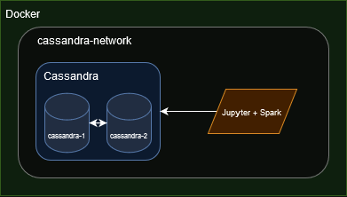
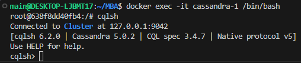
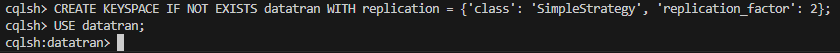
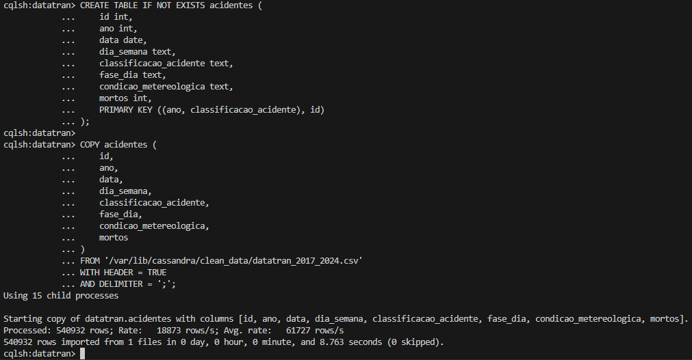
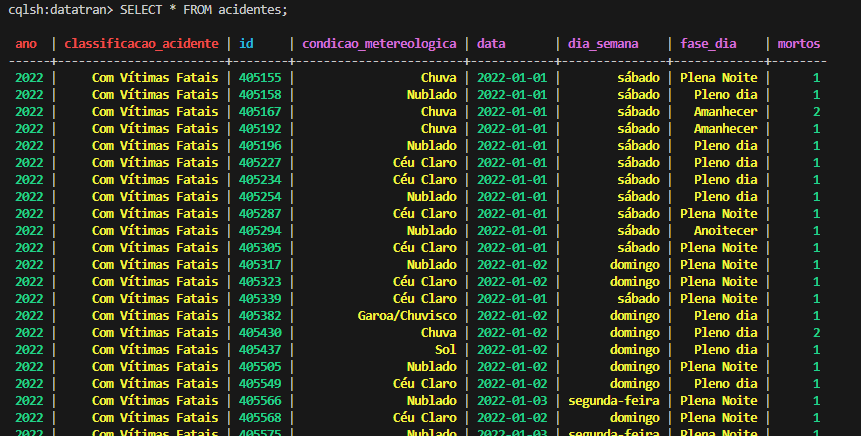
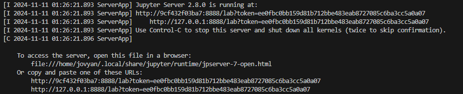
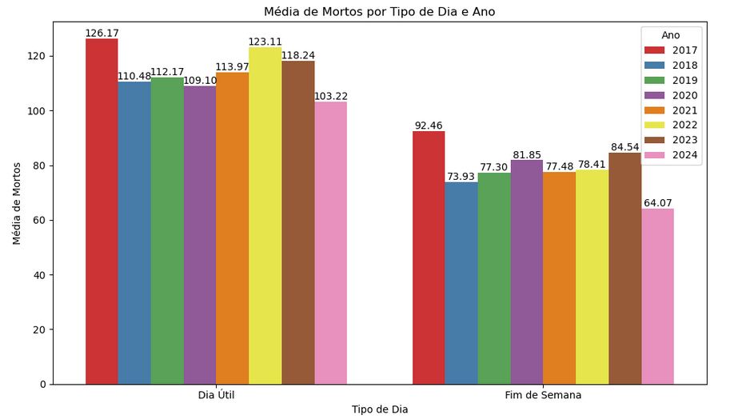
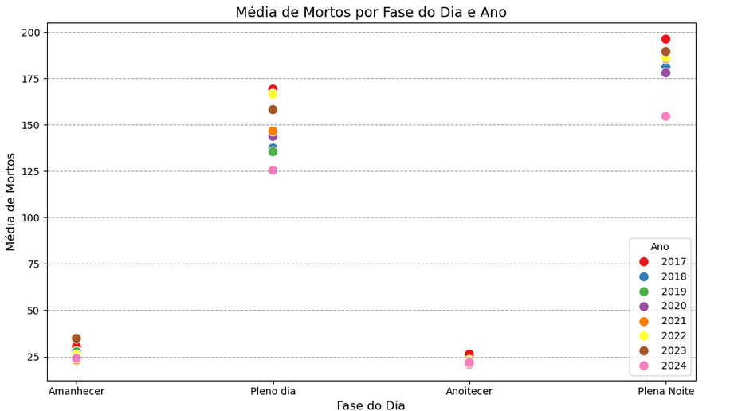
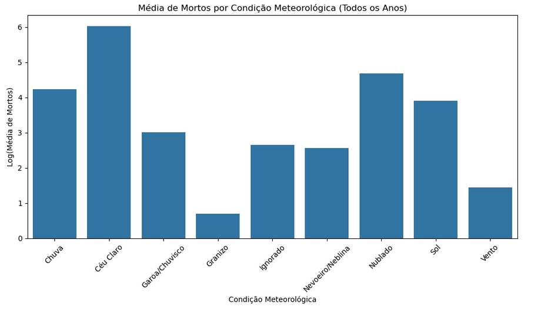

# Infraestrutura Cassandra

## SQL e NoSQL, definições e exemplos de uso

Para entender as diferenças entre bases de dados SQL e NoSQL, pense no tipo de dados que você vai trabalhar e em como esses dados podem mudar com o tempo.

**Bases de dados SQL** são como um arquivo organizado em tabelas, onde cada linha é um registro e cada coluna representa uma característica daquele registro. Pense em uma planilha super organizada, onde qualquer alteração na estrutura exige um cuidado grande para não bagunçar o conteúdo.
Esse tipo de banco de dados é ótimo para situações que exigem um controle rígido sobre as informações e onde a precisão é essencial. Por exemplo, no setor financeiro e em sistemas de ERP, os dados precisam estar bem estruturados e consistentes o tempo todo.

Alguns bancos de dados SQL bem conhecidos são o `MySQL`, o `PostgreSQL` e o `Oracle`.

**Bases de dados NoSQL** são uma alternativa para quando os dados não se encaixam tão bem em uma estrutura fixa. Em vez de trabalhar com tabelas, elas são mais flexíveis e permitem que a estrutura dos dados evolua conforme a necessidade. Esse tipo de banco é ótimo para aplicações que lidam com grandes volumes de dados ou com dados que mudam frequentemente. Existem quatro tipos principais de bancos NoSQL, cada um pensado para um tipo específico de dados:

- **Documentos**: Aqui, os dados são armazenados em documentos, geralmente no formato JSON. `MongoDB` é um dos mais populares e permite que você mude a estrutura dos documentos com facilidade. É ótimo para aplicações web, que muitas vezes têm dados semi-estruturados e precisam de flexibilidade para evoluir rapidamente.

- **Colunar**: Armazena dados em colunas, o que permite uma compressão eficiente e consultas rápidas para grandes volumes de dados. `Cassandra` é um exemplo muito usado, especialmente para redes sociais e sistemas de streaming, que precisam processar e analisar grandes quantidades de dados o tempo todo.

- **Chave-Valor**: Simples e direto, esse tipo de banco armazena pares de chave e valor, funcionando como um grande dicionário. O `Redis`, por exemplo, é ótimo para armazenar dados temporários, como sessões de usuário, já que permite buscas super rápidas.

- **Grafos**: Esse tipo de banco é usado para representar relações complexas entre dados, como em uma rede social, onde cada pessoa pode estar conectada a várias outras. `Neo4j` é um exemplo clássico de banco de grafos, ideal para aplicações com redes complexas de dados.

Resumindo, bases SQL são ideais para quando você precisa de consistência e estrutura, enquanto bases NoSQL são melhores para dados flexíveis e grandes volumes que podem mudar rapidamente. `MongoDB` e `Cassandra` são bons exemplos de NoSQL que oferecem essa flexibilidade e escalabilidade, tornando-se ótimos para aplicações que precisam crescer e se adaptar rapidamente. No fim, a escolha entre SQL e NoSQL depende muito do tipo de dados que você vai trabalhar e da necessidade de flexibilidade e escalabilidade da sua aplicação.


## Base de dados pública brasileira

### Caracterização geral
Para este trabalho, optei pela utilização do dataset que contém registros de acidentes ocorridos nas rodovias federais brasileiras, coletados pela Polícia Rodoviária Federal (PRF). Os dados são provenientes do sistema de registro de acidentes implementado a partir de janeiro de 2017, cobrindo aproximadamente 70.000 km de rodovias federais em todo o território nacional. 

### Estrutura dos Dados
O dataset contém 30 variáveis principais, incluindo:
- Informações Temporais
    - Data da ocorrência
    - Dia da semana
    - Horário
    - Fase do dia (amanhecer, pleno dia, etc.)

- Localização
    - UF
    - BR (número da rodovia)
    - Km
    - Município
    - Latitude/Longitude
    - Informações regionais (Regional, Delegacia, UOP)

- Características do Acidente
    - Causa do acidente
    - Tipo do acidente (colisão frontal, saída de pista, etc.)
    - Classificação quanto à gravidade
    - Condição meteorológica
    - Tipo de pista
    - Traçado da via
    - Uso do solo (urbano/rural)

- Métricas de Impacto
    - Total de pessoas envolvidas
    - Número de mortos
    - Feridos (leves e graves)
    - Ilesos
    - Total de veículos envolvidos

### Fonte
Os dados podem ser encontrados no site https://www.gov.br/prf/pt-br/acesso-a-informacao/dados-abertos/dados-abertos-da-prf.<br>
Utilizaremos os arquivos de acidentes agrupados por ocorrência, de 2017 a 2024.


## Estrutura Cassandra
Para a solução proposta, optei pelo uso de um cluster de Cassandra com duas máquinas configuradas como nós, interligadas entre si como seeds. Essa configuração garante alta disponibilidade e redundância para o banco de dados distribuído, permitindo que, em caso de falha de um nó, o sistema continue funcionando sem comprometimento de dados. O uso de duas máquinas como seeds proporciona um processo de descoberta mais eficiente e robusto dentro do cluster.

Além disso, o cluster de Cassandra está operando na mesma rede, `cassandra-network` que um container que hospeda ambientes Jupyter e Spark. Este container será utilizado para realizar extrações e análises de dados. A integração entre Cassandra, Spark e Jupyter permite executar consultas de maneira distribuída e analisar grandes volumes de dados com escalabilidade e eficiência.



## Transformando os dados para ingestão
Considerando que os dados estão separados em arquivos anuais e contêm muitas colunas que não serão utilizadas na análise final, optei por elaborar um script que 1) consolida todos os anos e 2) elimina as colunas que não serão utilizadas e 3) cria uma coluna `ano` que será utilizada no processo.

O script está contido no arquivo [transform_to_ingest.py](./transform_to_ingest.py).

```python
import csv
import glob
import os
from datetime import datetime

# Diretório onde os arquivos estão localizados
file_path = './raw_data/datatran_*.csv'

# Nome do arquivo de saída consolidado e diretório
output_dir = "./clean_data"
output_file = os.path.join(output_dir, "datatran_2017_2024.csv")

# Cria o diretório se não existir
os.makedirs(output_dir, exist_ok=True)

# Colunas para manter no arquivo de saída
columns_to_use = [
    "id", "data_inversa", "dia_semana", "classificacao_acidente", 
    "fase_dia", "condicao_metereologica", "mortos"
]
output_columns = ["id", "ano", "data", "dia_semana", "classificacao_acidente", "fase_dia", "condicao_metereologica", "mortos"]

# Função para extrair o ano da data
def extract_year(date_str):
    try:
        return datetime.strptime(date_str, "%Y-%m-%d").year
    except ValueError:
        return None

# Função para converter valores para inteiro, incluindo notação científica
def to_int(value):
    try:
        return int(float(value))
    except (ValueError, TypeError):
        return None  # Retorna None se o valor não puder ser convertido

# Abre o arquivo de saída para escrita
with open(output_file, mode="w", newline="", encoding="utf-8") as out_csv:
    writer = csv.writer(out_csv, delimiter=";")
    
    # Escreve o cabeçalho no arquivo de saída
    writer.writerow(output_columns)
    
    # Loop pelos arquivos de entrada
    for file in glob.glob(file_path):
        # Abre cada arquivo CSV para leitura
        with open(file, mode="r", encoding="iso-8859-1") as in_csv:
            reader = csv.DictReader(in_csv, delimiter=";")
            
            # Verifica se todas as colunas necessárias estão presentes
            if not all(col in reader.fieldnames for col in columns_to_use):
                print(f"Arquivo {file} não possui as colunas necessárias. Pulando...")
                continue
            
            # Processa cada linha do arquivo
            for row in reader:
                # Extração do ano e substituição do nome da coluna
                ano = extract_year(row["data_inversa"])
                
                if ano is not None:
                    # Cria uma nova linha com o schema final, convertendo 'id' e 'mortos' para inteiros
                    output_row = [
                        to_int(row["id"]),
                        ano,
                        row["data_inversa"],
                        row["dia_semana"],
                        row["classificacao_acidente"],
                        row["fase_dia"],
                        row["condicao_metereologica"],
                        to_int(row["mortos"])
                    ]
                    
                    writer.writerow(output_row)

print(f"Arquivo consolidado gerado com sucesso: {output_file}")
```

## Provisionando o ambiente local

O script abaixo, também encontrado [aqui](./docker-compose.yml), é responsável pelo provisionamento do ambiente local.

```docker
services:
  cassandra-1:
    image: cassandra:latest
    container_name: cassandra-1
    ports:
      - "9042:9042"
    environment:
      - CASSANDRA_CLUSTER_NAME=Cluster
      - CASSANDRA_SEEDS=cassandra-1,cassandra-2
      - CASSANDRA_DC=dc
      - CASSANDRA_RACK=rack
    volumes:
      - ./clean_data:/var/lib/cassandra/clean_data
    healthcheck:
      test: ["CMD", "cqlsh", "-e", "describe keyspaces"]
      interval: 15s
      timeout: 10s
      retries: 10
    networks:
      - cassandra-network

  cassandra-2:
    image: cassandra:latest
    container_name: cassandra-2
    environment:
      - CASSANDRA_CLUSTER_NAME=Cluster
      - CASSANDRA_SEEDS=cassandra-1,cassandra-2
      - CASSANDRA_DC=dc
      - CASSANDRA_RACK=rack
    depends_on:
      - cassandra-1
    networks:
      - cassandra-network

  jupyter:
    image: jupyter/pyspark-notebook:latest
    container_name: jupyter-spark
    user: root
    ports:
      - "8888:8888"
      - "4040:4040"
    environment:
      - JUPYTER_ENABLE_LAB=yes
    volumes:
      - ./notebooks:/home/jovyan/work/notebooks
      - ./output:/output
    depends_on:
      - cassandra-1
      - cassandra-2
    networks:
      - cassandra-network

networks:
  cassandra-network:
    driver: bridge
```

Executaremos o comando abaixo para criar o ambiente:
```bash
docker compose up -d
```

## Ingerindo os dados no Cassandra

Com o ambiente Docker executando, iremos conectado ao container `cassandra-1` através do comando abaixo:

```bash
docker exec -it cassandra-1 /bin/bash
```

A partir disso, vamos utilizar o `cqlsh` para interagir com o Cassandra:

```bash
cqlsh
```



Criaremos e utilizaremos um keyspace com nome `datatran` e com fator de replicação 2, por termos dois containers:

```sql
CREATE KEYSPACE IF NOT EXISTS datatran WITH replication = {'class': 'SimpleStrategy', 'replication_factor': 2};
USE datatran;
```



Para criar a tabela e ingerir os dados, executamos os comandos abaixo:

```sql
CREATE TABLE IF NOT EXISTS acidentes (
    id int,
    ano int,
    data date,
    dia_semana text,
    classificacao_acidente text,
    fase_dia text,
    condicao_metereologica text,
    mortos int,
    PRIMARY KEY ((ano, classificacao_acidente), id)
);

COPY acidentes (
    id,
    ano,
    data,
    dia_semana,
    classificacao_acidente,
    fase_dia,
    condicao_metereologica,
    mortos
) 
FROM '/var/lib/cassandra/clean_data/datatran_2017_2024.csv' 
WITH HEADER = TRUE
AND DELIMITER = ';';
```



O que resulta na tabela populada com os dados:




## Configuração do ambiente Spark e conexão com o Cassandra

A comunicação com o Cassandra se dará por um notebook Jupyter, que executará scripts em PySpark para consultar e manipular dados, além de criar visualizações e exportar bases tratadas.

Vamos conectar no ambiente Jupyter através do link autenticado retornado pelo comando abaixo:

```bash
docker logs jupyter-spark
```


É preciso alterar as permissões da pasta `./notebooks` para garantir que o container possa salvar alterações de arquivo:

```bash
sudo chmod -R 777 ./notebooks
```

## Análise de dados

Para iniciar a análise de dados, baseei-me em três perguntas norteadoras:

1. Qual é a distribuição anual das mortes que ocorrem durante os finais de semana e os dias da semana?
2. Como se distribuem as mortes anualmente por fase do dia?
3. Qual é a distribuição anual das mortes em relação às condições meteorológicas?

A partir do Jupyter Notebook que se encontra em [`./notebooks/analise_cassandra.ipynb`](./notebooks/analise_cassandra.ipynb) (o arquivo está com os outputs de execução salvos, possibilitando a conferência dos resultados sem a necessidade de processá-lo novamente), podemos dividir a execução de seu processamento em três fases:

1. **Instalação e configuração do ambiente e das bibliotecas:** na qual importo as bibliotecas, inicializo o ambiente Spark e realizo a conexão com o Cassandra para consultar os dados.
2. **Transformando e exportando os dados:** aqui transforno os dados, agregando os valores de mortos, exportando para uma base, representada pelo arquivo [`./output/acidentes_com_mortos_2017_2024/part-00000-e84adb69-91b0-464a-bf07-7c8c9cafe49f-c000.csv`](./output/acidentes_com_mortos_2017_2024/part-00000-e84adb69-91b0-464a-bf07-7c8c9cafe49f-c000.csv)
3. **Criando os gráficos comparativos:** fase em que os gráficos são criados para responder às perguntas levantadas, as quais se seguem.

### Resultado das análises

1. Qual é a distribuição anual das mortes que ocorrem durante os finais de semana e os dias da semana?



Como podemos conferir, a média de mortos em dias úteis se mantém anualmente acima das ocorridas em finais de semana, sem exceção.

2. Como se distribuem as mortes anualmente por fase do dia?



Aqui vemos que as mortes costumam acontecer com mais frequência nos períodos `Pleno dia` e `Plena Noite`, comparados aos períodos de transição.

3. Qual é a distribuição anual das mortes em relação às condições meteorológicas?



A distribuição aponta para 3 tipos de grupos de proporcionalidade relativa: `Céu Claro`, `Nublado`, `Chuva` e `Sol` caracterizam o grupo `ALTA`, respecitivamente (com ênfase no primeiro deles); `Garoa/Chuvisco`, `Ignorado` e `Nevoeiro/Neblina` compõem o grupo `MÉDIA`; enquanto `Granizo` compõe sozinho o grupo `BAIXA`. 

