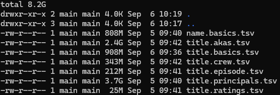
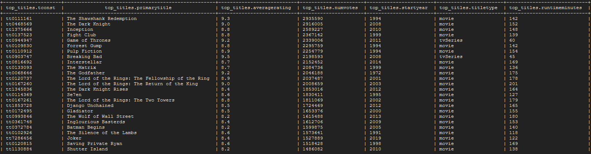
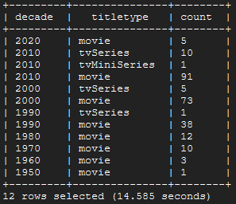
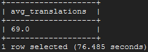
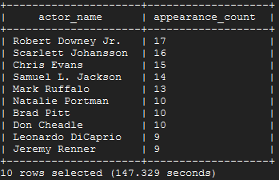
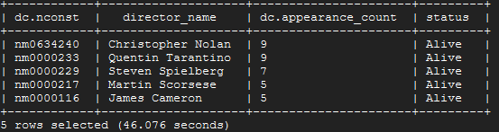
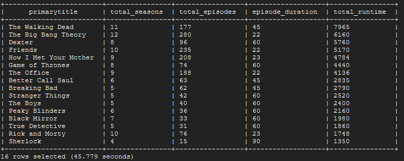

# Infraestrutura Hadoop

# Sumário
- [Proposta geral do trabalho](#proposta-geral-do-trabalho)
- [Esquema e origem dos dados](#esquema-e-origem-dos-dados)
- [Provisionamento do Hadoop](#provisionamento-do-hadoop)
- [Download dos arquivos](#download-dos-arquivos)
- [Envio dos arquivos para o HDFS](#envio-dos-arquivos-para-o-hdfs)
- [Criação e ingestão das tabelas no Hive](#criação-e-ingestão-das-tabelas-no-hive)
- [Análise exploratória de dados](#análise-exploratória-de-dados)
- [Proposta de evolução do trabalho](#proposta-de-evolução-do-trabalho)

## Proposta geral do trabalho
- Visão geral do esquema de dados (caracterização das tabelas, dicionário de dados, etc.)
- Identificação das fontes de onde os dados foram obtidos
- Construção de um database no Hive que implemente o esquema proposto
- Formulação de perguntas analíticas a serem respondidas com os dados
- Consultas SQL que respondem às perguntas elaboradas
- Proposta de evolução do trabalho

## Esquema e origem dos dados
Para este projeto, utilizei os datasets não-comerciais do IMDb (https://developer.imdb.com/non-commercial-datasets/).<br>
São ao todo 7 tabelas em formato `.tsv` (arquivo de valores separados por tabulação), caracterizados da seguinte forma, conforme documentação original:

`title.akas.tsv` **[2.4GB]**
- `titleId (string)`
    - a tconst, an alphanumeric unique identifier of the title
- `ordering (integer)`
    - a number to uniquely identify rows for a given titleId
- `title (string)` 
    - the localized title
- `region (string)`
    - the region for this version of the title
- `language (string)`
    - the language of the title
- `types (array)` 
    - Enumerated set of attributes for this alternative title. One or more of the following: "alternative", "dvd", "festival", "tv", "video", "working", "original", "imdbDisplay". New values may be added in the future without warning
- `attributes (array)` 
    - Additional terms to describe this alternative title, not enumerated
- `isOriginalTitle (boolean)`
    - 0: not original title; 1: original title

`title.basics.tsv.gz` **[908MB]**
- `tconst (string)`
    - alphanumeric unique identifier of the title
- `titleType (string)` 
    - the type/format of the title (e.g. movie, short, tvseries, tvepisode, video, etc)
- `primaryTitle (string)`
    - the more popular title / the title used by the filmmakers on promotional materials at the point of release
- `originalTitle (string)`
    - original title, in the original language
- `isAdult (boolean)`
    - 0: non-adult title; 1: adult title
- `startYear (YYYY)`
    - represents the release year of a title. In the case of TV Series, it is the series start year
- `endYear (YYYY)`
    - TV Series end year. ‘\N’ for all other title types
- `runtimeMinutes`
    - primary runtime of the title, in minutes
- `genres (string array)`
    - includes up to three genres associated with the title

`title.crew.tsv.gz` **[343MB]**
- `tconst (string)`
    - alphanumeric unique identifier of the title
- `directors (array of nconsts)`
    - director(s) of the given title
- `writers (array of nconsts)`
    - writer(s) of the given title

`title.episode.tsv.gz` **[212MB]**
- `tconst (string)`
    - alphanumeric identifier of episode
- `parentTconst (string)`
    - alphanumeric identifier of the parent TV Series
- `seasonNumber (integer)`
    - season number the episode belongs to
- `episodeNumber (integer)`
    - episode number of the tconst in the TV series

`title.principals.tsv.gz` **[3.7GB]**
- `tconst (string)`
    - alphanumeric unique identifier of the title
- `ordering (integer)`
    - a number to uniquely identify rows for a given titleId
- `nconst (string)`
    - alphanumeric unique identifier of the name/person
- `category (string)`
    - the category of job that person was in
- `job (string)`
    - the specific job title if applicable, else '\N'
- `characters (string)`
    - the name of the character played if applicable, else '\N'

`title.ratings.tsv.gz` **[25MB]**
- `tconst (string)`
    - alphanumeric unique identifier of the title
- `averageRating`
    - weighted average of all the individual user ratings
- `numVotes`
    - number of votes the title has received

`name.basics.tsv.gz` **[808MB]**
- `nconst (string)`
    - alphanumeric unique identifier of the name/person
- `primaryName (string)`
    - name by which the person is most often credited
- `birthYear`
    - in YYYY format
- `deathYear`
    - in YYYY format if applicable, else '\N'
- `primaryProfession (array of strings)`
    - the top-3 professions of the person
- `knownForTitles (array of tconsts)`
    - titles the person is known for

## Provisionamento do Hadoop
Em relação à criação do cluster Hadoop, optei por provisioná-lo na Google Cloud Platform (GCP), através do produto Dataproc (https://cloud.google.com/dataproc).<br>
A estrutura será de 1 master e 2 workers, ambos `n2-standard-4` (4 vCPUs e 16GB RAM) e com 100GB de armazenamento.<br>
Utilizei o Cloud Shell para operar os comandos abaixo:

```bash
# Ativa a API do Dataproc
gcloud services enable dataproc.googleapis.com

# Variáveis de ambiente para auxiliar na construção
export PROJECT_ID=$(gcloud config get-value project)
export REGION=us-central1
export ZONE=us-central1-c
export CLUSTER_NAME=hadoop-cluster-jt
export VM_NAME=$CLUSTER_NAME-m

# Comando para criação do cluster
gcloud dataproc clusters create $CLUSTER_NAME --enable-component-gateway --region $REGION --zone $ZONE --master-machine-type n2-standard-4 --master-boot-disk-type pd-balanced --master-boot-disk-size 100 --num-workers 2 --worker-machine-type n2-standard-4 --worker-boot-disk-type pd-balanced --worker-boot-disk-size 100 --image-version 2.2-debian12 --project $PROJECT_ID --public-ip-address
```

## Download dos arquivos
Para realizar o download dos arquivos, foi necessário fazer upload da pasta `./scripts` para dentro do Cloud Shell.<br>
Após isso, executei o comando abaixo para enviar a pasta do local (Cloud Shell) para dentro do cluster (VM Master do Dataproc):
```bash
gcloud compute scp --recurse scripts $VM_NAME:/home/$USER/scripts/ --project $PROJECT_ID --zone $ZONE
```

Em seguida, conectei à VM via SSH, e executei o script `./scripts/download_and_extract.sh` para realizar o download dos arquivos, com os seguintes comandos:
```bash
# Conecta à VM via SSH
gcloud compute ssh --project $PROJECT_ID --zone $ZONE $VM_NAME 

# Executa o script que realiza download e extração dos arquivos
chmod +x scripts/download_and_extract.sh
./scripts/download_and_extract.sh
```

O resultado segue conforme abaixo:<br>


Conteúdo do arquivo `./scripts/download_and_extract.sh`, também disponível [aqui](./scripts/download_and_extract.sh):
```bash
# Diretório para salvar os datasets
output_dir="./datasets"
mkdir -p "$output_dir"

# URLs para datasets IMDB
urls=(
  "https://datasets.imdbws.com/name.basics.tsv.gz"
  "https://datasets.imdbws.com/title.akas.tsv.gz"
  "https://datasets.imdbws.com/title.basics.tsv.gz"
  "https://datasets.imdbws.com/title.crew.tsv.gz"
  "https://datasets.imdbws.com/title.episode.tsv.gz"
  "https://datasets.imdbws.com/title.principals.tsv.gz"
  "https://datasets.imdbws.com/title.ratings.tsv.gz"
)

echo "Iniciando o processo de download e extração em $(date)"

# Itera por cada URL para realizar o download
for url in "${urls[@]}"; do
  # Extrai o nome do arquivo através da URL
  file_name=$(basename "$url")
  
  # Realiza o download e informa o status
  echo "Baixando o arquivo $file_name..."
  if wget -c "$url" -P "$output_dir"; then
    echo "O download do arquivo $file_name foi realizado com sucesso."
  else
    echo "O download do arquivo $file_name falhou."
    # Deleta download e pula a iteração
    rm -f "$output_dir/$file_name"  
    continue
  fi
done

# Espera a finalização de todos os downloads
wait

# Itera novamente para extrair os arquivos .gz
for url in "${urls[@]}"; do
  file_name=$(basename "$url")
  
  # Extrai o arquivo e informa o status
  echo "Extraindo o arquivo $file_name..."
  if gunzip -f "$output_dir/$file_name"; then
    echo "Extração do arquivo $file_name realizada com sucesso."
  else
    echo "Extração do arquivo $file_name falhou."
  fi
done

echo "Processo finalizado em $(date)"
```


## Envio dos arquivos para o HDFS
Realizei a transferência dos arquivos do ambiente local do cluster para o HDFS com o objetivo de analisar os dados via Hive.
```bash
# Cria uma pasta na raiz do HDFS
hdfs dfs -mkdir /user/$USER

# Envia os dados
hdfs dfs -put datasets/ datasets
```

## Criação e ingestão das tabelas no Hive
A conexão ao Hive se deu através do cliente JDBC Beeline.
```bash
# Cria uma variável de ambiente para deixar as conexões mais enxutas.
# A variável de ambiente $USER é passada ao Hive com o intuito de ser utilizada no apontamento de diretórios na hora de ingerir os dados.
BEELINE_CONNECT="beeline -u jdbc:hive2://localhost:10000/default -n $USER@$HOSTNAME -d org.apache.hive.jdbc.HiveDriver --hiveconf USER=$USER"
```

Para criar as tabelas e ingerir os dados, o seguinte comando foi executado:
```bash
# Executa o arquivo de criação e ingestão
$BEELINE_CONNECT -f scripts/ddl_and_ingest.sql
```

Conteúdo do arquivo `./scripts/ddl_and_ingest.sql`, também disponível [aqui](./scripts/ddl_and_ingest.sql):
```sql
-- Criação do database
CREATE DATABASE IF NOT EXISTS imdb;
USE imdb;

-- Criação das tabelas
DROP TABLE IF EXISTS title;
CREATE TABLE title (
    tconst STRING,
    titleType STRING,
    primaryTitle STRING,
    originalTitle STRING,
    isAdult INT,
    startYear INT,
    endYear INT,
    runtimeMinutes INT,
    genres ARRAY<STRING>
)
ROW FORMAT DELIMITED
FIELDS TERMINATED BY '\t'
LINES TERMINATED BY '\n'
STORED AS TEXTFILE
TBLPROPERTIES ('skip.header.line.count'='1');

DROP TABLE IF EXISTS title_translation;
CREATE TABLE title_translation (
    titleId STRING,
    ordering INT,
    title STRING,
    region STRING,
    language STRING,
    types ARRAY<STRING>,
    attributes ARRAY<STRING>,
    isOriginalTitle INT
)
ROW FORMAT DELIMITED
FIELDS TERMINATED BY '\t'
COLLECTION ITEMS TERMINATED BY ','
MAP KEYS TERMINATED BY ':'
LINES TERMINATED BY '\n'
STORED AS TEXTFILE
TBLPROPERTIES ('skip.header.line.count'='1');

DROP TABLE IF EXISTS episode;
CREATE TABLE episode (
    tconst STRING,
    parentTconst STRING,
    seasonNumber INT,
    episodeNumber  INT
)
ROW FORMAT DELIMITED
FIELDS TERMINATED BY '\t'
COLLECTION ITEMS TERMINATED BY ','
MAP KEYS TERMINATED BY ':'
LINES TERMINATED BY '\n'
STORED AS TEXTFILE
TBLPROPERTIES ('skip.header.line.count'='1');

DROP TABLE IF EXISTS principal;
CREATE TABLE principal (
    tconst STRING,
    ordering INT,
    nconst STRING,
    category STRING,
    job STRING,
    characters STRING
)
ROW FORMAT DELIMITED
FIELDS TERMINATED BY '\t'
COLLECTION ITEMS TERMINATED BY ','
MAP KEYS TERMINATED BY ':'
LINES TERMINATED BY '\n'
STORED AS TEXTFILE
TBLPROPERTIES ('skip.header.line.count'='1');

DROP TABLE IF EXISTS crew;
CREATE TABLE crew (
    tconst STRING,
    directors ARRAY<STRING>,
    writers ARRAY<STRING>
)
ROW FORMAT DELIMITED
FIELDS TERMINATED BY '\t'
COLLECTION ITEMS TERMINATED BY ','
MAP KEYS TERMINATED BY ':'
LINES TERMINATED BY '\n'
STORED AS TEXTFILE
TBLPROPERTIES ('skip.header.line.count'='1');

DROP TABLE IF EXISTS person;
CREATE TABLE person (
    nconst STRING,
    primaryName STRING,
    birthYear INT,
    deathYear INT,
    primaryProfession ARRAY<STRING>,
    knownForTitles ARRAY<STRING>
)
ROW FORMAT DELIMITED
FIELDS TERMINATED BY '\t'
COLLECTION ITEMS TERMINATED BY ','
MAP KEYS TERMINATED BY ':'
LINES TERMINATED BY '\n'
STORED AS TEXTFILE
TBLPROPERTIES ('skip.header.line.count'='1');

DROP TABLE IF EXISTS rating;
CREATE TABLE rating (
    tconst STRING,
    averageRating FLOAT,
    numVotes INT
)
ROW FORMAT DELIMITED
FIELDS TERMINATED BY '\t'
COLLECTION ITEMS TERMINATED BY ','
MAP KEYS TERMINATED BY ':'
LINES TERMINATED BY '\n'
STORED AS TEXTFILE
TBLPROPERTIES ('skip.header.line.count'='1');

-- Ingestão das tabelas
LOAD DATA INPATH '/user/${hiveconf:USER}/datasets/title.basics.tsv' OVERWRITE INTO TABLE title;
LOAD DATA INPATH '/user/${hiveconf:USER}/datasets/title.akas.tsv' OVERWRITE INTO TABLE title_translation;
LOAD DATA INPATH '/user/${hiveconf:USER}/datasets/title.episode.tsv' OVERWRITE INTO TABLE episode;
LOAD DATA INPATH '/user/${hiveconf:USER}/datasets/title.principals.tsv' OVERWRITE INTO TABLE principal;
LOAD DATA INPATH '/user/${hiveconf:USER}/datasets/title.crew.tsv' OVERWRITE INTO TABLE crew;
LOAD DATA INPATH '/user/${hiveconf:USER}/datasets/name.basics.tsv' OVERWRITE INTO TABLE person;
LOAD DATA INPATH '/user/${hiveconf:USER}/datasets/title.ratings.tsv' OVERWRITE INTO TABLE rating;
```

## Análise exploratória de dados
A etapa de análise exploratória de dados se deu da seguinte forma:

### Materialização base
O recorte base é o conjunto de 250 títulos com maior quantidade de avaliações.<br>
Todas as 5 análises posteriores usarão esse conjunto de títulos, e por esse motivo optei por materializar os dados em forma de tabela.

#### Comando de execução 
`$BEELINE_CONNECT -f scripts/query_0.sql`

#### Query
Também disponível [aqui](./scripts/query_0.sql):
```sql
USE imdb;
DROP TABLE IF EXISTS top_titles;
CREATE TABLE top_titles AS
    (
        SELECT 
            t.tconst,
            t.primaryTitle,
            r.averageRating,
            r.numVotes,
            t.startYear,
            t.titleType,
            t.runtimeMinutes
        FROM rating AS r 
        INNER JOIN title AS t 
        USING(tconst) 
        ORDER BY numVotes DESC 
        LIMIT 250
    );

SELECT * FROM top_titles;
```
#### Output


### Análise 1
Distribuição de quantidade de títulos por década e por tipo.

#### Comando de execução 
`$BEELINE_CONNECT -f scripts/query_1.sql`

#### Query
Também disponível [aqui](./scripts/query_1.sql):
```sql
USE imdb;
SELECT 
    CAST(FLOOR(startYear / 10) * 10 AS INT) AS decade,
    titleType,
    COUNT(*) AS count
FROM top_titles
WHERE startYear IS NOT NULL
GROUP BY FLOOR(startYear / 10) * 10, titleType
ORDER BY FLOOR(startYear / 10) * 10 DESC, titleType DESC;
```
#### Output


### Análise 2
Média da quantidade de idiomas para os quais os títulos foram traduzidos

#### Comando de execução 
`$BEELINE_CONNECT -f scripts/query_2.sql`

#### Query
Também disponível [aqui](./scripts/query_2.sql):
```sql
USE imdb;
WITH translation_counts AS (
    SELECT
        titleId AS tconst,
        COUNT(*) AS translation_count
    FROM
        title_translation
    GROUP BY
        titleId
)

SELECT
    ROUND(AVG(tc.translation_count)) AS avg_translations
FROM
    top_titles tt
INNER JOIN
    translation_counts tc ON tt.tconst = tc.tconst;
```
#### Output


### Análise 3
Top 10 atores e atrizes com mais participações.

#### Comando de execução 
`$BEELINE_CONNECT -f scripts/query_3.sql`

#### Query
Também disponível [aqui](./scripts/query_3.sql):
```sql
USE imdb;
WITH actor_appearances AS (
    SELECT
        pr.nconst AS actor_id,
        p.primaryName AS actor_name,
        COUNT(*) AS appearance_count
    FROM
        principal pr
    JOIN
        top_titles tt ON pr.tconst = tt.tconst
    JOIN
        person p ON pr.nconst = p.nconst
    WHERE
        pr.category in ('actor', 'actress')
    GROUP BY
        pr.nconst, p.primaryName
)

SELECT
    actor_name,
    appearance_count
FROM
    actor_appearances
ORDER BY
    appearance_count DESC
LIMIT 10;
```
#### Output


### Análise 4
Top 5 diretores com mais participações e se estão vivos

#### Comando de execução 
`$BEELINE_CONNECT -f scripts/query_4.sql`

#### Query
Também disponível [aqui](./scripts/query_4.sql):
```sql
USE imdb;
WITH director_appearances AS (
    SELECT
        c.tconst,
        director AS nconst
    FROM
        crew c
    LATERAL VIEW explode(c.directors) d AS director
    WHERE
        c.tconst IN (SELECT tconst FROM top_titles)
),
director_count AS (
    SELECT
        da.nconst,
        COUNT(*) AS appearance_count
    FROM
        director_appearances da
    GROUP BY
        da.nconst
)

SELECT
    dc.nconst,
    p.primaryName AS director_name,
    dc.appearance_count,
    CASE 
        WHEN p.deathYear IS NOT NULL THEN 'Deceased'
        ELSE 'Alive'
    END AS status
FROM
    director_count dc
JOIN
    person p ON dc.nconst = p.nconst
ORDER BY
    dc.appearance_count DESC
LIMIT 5;
```
#### Output


### Análise 5
Séries ordenadas por tempo total de duração em minutos, com total de temporadas, total de episódios e duração nominal por episódio.

#### Comando de execução 
`$BEELINE_CONNECT -f scripts/query_5.sql`

#### Query
Também disponível [aqui](./scripts/query_5.sql):
```sql
USE imdb;
WITH series_info AS (
    SELECT
        t.tconst,
        t.primaryTitle,
        COUNT(DISTINCT e.seasonNumber) AS num_seasons,
        COUNT(*) AS num_episodes,
        MAX(t.runtimeMinutes) AS episode_duration
    FROM
        top_titles t
    LEFT JOIN
        episode e ON t.tconst = e.parentTconst
    WHERE
        t.titleType = 'tvSeries'
    GROUP BY
        t.tconst, t.primaryTitle
)

SELECT
    primaryTitle,
    num_seasons AS total_seasons,
    num_episodes AS total_episodes,
    episode_duration,
    num_episodes * episode_duration AS total_runtime
FROM
    series_info
ORDER BY
    num_episodes * episode_duration DESC;
```
#### Output


## Proposta de evolução do trabalho
Alguns pontos de melhoria para uma evolução futura do trabalho:
1. Orquestração da criação do cluster, download dos arquivos e materialização das tabelas via Terraform.
2. Possibilidade de provisionar a mesma solução em outras provedoras de Cloud.
3. Integração com dados não-estruturados de avaliação e resenhas, para complementar as análises qualitativamente.
4. Utilização de boas práticas do Hive, como particionamento e bucketing.