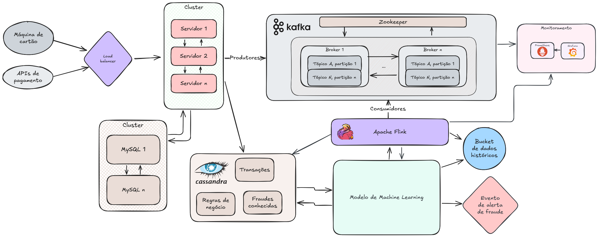

# Infraestrutura Kafka

## Proposta geral do trabalho
- **Parte teórica**: Design de Sistema, Detecção de Fraude em Tempo Real para Transações com Cartão de Crédito
- **Parte prática**: Detecção de Fraudes em Transações Financeiras com Kafka

## Parte teórica

### Objetivo

Seu objetivo é projetar um Sistema de Detecção de Fraude que analisa transações de cartão de crédito em tempo real e identificar atividades suspeitas. 

O sistema deve fornecer uma resposta imediata se a transação envolver um cartão, usuário ou site previamente identificado como fraudulento, ou se for identificada com base em um conjunto de regras de negócio específicas. 

Para transações que não possuem histórico de fraude, o sistema utilizará Machine Learning para identificar comportamentos suspeitos. Esses dados serão usados para alimentar a lista de bloqueio usada pelo módulo de resposta imediata, ajudando a prevenir futuras transações fraudulentas. 

As transações são originadas nas maquininhas de pagamento, distribuídas pelos estabelecimentos comerciais ou via API, em caso de pagamento online. 
As regras de negócio devem ser cadastradas e armazenadas, não sendo hardcoded, para garantir que possam ser facilmente acessadas e atualizadas.

### Dados
Uma transação é composta pelos campos: `timestamp`, `transaction_id`, `user_id`, `card_id`, `site_id`, `value`, `location_id`, `country`

Você terá acesso aos dados do usuário e dados de referência. 

Precisará determinar como armazená-los e para que usá-los: 
- **Usuário**: `user_id`, `nome`, `endereço`, `email`
- **Estabelecimento**: `site_id`, `nome`, `endereço`, `categoria de produtos` (bens de consumo, viagens, restaurantes etc.)

### Requisitos não funcionais:
- **Escalabilidade**: O sistema deve suportar até 10 mil transações por segundo (TPS).
- **Disponibilidade**: 99,9% de uptime.
- **Latência**:
    - **Resposta imediata**:
        - **P50**: 1 segundo
        - **P90**: 5 segundos
    - **Identificação de comportamentos suspeitos**:
        - **P50**: 10 minutos
        - **P90**: 30 minutos
- **Armazenamento**:
    - Todas as transações devem ser armazenadas por 180 dias.
    - Transações suspeitas também devem ser armazenadas.

### O que você deve integrar

- **Diagrama de Arquitetura**: Apresente a arquitetura do sistema, mostrando os diversos módulos e como eles interagem.
- **Casos de Uso**: Detalhe os casos de uso, explicando os fluxos de dados, como transações verdadeiras, fraudulentas, e falsos positivos.
- **Tecnologias**: Identifique as tecnologias a serem usadas, explicando, por exemplo, a escolha do banco de dados (relacional, NoSQL, grafos, busca etc.).
- **Machine Learning**: Identifique como e quando o modelo será treinado.
- **Evitar SPOF**: Garanta que o sistema não tenha pontos únicos de falha (SPOF).
- **Monitoramento**: Identifique que métricas você utilizará para definir se o sistema está saudável.

### Solução proposta

#### Arquitetura e caso de uso

A arquitetura acima pode ser dividida entre 4 grandes blocos, descritos a seguir:

- **Realização das transações**:
    - Para garantir a disponibilidade e a escalabilidade da solução, as máquinas de cartão e as APIs de pagamento acessam um cluster de servidores através de um balanceador de carga
    - Os servidores se comunicam com um cluster de banco de dados relacional (MySQL), que guarda informações de usuários e estabelecimentos.
        - A escolha por um banco de dados relacional se deve aos mecanismos robustos de segurança e à integridade dos dados e dos relacionamentos através de normalização. 
    - O cluster de servidores está em constante contato com um banco de dados não relacional (Cassandra) que guarda em diferentes tabelas as 1) regras de negócio e 2) fraudes já conhecidas. Com isso, se for o caso de uma transação ter característias pertencentes ao histórico de fraudes, a resposta da aplicação é **imediata**.
        - O Apache Cassandra é um banco de dados NoSQL recomendado para aplicações críticas, por ter robustez para trabalhar com alta taxa de transferência, alta disponibilidade e alta tolerância a falha.
- **Streaming**
    - Todas as transações são direcionadas para um cluster Apache Kafka, no qual os produtores direcionam os eventos para tópicos. Tais tópicos são replicados em diferentes brokers, o que aumenta a disponibilidade do sistema. 
    - Com essa solução, possibilitamos o fluxo constante de dados e habilitamos a comunicação assíncrona entre as tecnologias.
    - O Apache Flink processa os dados em tempo real, direcionando os dados para 1) um bucket de backup histórico, 2) um modelo de Machine Learning que detecta característias de fraude nas transações e 3) tabelas no Apache Cassandra, que guardam as transações para acesso dinâmico.
- **Machine Learning**
    - O modelo de aprendizado de máquina detecta as características de transações fraudulentas através da aplicação de um algoritmo de Random Forest (algoritmo supervisionado de regressão e classificação), treinado inicialmente com os dados históricos de fraudes já conhecidas, adicionalmente aos treinos regulares, ocorridos semanalmente, com base nas transações realizadas no período.
    - No caso da detecção de um caso, a aplicação do modelo aciona um evento de fraude, que chega aos dispositivos do usuário. Como podem acontecer falsos positivos, a aplicação trabalha com uma margem para que o usuário dê algum tipo de retorno, provando a veracidade da transação. Quando o caráter de fraude se mantém, esse caso é registrado no histórico de fraudes, que é consumido pelos servidores acessados pelas máquinas e APIs.
- **Monitoramento**
    - Para monitoramento, o Prometheus colhe as informações em tempo real, enquanto o Grafana consulta as informações e possibilita a criação de dashboards interativos para acompanhamento de métricas, como as abaixo:
        - Utilização de CPU e memória
        - Latência de resposta
        - Taxa de transferência
        - Número de transações por segundo
        - Número de transações fraudulentas
        - Tempo médio de resposta às transações
        - Volume de transações processadas por período

## Parte prática

Objetivo:

O objetivo deste exercício é desenvolver uma aplicação que processe dados de transações financeiras em tempo real a partir de um tópico Kafka e identifique transações fraudulentas com base em um conjunto de regras específicas. Não iremos implementar todo o sistema da parte teórica, mas apenas o módulo de detecção. Também não iremos fazer uso de Machine Learning. Iremos simplificar o problema criando algumas regras que levam em conta o contexto de cada usuário e podem ser caracterizadas por atividades suspeitas. 

Regras de Fraude:

Sua solução deverá identificar fraudes com base nas seguintes regras:

    Alta Frequência: Um usuário realizou duas transações com valores diferentes em um intervalo inferior a 5 minutos entre elas.
    Alto Valor: Um usuário realizou uma transação que excede o dobro do maior valor que ele já gastou em transações anteriores.
    Outro País: Um usuário fez uma transação em um país diferente menos de 2 horas após ter feito uma transação em outro país.

Fornecimento de Dados:

Para facilitar o desenvolvimento, uma função Python será fornecida para gerar dados de transações. Algumas dessas transações serão fraudulentas.

    Essa função retornará um objeto da classe Transaction, cujo formato estará disponível para consulta.
    Você precisará criar um produtor Kafka que execute essa função em looping, enviando as mensagens geradas para um tópico Kafka.

Tecnologias:

Você deverá desenvolver uma aplicação que consuma as mensagens do Kafka e identifique fraudes com base nas regras descritas acima.

    Você deve utilizar um consumidor Kafka em Python para processar os eventos.
    Caso prefira explorar outras tecnologias além das abordadas no curso, você pode utilizar Kafka Streams, Flink ou Spark Streaming para implementar a detecção de fraude.
    A aplicação deverá publicar os resultados em um novo tópico Kafka, contendo informações dos usuários com suspeitas de fraude, bem como o tipo de fraude e os parâmetros da fraude.
    Os dados dos usuários suspeitos deverão também ser armazenados em um banco de dados de sua escolha.
