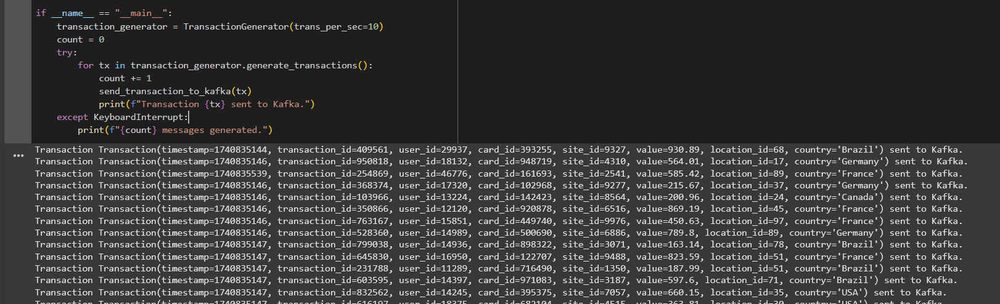

# Infraestrutura Kafka

## Proposta geral do trabalho
- **Parte teórica**: Design de Sistema, Detecção de Fraude em Tempo Real para Transações com Cartão de Crédito
- **Parte prática**: Detecção de Fraudes em Transações Financeiras com Kafka

## Parte teórica

### Objetivo
<p>Seu objetivo é projetar um Sistema de Detecção de Fraude que analisa transações de cartão de crédito em tempo real e identificar atividades suspeitas.<br>
<p>O sistema deve fornecer uma resposta imediata se a transação envolver um cartão, usuário ou site previamente identificado como fraudulento, ou se for identificada com base em um conjunto de regras de negócio específicas.<br>
<p>Para transações que não possuem histórico de fraude, o sistema utilizará Machine Learning para identificar comportamentos suspeitos. Esses dados serão usados para alimentar a lista de bloqueio usada pelo módulo de resposta imediata, ajudando a prevenir futuras transações fraudulentas.<br>
<p>As transações são originadas nas maquininhas de pagamento, distribuídas pelos estabelecimentos comerciais ou via API, em caso de pagamento online.<br>
As regras de negócio devem ser cadastradas e armazenadas, não sendo hardcoded, para garantir que possam ser facilmente acessadas e atualizadas.

### Dados
Uma transação é composta pelos campos: `timestamp`, `transaction_id`, `user_id`, `card_id`, `site_id`, `value`, `location_id`, `country`

Você terá acesso aos dados do usuário e dados de referência. 

Precisará determinar como armazená-los e para que usá-los:<br>
- **Usuário**: `user_id`, `nome`, `endereço`, `email`
- **Estabelecimento**: `site_id`, `nome`, `endereço`, `categoria de produtos` (bens de consumo, viagens, restaurantes etc.)

### Requisitos não funcionais:
- **Escalabilidade**: O sistema deve suportar até 10 mil transações por segundo (TPS).
- **Disponibilidade**: 99,9% de uptime.
- **Latência**:
    - **Resposta imediata**:
        - **P50**: 1 segundo
        - **P90**: 5 segundos
    - **Identificação de comportamentos suspeitos**:
        - **P50**: 10 minutos
        - **P90**: 30 minutos
- **Armazenamento**:
    - Todas as transações devem ser armazenadas por 180 dias.
    - Transações suspeitas também devem ser armazenadas.

### O que você deve integrar

- **Diagrama de Arquitetura**: Apresente a arquitetura do sistema, mostrando os diversos módulos e como eles interagem.
- **Casos de Uso**: Detalhe os casos de uso, explicando os fluxos de dados, como transações verdadeiras, fraudulentas, e falsos positivos.
- **Tecnologias**: Identifique as tecnologias a serem usadas, explicando, por exemplo, a escolha do banco de dados (relacional, NoSQL, grafos, busca etc.).
- **Machine Learning**: Identifique como e quando o modelo será treinado.
- **Evitar SPOF**: Garanta que o sistema não tenha pontos únicos de falha (SPOF).
- **Monitoramento**: Identifique que métricas você utilizará para definir se o sistema está saudável.

### Solução proposta

#### Arquitetura e caso de uso


A arquitetura acima pode ser dividida entre 4 grandes blocos, descritos a seguir:

- **Realização das transações**:
    - Para garantir a disponibilidade e a escalabilidade da solução, as máquinas de cartão e as APIs de pagamento acessam um cluster de servidores através de um balanceador de carga
    - Os servidores se comunicam com um cluster de banco de dados relacional (MySQL), que guarda informações de usuários e estabelecimentos.
        - A escolha por um banco de dados relacional se deve aos mecanismos robustos de segurança e à integridade dos dados e dos relacionamentos através de normalização. 
    - O cluster de servidores está em constante contato com um banco de dados não relacional (Cassandra) que guarda em diferentes tabelas as 1) regras de negócio e 2) fraudes já conhecidas. Com isso, se for o caso de uma transação ter característias pertencentes ao histórico de fraudes, a resposta da aplicação é **imediata**.
        - O Apache Cassandra é um banco de dados NoSQL recomendado para aplicações críticas, por ter robustez para trabalhar com alta taxa de transferência, alta disponibilidade e alta tolerância a falha.
- **Streaming**
    - Todas as transações são direcionadas para um cluster Apache Kafka, no qual os produtores direcionam os eventos para tópicos. Tais tópicos são replicados em diferentes brokers, o que aumenta a disponibilidade do sistema. 
    - Com essa solução, possibilitamos o fluxo constante de dados e habilitamos a comunicação assíncrona entre as tecnologias.
    - O Apache Flink processa os dados em tempo real, direcionando os dados para 1) um bucket de backup histórico, 2) um modelo de Machine Learning que detecta característias de fraude nas transações e 3) tabelas no Apache Cassandra, que guardam as transações para acesso dinâmico.
- **Machine Learning**
    - O modelo de aprendizado de máquina detecta as características de transações fraudulentas através da aplicação de um algoritmo de Random Forest (algoritmo supervisionado de regressão e classificação), treinado inicialmente com os dados históricos de fraudes já conhecidas, adicionalmente aos treinos regulares, ocorridos semanalmente, com base nas transações realizadas no período.
    - No caso da detecção de um caso, a aplicação do modelo aciona um evento de fraude, que chega aos dispositivos do usuário. Como podem acontecer falsos positivos, a aplicação trabalha com uma margem para que o usuário dê algum tipo de retorno, provando a veracidade da transação. Quando o caráter de fraude se mantém, esse caso é registrado no histórico de fraudes, que é consumido pelos servidores acessados pelas máquinas e APIs.
- **Monitoramento**
    - Para monitoramento, o Prometheus colhe as informações em tempo real, enquanto o Grafana consulta as informações e possibilita a criação de dashboards interativos para acompanhamento de métricas, como as abaixo:
        - Utilização de CPU e memória
        - Latência de resposta
        - Taxa de transferência
        - Número de transações por segundo
        - Número de transações fraudulentas
        - Tempo médio de resposta às transações
        - Volume de transações processadas por período

## Parte prática

### Objetivo

<p> O objetivo deste exercício é desenvolver uma aplicação que processe dados de transações financeiras em tempo real a partir de um tópico Kafka e identifique transações fraudulentas com base em um conjunto de regras específicas. Não iremos implementar todo o sistema da parte teórica, mas apenas o módulo de detecção. Também não iremos fazer uso de Machine Learning. Iremos simplificar o problema criando algumas regras que levam em conta o contexto de cada usuário e podem ser caracterizadas por atividades suspeitas. 

### Regras de Fraude

Sua solução deverá identificar fraudes com base nas seguintes regras:

- **Alta Frequência**: Um usuário realizou duas transações com valores diferentes em um intervalo inferior a 5 minutos entre elas.
- **Alto Valor**: Um usuário realizou uma transação que excede o dobro do maior valor que ele já gastou em transações anteriores.
- **Outro País**: Um usuário fez uma transação em um país diferente menos de 2 horas após ter feito uma transação em outro país.

### Fornecimento de Dados

Para facilitar o desenvolvimento, uma função Python [será fornecida](https://github.com/werneckpaiva/kafka_classes/tree/main/project) para gerar dados de transações. Algumas dessas transações serão fraudulentas.

- Essa função retornará um objeto da classe Transaction, cujo formato estará disponível para consulta.
- Você precisará criar um produtor Kafka que execute essa função em looping, enviando as mensagens geradas para um tópico Kafka.

### Tecnologias

Você deverá desenvolver uma aplicação que consuma as mensagens do Kafka e identifique fraudes com base nas regras descritas acima.

- Você deve utilizar um consumidor Kafka em Python para processar os eventos.
- Caso prefira explorar outras tecnologias além das abordadas no curso, você pode utilizar Kafka Streams, Flink ou Spark Streaming para implementar a detecção de fraude.
- A aplicação deverá publicar os resultados em um novo tópico Kafka, contendo informações dos usuários com suspeitas de fraude, bem como o tipo de fraude e os parâmetros da fraude.
- Os dados dos usuários suspeitos deverão também ser armazenados em um banco de dados de sua escolha.

### Solução proposta

#### Arquitetura para o caso de uso


A arquitetura acima ilustra o seguinte processo:
- Um script python gera as transações, incluindo as fraudulentas
- Um produtor se utiliza desse script para enviar as informações para um tópico (transaction) no Kafka
- Um consumidor (detector de fraudes) processa os dados, identifica os casos de fraude e joga em um novo tópico (fraudulent-transactions)
- O Kafka Connect consome do novo tópico (fraudulent-transaction) e ingere os dados de identificação dos fraudadores em um banco de dados Postgres

#### Máquinas virtuais do Kafka


Máquinas virtuais foram criadas no Free Tier do Google Cloud (e2-micro) para instalar o Kafka em cada instância.

O conjunto de comandos abaixo foi executado em cada máquina:

```bash
# Instalando o Java
sudo apt update
sudo apt install -y default-jdk

# Baixando o Kafka
wget https://dlcdn.apache.org/kafka/3.9.0/kafka_2.13-3.9.0.tgz
tar -xzf kafka_2.13-3.9.0.tgz
mkdir ~/kafka/
cd kafka_2.13-3.9.0/

# Editando os parâmetros do KRaft para permitir a comunicação do cluster
vi config/kraft/server.properties
```

Dentro do editor de texto, vamos modificar as seguintes propriedades:

```bash
# Substituímos pelo número da instância em questão
node.id=<id>

# Replicamos esse parâmetro em cada uma das máquinas, usando o hostname interno da rede e a porta de comunicação
controller.quorum.voters=1@kafka-broker-1:9093,2@kafka-broker-2:9093,3@kafka-broker-3:9093 

# Substituímos pelo número da instância em questão
advertised.listeners=PLAINTEXT://kafka-broker-<id>:9092

# Alteramos para a pasta em questão, utilizando o usuário ($whoami)
log.dirs=/home/<user>/kafka
```

Após a edição dos arquivos, precisamos gerar um UUID (identificador único) para designar o Cluster:

```bash
# Gera o UUID
./bin/kafka-storage.sh random-uuid

# Formatamos os metadados do cluster utilizando o UUID gerado
./bin/kafka-storage.sh format -t <uuid> -c ./config/kraft/server.properties
```

Para iniciar o Kafka em cada máquina, basta executar o comando:

```bash
# Executando o Kafka
./bin/kafka-server-start.sh -daemon ./config/kraft/server.properties
```

#### Criação dos tópicos

Utilizamos notebooks do Google Colab para facilitar a execução e a autenticação.

No Google Colab, vamos atribuir nomes aos IPs externos das máquinas virtuais, tornando mais fácil a referência dentro dos scripts:

```bash
!echo "<ip-externo-1>  kafka-broker-1" >> /etc/hosts
!echo "<ip-externo-2>  kafka-broker-2" >> /etc/hosts
!echo "<ip-externo-3>  kafka-broker-3" >> /etc/hosts

brokers="kafka-broker-1:9092,kafka-broker-2:9092,kafka-broker-3:9092"
```

Após realizar download dos binários do Kafka no notebook, vamos executar os seguintes comandos para criar os tópicos.

````bash
# replication-factor: 3 (são 3 máquinas no Cluster)
# partitions: 4 (por se tratar de 4 tipos de usuário/transação, o que facilita a garantia de ordem no tópico)
# retention.ms: 86400000 (1 dia de retenção no tópico)
# segment.bytes: 16777216 (16 MB de tamanho de segmento)

!kafka_2.13-3.9.0/bin/kafka-topics.sh \
  --create \
  --topic "transaction" \
  --bootstrap-server $brokers \
  --replication-factor 3 \
  --partitions 4 \
  --config retention.ms=86400000 \
  --config segment.bytes=16777216
```

```bash
# replication-factor: 3 (são 3 máquinas no Cluster)
# partitions: 3 (por se tratar de 3 tipos de usuário/transação fraudulentas, o que facilita a garantia de ordem no tópico)
# retention.ms: 86400000 (1 dia de retenção no tópico)
# segment.bytes: 16777216 (16 MB de tamanho de segmento)

!kafka_2.13-3.9.0/bin/kafka-topics.sh \
  --create \
  --topic "fraudulent-transaction" \
  --bootstrap-server $brokers \
  --replication-factor 3 \
  --partitions 3 \
  --config retention.ms=86400000 \
  --config segment.bytes=16777216
````

Output:


##### Python Producer

Com o pacote `confluent_kafka` devidamente instalando no ambiente Python, executamos o script abaixo, disponível também em [`scripts/producer.py`](./scripts/producer.py):

```python
import queue
import random
import threading
import time
from dataclasses import dataclass, asdict
from typing import Optional
import json
from confluent_kafka import Producer, KafkaException, KafkaError

BROKERS = "kafka-broker-1:9092,kafka-broker-2:9092,kafka-broker-3:9092"
TOPIC = "transaction"

@dataclass
class Transaction:
    timestamp: int
    transaction_id: int
    user_id: int
    card_id: int
    site_id: int
    value: float
    location_id: int
    country: str

class TransactionGenerator:
    _transactions_queue: queue.Queue
    _trans_per_sec: int
    _fraudulent_transactions_freq: int
    _COUNTRIES: list[str] = ["USA", "Canada", "Germany", "France", "UK", "Brazil",
                             "Australia"]

    def __init__(self, trans_per_sec: int = 10, fraudulent_transactions_freq: int = 10,
                 max_queue_size: int = 1000):
        self._transactions_queue = queue.Queue(maxsize=max_queue_size)
        self._trans_per_sec = trans_per_sec
        self._fraudulent_transactions_freq = fraudulent_transactions_freq

    def generate_valid_transaction(self,
                                   timestamp: Optional[int] = None,
                                   transaction_id: Optional[int] = None,
                                   user_id: Optional[int] = None,
                                   card_id: Optional[int] = None,
                                   site_id: Optional[int] = None,
                                   value: Optional[float] = None,
                                   location: Optional[int] = None,
                                   country: Optional[str] = None) -> Transaction:
        user_id = user_id or random.randint(11000, 19999)
        tx = Transaction(
            # Criando delay para transações futuras
            timestamp=timestamp or int(time.time()) - 600,
            transaction_id=transaction_id or random.randint(100000, 999999),
            user_id=user_id,
            card_id=card_id or random.randint(100000, 999999),
            site_id=site_id or random.randint(1000, 9999),
            value=value or round(random.uniform(1.0, 1000.0), 2),
            location_id=location or random.randint(1, 100),
            country=country or self._COUNTRIES[user_id % len(self._COUNTRIES)]
        )
        return tx

    def valid_transactions_thread(self) -> None:
        delay = 1 / self._trans_per_sec
        while True:
            tx = self.generate_valid_transaction()
            self._transactions_queue.put(tx)
            time.sleep(delay)

    def generate_high_frequency_fraudulent_transactions(self) -> list[Transaction]:
        tx = self.generate_valid_transaction(
            user_id=random.randint(21000, 29999)
        )
        transactions = []
        for i in range(random.randint(2, 4)):
            # Menos de 5 minutos de diferença
            new_ts = tx.timestamp + (i * random.randint(30, 100))
            transactions.append(
                self.generate_valid_transaction(
                    timestamp=new_ts,
                    user_id=tx.user_id,
                    card_id=tx.card_id
                )
            )
        return transactions

    def generate_high_value_fraudulent_transactions(self) -> list[Transaction]:
        transactions = []
        user_id = random.randint(31000, 39999)
        card_id = None
        ts = int(time.time()) - 3600
        max_value = 0

        for i in range(random.randint(1, 10)):
            tx = self.generate_valid_transaction(
                timestamp=ts + (i * random.randint(360, 600)),
                user_id=user_id,
                card_id=card_id,
            )
            transactions.append(tx)
            max_value = max(max_value, tx.value)
            card_id = tx.value

        transactions.append(
            self.generate_valid_transaction(
                timestamp=ts + 3600,
                user_id=user_id,
                card_id=card_id,
                value=round(max_value * random.uniform(2.1, 5.0), 2)
            )
        )
        return transactions

    def generate_different_country_fraudulent_transactions(self) -> list[Transaction]:
        tx1 = self.generate_valid_transaction()
        tx1.user_id = random.randint(41000, 49999)

        tx2 = self.generate_valid_transaction(
            # Adiciona ao menos 6 minutos para não gerar conflito com a fraude de frequência
            timestamp=tx1.timestamp + random.randint(360, 600),
            user_id=tx1.user_id,
            card_id=tx1.card_id,
            country=self._COUNTRIES[(tx1.user_id + 1) % len(self._COUNTRIES)]
        )
        return [tx1, tx2]

    def fraudulent_transactions_thread(self, transactions_generator) -> None:
        delay = (1 / self._trans_per_sec) * self._fraudulent_transactions_freq
        while True:
            transactions = transactions_generator()
            for tx in transactions:
                time.sleep(random.uniform(delay, delay * 3))
                self._transactions_queue.put(tx)

    def generate_transactions(self):
        # Transação válidas
        threading.Thread(target=self.valid_transactions_thread,
                         daemon=True).start()

        # Transação fraudulenta: Alta frequência
        threading.Thread(target=self.fraudulent_transactions_thread,
                         args=(self.generate_high_frequency_fraudulent_transactions,),
                         daemon=True).start()

        # Transação fraudulenta: Alto valor
        threading.Thread(target=self.fraudulent_transactions_thread,
                         args=(self.generate_high_value_fraudulent_transactions,),
                         daemon=True).start()

        # Transação fraudulenta - País diferente
        threading.Thread(target=self.fraudulent_transactions_thread,
                         args=(
                         self.generate_different_country_fraudulent_transactions,),
                         daemon=True).start()

        while True:
            transaction = self._transactions_queue.get()
            yield transaction
            self._transactions_queue.task_done()

producer_config = {
    'bootstrap.servers': BROKERS,
    'acks': 'all',
    'retries': 3,
    'batch.size': 16_384,
    'linger.ms': 1000,
    'compression.type': 'gzip',
}

producer = Producer(producer_config)

def send_transaction_to_kafka(transaction: Transaction):
    tx_dict = asdict(transaction)
    tx_json = json.dumps(tx_dict)

    try:
        producer.produce(
            TOPIC,
            key=str(transaction.user_id),  # Envia o user_id como chave para garantir ordenação dentro da mesma partição do tópico
            value=tx_json
        )
        producer.flush()

    except KafkaException as e:
        print(f"Error producing message to Kafka: {e}")
        if e.args[0].code() == KafkaError._ALL_BROKERS_DOWN:
            print("All brokers are down.")
        else:
            print(f"Kafka error code: {e.args[0].code()}")
    except Exception as e:
        print(f"Unexpected error occurred: {e}")

if __name__ == "__main__":
    transaction_generator = TransactionGenerator(trans_per_sec=10)
    count = 0
    try:
        for tx in transaction_generator.generate_transactions():
            count += 1
            send_transaction_to_kafka(tx)
            print(f"Transaction {tx} sent to Kafka.")
    except KeyboardInterrupt:
        print(f"{count} messages generated.")
```

Output:


#### Consumer para verificar o tópico transaction

Instalando o `kafkacat` no terminal, podemos visualizar as mensagens com informações dos tópicos, com o comando abaixo:

```bash
!kafkacat -C \
          -b $brokers \
          -t "transaction" \
          -o beginning \
          -f "Topic: %t, Partition: %p, Offset: %o, Key: %k, Payload: %s\n" \
          -q
```


Podemos perceber que tipos de transação/fraude diferentes são colocadas na mesma partição, tornando possível a garantia de ordem dos eventos.

Isso foi possível porque atribuímos uma chave no envio do produtor, no script Python:

```python
# ...
producer.produce(
            TOPIC,
            key=str(transaction.user_id),  # Envia o user_id como chave para garantir ordenação dentro da mesma partição do tópico
            value=tx_json
        )
# ...
```

#### Consumer + Producer

O script Python abaixo, também disponível em [`scripts/consumer.py`](./scripts/consumer.py), consome os eventos do tópico `transaction`, aplica as regras de negócio para detecção de fraude e envia informações sobre transações fraudulentas para o tópico `fraudulent-transaction`:

```python
from collections import defaultdict
from confluent_kafka import Consumer, Producer
from confluent_kafka.cimpl import TopicPartition
import json

BROKERS = "kafka-broker-1:9092,kafka-broker-2:9092,kafka-broker-3:9092"
INPUT_TOPIC = "transaction"
OUTPUT_TOPIC = "fraudulent-transaction"


# Configuração do Consumer Kafka
consumer = Consumer({
    'bootstrap.servers': BROKERS,
    'group.id': 'consumers',
    'auto.offset.reset': 'earliest',  # Começar a consumir do início
    'enable.auto.commit': True,  # Habilitar auto-commit
    'auto.commit.interval.ms': 2000,  # Commit a cada 2 segundos
    'session.timeout.ms': 10000,  # Timeout de sessão de 10 segundos
    'heartbeat.interval.ms': 3000,  # Intervalo de heartbeat de 3 segundos
    'max.poll.interval.ms': 300_000,    # Tempo máximo entre chamadas sucessivas ao método poll()
})

# Configuração do Producer Kafka
producer_config = {
    'bootstrap.servers': BROKERS,
    'acks': 'all',
    'retries': 3,
    'batch.size': 16_384,
    'linger.ms': 1000,
    'compression.type': 'gzip',
}

# Criar o Producer Kafka com a configuração fornecida
producer = Producer(producer_config)

def on_rebalance(consumer: Consumer, assignment: list[TopicPartition]):
    topics = ", ".join({str(tp.topic) for tp in assignment})
    partitions = ", ".join([str(tp.partition) for tp in assignment])
    print(f"Partitions assignment: Topic {topics}, partitions: {partitions}")

# Estrutura para armazenar transações por usuário
user_transactions = defaultdict(list)
user_last_transaction = {}

# Função para verificar as regras de fraude
def check_fraud(transaction):
    user_id = transaction['user_id']
    timestamp = transaction['timestamp']
    value = transaction['value']
    country = transaction['country']
    card_id = transaction['card_id']

    fraud_alert = None

    # 1. Alta Frequência: Verificar transações dentro de 5 minutos
    if user_id in user_last_transaction:
        last_trans = user_last_transaction[user_id]
        if timestamp - last_trans['timestamp'] < 300:  # 5 minutos
            if value != last_trans['value']:
                fraud_alert = {
                    "timestamp": timestamp,
                    "fraud_type": "Alta Frequência",
                    "user_id": user_id,
                    "card_id": card_id,
                    "details": {
                        "last_transaction_timestamp": last_trans['timestamp'],
                        "current_transaction_timestamp": timestamp,
                        "value_difference": value - last_trans['value']
                    }
                }
                print(f"[FRAUDE - Alta Frequência] Usuário {user_id} fez transações diferentes em menos de 5 minutos.")

    # 2. Alto Valor: Verificar se o valor da transação excede o dobro do maior valor anterior
    if user_id in user_transactions:
        max_value = max([t['value'] for t in user_transactions[user_id]], default=0)
        if value > 2 * max_value:
            fraud_alert = {
                "timestamp": timestamp,
                "fraud_type": "Alto Valor",
                "user_id": user_id,
                "card_id": card_id,
                "details": {
                    "max_previous_value": max_value,
                    "current_value": value
                }
            }
            print(f"[FRAUDE - Alto Valor] Usuário {user_id} fez uma transação de valor {value}, superior ao dobro do maior valor anterior {max_value}.")

    # 3. Outro País: Verificar transações em países diferentes em um intervalo inferior a 2 horas
    if user_id in user_last_transaction:
        last_country = user_last_transaction[user_id]['country']
        last_timestamp = user_last_transaction[user_id]['timestamp']
        if country != last_country and (timestamp - last_timestamp) < 7200:  # 2 horas
            fraud_alert = {
                "timestamp": timestamp,
                "fraud_type": "Outro País",
                "user_id": user_id,
                "card_id": card_id,
                "details": {
                    "last_country": last_country,
                    "current_country": country,
                    "time_difference": timestamp - last_timestamp
                }
            }
            print(f"[FRAUDE - Outro País] Usuário {user_id} fez transações em países diferentes em menos de 2 horas. País atual: {country}, País anterior: {last_country}")

    # Se houver uma fraude, publicar no Kafka
    if fraud_alert:
        # Publicando a fraude com o card_id incluído
        producer.produce(OUTPUT_TOPIC, key=str(user_id), value=json.dumps(fraud_alert))
        producer.flush()  # Garante que a mensagem seja enviada imediatamente

    # Adiciona a transação à lista de transações do usuário
    user_transactions[user_id].append(transaction)
    user_last_transaction[user_id] = transaction

try:
    consumer.subscribe([INPUT_TOPIC], on_assign=on_rebalance)
    print(f"Consuming messages from {INPUT_TOPIC}")
    while True:
        msg = consumer.poll(1.0)
        if msg is None:
            continue
        elif msg.error():
            print(str(msg.error()))
        transaction = json.loads(msg.value())
        if 'user_id' in transaction and 'value' in transaction and 'country' in transaction:
            check_fraud(transaction)

except KeyboardInterrupt:
    print('Encerrando consumidor...')
finally:
    consumer.close()
```

Output:


#### Consumer para verificar o tópico fraudulent-transaction

Executamos o comando abaixo:

```bash
!kafkacat -C \
          -b $brokers \
          -t "fraudulent-transaction" \
          -o beginning \
          -f "Topic: %t, Partition: %p, Offset: %o, Key: %k, Payload: %s\n" \
          -q
```

Output:


#### Máquina virtual Kafka Connect

Para a máquina virtual do Kafka Connect, vamos realizar novamente a instalação do Java e o download dos binários do Kafka, conforme configurações anteriores.

Precisamos também realizar o download dos conectores para o Postgres (disponíveis também no repositório, em `connectors/`).

É necessário editar as informações do Kafka Connect em `./config/connect-distributed.properties`, dentro da máquina virtual.

```bash
bootstrap.servers=kafka-broker-1:9092,kafka-broker-2:9092,kafka-broker-3:9092
offset.storage.replication.factor=3
config.storage.replication.factor=3
status.storage.replication.factor=3
listeners=HTTP://:8083 # Descomentar a linha
plugin.path=/home/<user>/connectors # Descomentar a linha
```

Iniciando o serviço:
```bash
./bin/connect-distributed.sh ./config/connect-distributed.properties
```

Executando o comando de outra máquina para verificar se a instalação foi bem sucedida:
```bash
curl kafka-connect:8083 | jq .
```

Output:


#### Máquina virtual PostgreSQL

Vamos instalar o PostgreSQL e iniciar o serviço com os comandos abaixo:

```bash
sudo apt install -y postgresql postgresql-contrib
sudo systemctl start postgresql.service
```

Agora vamos criar o usuário que será usado na conexão:
```bash
sudo -i -u postgres
psql

CREATE USER db_user WITH PASSWORD 'db_pass';
CREATE DATABASE kafka;
GRANT ALL PRIVILEGES ON DATABASE Kafka TO db_user;
```

Precisamos também editar o arquivo `/etc/postgresql/<version>/main/pg_hba.conf` para habilitar as conexões.

```bash
# Econtrar a linha abaixo e alterar de peer para md5

# "local" is for Unix domain socket connections only
local   all             postgres                                peer

# Alterar as linhas de ip para o range de ip interno da másquina do Kafka Connect 
host    all             all             127.0.0.1/32            md5
```

Reiniciando o serviço para aplicar as modificações:

```bash
sudo systemctl restart postgresql
```

Testamos as modificações com o comando abaixo:

```bash
psql -U db_user -d kafka
```

Output:


Vamos deixar a tabela que receberá os registros fraudulentos criada:

```SQL
CREATE TABLE fraud_data (
    user_id INT,
    card_id INT,
    timestamp BIGINT,
    PRIMARY KEY (user_id, card_id)
);
```


#### Criação do conector no Kafka Connect

Usaremos o comando REST abaixo para criar o conector no Kafka Connect:

```bash
curl -X POST -H "Content-Type: application/json" -d '{
    "name": "postgres-sink",
    "config": {
        "connector.class": "io.confluent.connect.jdbc.JdbcSinkConnector",
        "tasks.max": "2",
        "topics": "fraudulent_transaction",
        "connection.url": "jdbc:postgresql://postgres:5432/kafka",
        "connection.user": "db_user",
        "connection.password": "db_pass",
        "auto.create": "false",
        "insert.mode": "upsert",
        "pk.mode": "record_key",
        "pk.fields": "user_id,card_id",
        "table.name.format": "fraud_data",
        "transforms": "ExtractFields",
        "transforms.ExtractFields.type": "org.apache.kafka.connect.transforms.ExtractField$Value",
        "transforms.ExtractFields.field": "user_id,card_id,timestamp",
        "key.converter": "org.apache.kafka.connect.storage.StringConverter",
        "key.converter.schemas.enable": "false",
        "value.converter": "org.apache.kafka.connect.json.JsonConverter",
        "value.converter.schemas.enable": "true",
        "errors.tolerance": "all",
        "errors.deadletterqueue.topic.name": "my-connector-errors",
        "errors.deadletterqueue.topic.replication.factor": "3",
        "errors.deadletterqueue.context.headers.enable": "true"
    }
}' http://kafka-connect:8083/connectors | jq .
```

#### Output final no Postgres

Com o conector configurado, os registros são automaticamente materializados no Postgres como evidência abaixo:


