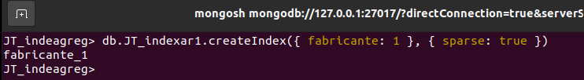
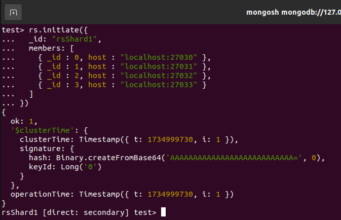

# Infraestrutura MongoDB

# Sumário
- [Proposta geral do trabalho](#proposta-geral-do-trabalho)
- [Conceitos](#conceitos)
    - [Questão 1](#1---descreva-com-suas-palavras-3-principais-diferenças-e-3-semelhanças-entre-bases-de-dados-sql-e-bases-nosql)
    - [Questão 2](#2---em-sua-opinião-as-bases-nosql-são-melhores-ou-piores-que-as-bases-sql-em-que-elas-se-destacam-justifique-sua-resposta)
    - [Questão 3](#3---descreva-com-suas-palavras-um-cenário-onde-você-optaria-por-um-modelo-nosql-e-um-cenário-onde-você-optaria-por-um-modelo-sql)
    - [Questão 4](#4---além-do-material-usado-em-aula-faça-uma-pequena-pesquisa-e-descreva-com-suas-palavras-quais-são-os-tipos-de-bases-nosql-existentes-no-mercado-atual-com-as-principais-características-de-uso-cada-um-tipo-cite-as-fontes-da-pesquisa)
- [Prática](#prática)
    - [Configuração do ambiente](#configuração-do-ambiente)
    - [A - Instalações e criações](#a---instalações-e-criações)
    - [B - Modelagem](#b---modelagem)
    - [C - Índices](#c---índices)
    - [D - Replicação](#d---replicação)
    - [E - Particionamento](#e---particionamento)
    - [F - Storage Engines](#f---storage-engines)
    - [G - Depuração, Backup/Restore](#g---depuração-backuprestore)

## Proposta geral do trabalho
- **Questões conceituais:** definições SQL x NoSQL, semelhanças e diferenças
- **Questões práticas:** CRUD, Modelagem, Índices, Replicação, Particionamento, Storage Engines, Depuração e Backup/Restore 

## Conceitos

### 1 - Descreva com suas palavras 3 principais diferenças e 3 semelhanças entre bases de dados SQL e bases NoSQL. 

#### Diferenças

**Modelo de dados:** Bancos SQL usam um modelo relacional com tabelas estruturadas, enquanto NoSQL pode usar modelos flexíveis como documentos, colunas, grafos ou pares chave-valor

**Escalabilidade:** SQL geralmente escala de forma vertical (adicionando mais recursos ao servidor), enquanto NoSQL tende a escalar horizontalmente (adicionando mais servidores ao cluster).

**Schema**: Bancos SQL possuem schema fixo e rígido, exigindo planejamento prévio para alterações; já os NoSQL permitem schema flexível, adaptando-se mais facilmente a mudanças nos dados.


#### Semelhanças

**Finalidade:** Ambos armazenam e gerenciam dados para aplicações e análises.

**Consultas:** Ambos oferecem formas de realizar consultas e manipulação de dados, seja por SQL tradicional ou linguagens próprias (como MongoDB Query Language).

**Suporte a índices:** Tanto SQL quanto NoSQL permitem o uso de índices para melhorar a performance de consultas.

### 2 - Em sua opinião as bases NoSQL são melhores ou piores que as bases SQL? Em que elas se destacam? Justifique sua resposta.

Não existe uma resposta definitiva sobre serem "melhores" ou "piores", pois depende do cenário. As bases NoSQL se destacam quando lidamos com grandes volumes de dados (Big Data), alta variabilidade nos formatos ou necessidade de alta escalabilidade horizontal. Exemplos incluem logs de sistemas, redes sociais e catálogos dinâmicos.

Bases SQL continuam fortes para cenários que exigem consistência transacional (ACID), como sistemas financeiros e ERPs. A escolha depende do problema a ser resolvido.

### 3 - Descreva com suas palavras um cenário onde você optaria por um modelo NoSQL e um cenário onde você optaria por um modelo SQL.

**Modelo NoSQL:**
Um cenário típico seria o gerenciamento de um aplicativo de streaming de vídeo, no qual os dados dos usuários (histórico de reprodução, preferências, recomendações) podem variar amplamente entre registros. O modelo NoSQL permite flexibilidade no formato e escalabilidade para atender milhões de usuários.

**Modelo SQL:**
Já para um sistema de controle financeiro de uma empresa, que exige consistência e integridade nas transações (exemplo: contabilidade ou folha de pagamento), o modelo SQL é mais indicado por sua robustez em transações ACID.

### 4 - Além do material usado em aula, faça uma pequena pesquisa e descreva com suas palavras quais são os tipos de bases noSQL existentes no mercado atual, com as principais características de uso cada um tipo. Cite as fontes da pesquisa.

#### Document Stores

**Exemplos:** MongoDB, Couchbase.<br>
**Características:** Armazenam dados no formato de documentos (JSON/BSON). São ideais para aplicativos com dados semiestruturados e flexibilidade de schema, como catálogos de produtos ou perfis de usuários.

#### Key-Value Stores

**Exemplos:** Redis, DynamoDB.<br>
**Características:** Dados armazenados como pares chave-valor. Simples e rápido, ideal para caching, sessões de usuário e dados temporários.

#### Columnar Stores

**Exemplos:** Cassandra, HBase.<br>
**Características:** Otimizados para consultas em grandes volumes de dados estruturados, frequentemente usados em análise de séries temporais ou logs.

#### Graph Databases

**Exemplos:** Neo4j, ArangoDB.<br>
**Características:** Foco em relações complexas entre dados, como redes sociais ou sistemas de recomendação.

#### Fontes
- **Big Data: Principles and Best Practices of Scalable Realtime Data Systems** – Nathan Marz e James Warren (O'Reilly Media).
- **MongoDB Documentation:** https://www.mongodb.com/docs/
- **Redis Documentation:** https://redis.io/docs/
- **Apache Cassandra Documentation:** https://cassandra.apache.org/doc/latest/
- **Neo4j Documentation:** https://neo4j.com/docs/

## Prática

### Configuração do ambiente

Para a elaboração deste trabalho, utilizamos o sistema operacional [Ubuntu 20.04](https://releases.ubuntu.com/20.04/) executado em uma máquina virtual via [VMWare](https://www.vmware.com/). O banco de dados escolhido foi o [MongoDB](https://www.mongodb.com/) na versão 6.0, que oferece suporte a diversas funcionalidades avançadas e é amplamente utilizado em ambientes de produção.

### A - Instalações e criações

Obs.: em todo lugar que você encontrar os caracteres "&&\_" substitua pelas iniciais do seu primeiro nome e último sobrenome. No meu caso, substituir por “JT\_”.

#### 1. Criar o database "&&_rh".

**Comando:**
```bash
use JT_rh
```

**Output:**


#### 2. Criar as coleções: "&&_DEPARTAMENTO", "&&_FUNCIONARIO", "&&_DEPENDENTE".

**Comando:**
```bash
db.createCollection("JT_DEPARTAMENTO")
db.createCollection("JT_FUNCIONARIO")
db.createCollection("JT_DEPENDENTE")
```

**Output:**


#### 3. Inserir 3 documentos para cada coleção. 
Obs.: Pelo menos uma inserção para cada coleção deve ter um atributo a mais ou a menos.

**Comando:**
```javascript
db.JT_DEPARTAMENTO.insertMany([
  { _id: 1, nome: "Recursos Humanos", descricao: "Gerencia funcionários e processos internos" },
  { _id: 2, nome: "TI", descricao: "Gerencia infraestrutura e sistemas de tecnologia" },
  { _id: 3, nome: "Financeiro", descricao: "Gerencia contas e despesas", sede: "São Paulo" } // Atributo adicional
])

db.JT_FUNCIONARIO.insertMany([
  { _id: 1, nome: "João Silva", salario: 2500.00, departamento: "TI" },
  { _id: 2, nome: "Maria Oliveira", salario: 1800.00 }, // Atributo faltante
  { _id: 3, nome: "Pedro Santos", salario: 3000.00, departamento: "Financeiro" }
])

db.JT_DEPENDENTE.insertMany([
  { _id: 1, nome: "Ana Clara", parentesco: "Filha", funcionario_id: 1 },
  { _id: 2, nome: "Carlos Eduardo", funcionario_id: 2 }, // Atributo faltante
  { _id: 3, nome: "Laura Silva", parentesco: "Esposa", funcionario_id: 3, idade: 30 } // Atributo adicional
])
```

**Output:**


#### 4. Mostrar o conteúdo de cada coleção.

**Comando:**
```javascript
db.JT_DEPARTAMENTO.find().pretty()
db.JT_FUNCIONARIO.find().pretty()
db.JT_DEPENDENTE.find().pretty()
```

**Output:**


#### 5. Para a coleção "&&_DEPARTAMENTO" fazer um filtro baseado numa descrição do departamento (igualdade).

**Comando:**
```javascript
db.JT_DEPARTAMENTO.find({ descricao: "Gerencia infraestrutura e sistemas de tecnologia" }).pretty()
```

**Output:**


#### 6. Para a coleção "&&_FUNCIONARIO" mostrar os funcionários que recebem salário acima de R$2.000,00.

**Comando:**
```javascript
db.JT_FUNCIONARIO.find({ salario: { $gt: 2000 } }).pretty()
```

**Output:**


#### 7. Para a coleção "&&_DEPENDENTE" executar o método distinct para o atributo nome.

**Comando:**
```javascript
db.JT_DEPENDENTE.distinct("nome")
```

**Output:**


#### 8. Executar um update para uma das coleções.

**Comando:**
```javascript
// Antes do update
db.JT_FUNCIONARIO.find({ nome: "Maria Oliveira" }).pretty()

// Update
db.JT_FUNCIONARIO.updateOne(
  { nome: "Maria Oliveira" },
  { $set: { salario: 2000.00 } }
)

// Após o update
db.JT_FUNCIONARIO.find({ nome: "Maria Oliveira" }).pretty()
```

**Output:**


#### 9. Executar um delete (remove) para uma das coleções.

**Comando:**
```javascript
// Antes do delete
db.JT_DEPENDENTE.find({ nome: "Carlos Eduardo" }).pretty()

// Delete
db.JT_DEPENDENTE.deleteOne({ nome: "Carlos Eduardo" })

// Após o delete
db.JT_DEPENDENTE.find({ nome: "Carlos Eduardo" }).pretty()
```

**Output:**


### B - Modelagem

#### 1. Criar o database "&&_modelo".

**Comando:**
```javascript
use JT_modelo
```

**Output:**


#### 2. Criar um pequeno modelo que envolva duas coleções com as cardinalidades 1-N. O nome das coleções deve ser "&&_col1a" e "&&_col2a"

Use nesse caso o conceito de referenciar o id de uma coleção para a outra (envie para o lado N como se fosse a chave primária do lado 1). 

**Comando:**
```javascript
db.createCollection("JT_col1a") // Coleção mãe
db.createCollection("JT_col2a") // Coleção filha
```

**Output:**


##### a. Faça a inserção de 2 documentos na coleção (lado 1).

**Comando:**
```javascript
db.JT_col1a.insertMany([
  { 
    _id: ObjectId("64a5f1e9c89b5e0d4f0041c0"), 
    nome: "Categoria A", 
    descricao: "Categoria que agrupa itens relacionados a tecnologia", 
    items: [
      ObjectId("64a1f1e9c89b5e0d4f0041bc"), 
      ObjectId("64a2f1e9c89b5e0d4f0041bd")
    ]
  },
  { 
    _id: ObjectId("64a6f1e9c89b5e0d4f0041c1"), 
    nome: "Categoria B", 
    descricao: "Categoria que agrupa itens relacionados a moda", 
    items: [
      ObjectId("64a3f1e9c89b5e0d4f0041be"), 
      ObjectId("64a4f1e9c89b5e0d4f0041bf")
    ]
  }
])
```

**Output:**


##### b. Faça a inserção de 4 documentos na coleção (lado N).

Obs.: O lado 1 (é como se fosse a coleção mãe) e o lado N (é como se fosse a coleção filha). No item (2.2) cada documento da coleção mãe deverá referenciar 2 documentos da coleção filha.

**Comando:**
```javascript
db.JT_col2a.insertMany([
  { _id: ObjectId("64a1f1e9c89b5e0d4f0041bc"), nome: "Item 1", descricao: "Item tecnológico avançado" },
  { _id: ObjectId("64a2f1e9c89b5e0d4f0041bd"), nome: "Item 2", descricao: "Outro item tecnológico" },
  { _id: ObjectId("64a3f1e9c89b5e0d4f0041be"), nome: "Item 3", descricao: "Peça de vestuário moderna" },
  { _id: ObjectId("64a4f1e9c89b5e0d4f0041bf"), nome: "Item 4", descricao: "Acessório de moda estiloso" }
])
```

**Output:**


#### 3. Criar um pequeno modelo que envolva duas coleções com as cardinalidades N-N. O nome das coleções deve ser "&&_col1b" e "&&_col2b"

##### a. Criar duas coleções de nome (se você embarcar) ou;
##### b. Criar três coleções (se você usar referência)

**Comando:**
```javascript
db.createCollection("JT_col1b")        // Coleção de clientes
db.createCollection("JT_col2b")        // Coleção de produtos
db.createCollection("JT_col3b")         // Coleção de pedidos
```

**Output:**


##### c. Caso você tenha escolhido a opção (3.1), criar as duas coleções e fazer um insert de 2 documentos em cada uma das coleções.
##### d. Caso você tenha escolhido a opção (3.2), criar as três coleções e fazer um insert de 2 documentos em cada uma das coleções.

**Comando:**
```javascript
db.JT_col1b.insertMany([
  { _id: ObjectId("64b1f1e9c89b5e0d4f0041c0"), nome: "Carlos Silva", email: "carlos.silva@email.com" },
  { _id: ObjectId("64b2f1e9c89b5e0d4f0041c1"), nome: "Ana Costa", email: "ana.costa@email.com" }
])

db.JT_col2b.insertMany([
  { _id: ObjectId("64b3f1e9c89b5e0d4f0041c2"), nome: "Camiseta Esportiva", preco: 79.90 },
  { _id: ObjectId("64b4f1e9c89b5e0d4f0041c3"), nome: "Tênis de Corrida", preco: 199.90 }
])

db.JT_col3b.insertMany([
  { 
    _id: ObjectId("64b5f1e9c89b5e0d4f0041c4"), 
    cliente_id: ObjectId("64b1f1e9c89b5e0d4f0041c0"), // Carlos Silva
    produtos_ids: [ ObjectId("64b3f1e9c89b5e0d4f0041c2"), ObjectId("64b4f1e9c89b5e0d4f0041c3") ] // Camiseta Esportiva e Tênis de Corrida
  },
  { 
    _id: ObjectId("64b6f1e9c89b5e0d4f0041c5"), 
    cliente_id: ObjectId("64b2f1e9c89b5e0d4f0041c1"), // Ana Costa
    produtos_ids: [ ObjectId("64b3f1e9c89b5e0d4f0041c2") ] // Camiseta Esportiva
  }
])
```

**Output:**


#### e. Verificação

**Comando:**
```javascript
// Listar todos os clientes que compraram a Camiseta Esportiva.
let produtoCamiseta = ObjectId("64b3f1e9c89b5e0d4f0041c2")
let pedidosCamiseta = db.JT_col3b.find({ produtos_ids: produtoCamiseta }).toArray()
let clientesIdsCamiseta = pedidosCamiseta.map(p => p.cliente_id)
db.JT_col1b.find({ _id: { $in: clientesIdsCamiseta } }).pretty()
```

**Output:**


### C - Índices

#### 1. Criar o database "&&_indeagreg".

**Comando:**
```bash
use JT_indeagreg
```

**Output:**


#### 2. Criar uma coleção de nome "&&_indexar1" que apresente pelo menos 7 atributos (tem que ter pelo menos um atributo array).

**Comando:**
```javascript
db.createCollection("JT_indexar1")
```

**Output:**


##### a. Criar um índice (não único e com ordenação ascendente).

**Comando:**
```javascript
db.JT_indexar1.createIndex({ preco: 1 })
```

**Output:**


##### b. Criar um índice (único e com ordenação descendente).

**Comando:**
```javascript
db.JT_indexar1.createIndex({ nome: -1 }, { unique: true })
```

**Output:**


##### c. Criar um índice (com dois atributos).

**Comando:**
```javascript
db.JT_indexar1.createIndex({ categoria: 1, estoque: -1 })
```

**Output:**


##### d. Criar um índice para um atributo array.

**Comando:**
```javascript
db.JT_indexar1.createIndex({ tags: 1 })
```

**Output:**


##### e. Criar um índice esparso (com um atributo).

**Comando:**
```javascript
db.JT_indexar1.createIndex({ fabricante: 1 }, { sparse: true })
```

**Output:**



##### f. Criar um índice com tempo de vida - TTL (com um atributo e com expiração de 20 segundos).

**Comando:**
```javascript
db.JT_indexar1.createIndex({ data_criacao: 1 }, { expireAfterSeconds: 20 })
```

**Output:**


##### g. Inserir 4 documentos nessa coleção.

**Comando:**
```javascript
db.JT_indexar1.insertMany([
  {
    _id: ObjectId("64b7f1e9c89b5e0d4f0041c6"),
    nome: "Produto A",
    categoria: "Categoria 1",
    preco: 199.99,
    estoque: 50,
    tags: ["eletrônico", "smartphone"],
    fabricante: "Marca X",
    data_criacao: new Date()
  },
  {
    _id: ObjectId("64b8f1e9c89b5e0d4f0041c7"),
    nome: "Produto B",
    categoria: "Categoria 2",
    preco: 150.50,
    estoque: 30,
    tags: ["eletrônico", "tablet"],
    fabricante: "Marca Y",
    data_criacao: new Date()
  },
  {
    _id: ObjectId("64b9f1e9c89b5e0d4f0041c8"),
    nome: "Produto C",
    categoria: "Categoria 1",
    preco: 299.99,
    estoque: 20,
    tags: ["eletrônico", "smartwatch"],
    fabricante: "Marca Z",
    data_criacao: new Date()
  },
  {
    _id: ObjectId("64baf1e9c89b5e0d4f0041c9"),
    nome: "Produto D",
    categoria: "Categoria 3",
    preco: 99.99,
    estoque: 100,
    tags: ["eletrônico", "acessório"],
    fabricante: "Marca X",
    data_criacao: new Date()
  }
])
```

**Output:**


#### 3. Criar uma segunda coleção de nome "&&_indexar2" (que apresente pelo menos 4 atributos string)

**Comando:**
```javascript
db.createCollection("JT_indexar2")
```

**Output:**


##### a. Criar um índice textual para essa segunda coleção.

**Comando:**
```javascript
db.JT_indexar2.createIndex({ nome: "text", endereco: "text", cidade: "text", estado: "text" })
```

**Output:**


##### b. Inserir 4 documentos nessa coleção.

**Comando:**
```javascript
db.JT_indexar2.insertMany([
  { _id: ObjectId("64bbf1e9c89b5e0d4f0041ca"), nome: "João", endereco: "Rua A", cidade: "São Paulo", estado: "SP" },
  { _id: ObjectId("64bcf1e9c89b5e0d4f0041cb"), nome: "Maria", endereco: "Rua B", cidade: "Rio de Janeiro", estado: "RJ" },
  { _id: ObjectId("64bdf1e9c89b5e0d4f0041cc"), nome: "Carlos", endereco: "Rua C", cidade: "Belo Horizonte", estado: "MG" },
  { _id: ObjectId("64bef1e9c89b5e0d4f0041cd"), nome: "Ana", endereco: "Rua D", cidade: "Curitiba", estado: "PR" }
])
```

**Output:**


#### 4. Criar uma terceira coleção de nome "&&_Venda" (na qual terão os atributos: Cod_Venda, UF_Venda, Desc_Prod_Vendido, Valor_Venda).

**Comando:**
```javascript
db.createCollection("JT_Venda")
```

**Output:**


##### a. Inserir 16 documentos (sendo 4 documentos para cada uma das UFs - serão 4 UFs diferentes). Preencher os 4 atributos citados.

**Comando:**
```javascript
db.JT_Venda.insertMany([
  { Cod_Venda: 1, UF_Venda: "SP", Desc_Prod_Vendido: "Produto A", Valor_Venda: 199.99 },
  { Cod_Venda: 2, UF_Venda: "SP", Desc_Prod_Vendido: "Produto B", Valor_Venda: 150.50 },
  { Cod_Venda: 3, UF_Venda: "SP", Desc_Prod_Vendido: "Produto C", Valor_Venda: 299.99 },
  { Cod_Venda: 4, UF_Venda: "SP", Desc_Prod_Vendido: "Produto D", Valor_Venda: 99.99 },
  
  { Cod_Venda: 5, UF_Venda: "RJ", Desc_Prod_Vendido: "Produto A", Valor_Venda: 199.99 },
  { Cod_Venda: 6, UF_Venda: "RJ", Desc_Prod_Vendido: "Produto B", Valor_Venda: 150.50 },
  { Cod_Venda: 7, UF_Venda: "RJ", Desc_Prod_Vendido: "Produto C", Valor_Venda: 299.99 },
  { Cod_Venda: 8, UF_Venda: "RJ", Desc_Prod_Vendido: "Produto D", Valor_Venda: 99.99 },
  
  { Cod_Venda: 9, UF_Venda: "MG", Desc_Prod_Vendido: "Produto A", Valor_Venda: 199.99 },
  { Cod_Venda: 10, UF_Venda: "MG", Desc_Prod_Vendido: "Produto B", Valor_Venda: 150.50 },
  { Cod_Venda: 11, UF_Venda: "MG", Desc_Prod_Vendido: "Produto C", Valor_Venda: 299.99 },
  { Cod_Venda: 12, UF_Venda: "MG", Desc_Prod_Vendido: "Produto D", Valor_Venda: 99.99 },
  
  { Cod_Venda: 13, UF_Venda: "PR", Desc_Prod_Vendido: "Produto A", Valor_Venda: 199.99 },
  { Cod_Venda: 14, UF_Venda: "PR", Desc_Prod_Vendido: "Produto B", Valor_Venda: 150.50 },
  { Cod_Venda: 15, UF_Venda: "PR", Desc_Prod_Vendido: "Produto C", Valor_Venda: 299.99 },
  { Cod_Venda: 16, UF_Venda: "PR", Desc_Prod_Vendido: "Produto D", Valor_Venda: 99.99 }
])
```

**Output:**


##### b. Criar uma consulta que mostre o número de documentos por UF.

**Comando:**
```javascript
db.JT_Venda.aggregate([ 
  { $group: {_id:"$UF_Venda", count: {$sum: 1} } } 
])
```

**Output:**


##### c. Criar uma consulta que mostre o valor total das vendas por UF.

**Comando:**
```javascript
db.JT_Venda.aggregate([
  { $group: { _id: "$UF_Venda", total_valor_vendas: { $sum: "$Valor_Venda" } } }
])
```

**Output:**


##### d. Criar uma consulta que mostre o valor de médias das vendas por UF.

**Comando:**
```javascript
db.JT_Venda.aggregate([
  { $group: { _id: "$UF_Venda", media_valor_vendas: { $avg: "$Valor_Venda" } } }
])
```

**Output:**


##### e. Criar uma consulta que mostre o maior valor de venda por UF.

**Comando:**
```javascript
db.JT_Venda.aggregate([
  { $group: { _id: "$UF_Venda", maior_valor_venda: { $max: "$Valor_Venda" } } }
])
```

**Output:**


##### f. Criar uma consulta que mostre o menor valor de venda por UF.

**Comando:**
```javascript
db.JT_Venda.aggregate([
  { $group: { _id: "$UF_Venda", menor_valor_venda: { $min: "$Valor_Venda" } } }
])
```

**Output:**


### D - Replicação

#### 1 - Criar o replica set "&&_rsposmit".
#### 2 - Desenho da arquitetura:
##### a. Um primário;
##### b. Dois secundários;
##### c. Um árbitro.

**Observações:**
  - Ativar os processos no nível do Sistema Operacional; 
  - Ativar o replica set através do MongoDB, lembrar de adicionar todos os membros ao replica set (ver item(2)).

**Comando:**
```javascript
// Criando as pastas para cada nó do Replica Set
mkdir -p /home/ubuntu/replica/primary
mkdir -p /home/ubuntu/replica/node1
mkdir -p /home/ubuntu/replica/node2
mkdir -p /home/ubuntu/replica/arbiter

// Iniciando instâncias (em cada janela)
mongod --replSet "JT_rsposmit" --dbpath=/home/ubuntu/replica/primary --port 40001
mongod --replSet "JT_rsposmit" --dbpath=/home/ubuntu/replica/node1 --port 40002
mongod --replSet "JT_rsposmit" --dbpath=/home/ubuntu/replica/node2 --port 40003
mongod --replSet "JT_rsposmit" --dbpath=/home/ubuntu/replica/arbiter --port 40004

// Entrando no nó primário
mongosh localhost:40001

// Iniciando o Replica Set e adicionando os nós secundários
rs.initiate()
rs.add('localhost:40002')
rs.add('localhost:40003')

// Configurando para adicionar o árbitro
db.adminCommand({ 
  "setDefaultRWConcern" : 1, 
  "defaultWriteConcern" : { 
    "w" : 1 
  } 
}) 

// Adicionando árbitro
rs.addArb('localhost:40004')

// Checando o status do Replica Set
rs.status()
```

**Output:**


#### 3 - No nó primário criar a coleção "&&_col_filmes".

**Comando:**
```javascript
// Entrando no nó primário
mongosh localhost:40001

// Criando coleção
db.createCollection("JT_col_filmes")
```

**Output:**


##### a. Inserir 5 documentos na coleção "&&_col_filmes".

**Comando:**
```javascript
db.JT_col_filmes.insertMany([
  { 
    "title": "Inception",
    "year": 2010,
    "genre": ["Sci-Fi", "Action"],
    "director": "Christopher Nolan",
    "ratings": { "IMDb": 8.8, "Rotten Tomatoes": "87%" }
  },
  { 
    "title": "The Godfather",
    "year": 1972,
    "genre": ["Crime", "Drama"],
    "director": "Francis Ford Coppola",
    "ratings": { "IMDb": 9.2, "Rotten Tomatoes": "97%" }
  },
  { 
    "title": "Parasite",
    "year": 2019,
    "genre": ["Drama", "Thriller"],
    "director": "Bong Joon Ho",
    "ratings": { "IMDb": 8.5, "Rotten Tomatoes": "99%" }
  },
  { 
    "title": "The Dark Knight",
    "year": 2008,
    "genre": ["Action", "Crime", "Drama"],
    "director": "Christopher Nolan",
    "ratings": { "IMDb": 9.0, "Rotten Tomatoes": "94%" }
  },
  { 
    "title": "Pulp Fiction",
    "year": 1994,
    "genre": ["Crime", "Drama"],
    "director": "Quentin Tarantino",
    "ratings": { "IMDb": 8.9, "Rotten Tomatoes": "92%" }
  }
])
```

**Output:**


#### 4 - Acessar um dos nós secundários. 

**Comando:**
```javascript
// Em outra janela, acessar um nó secundário
mongosh localhost:40002
```

**Output:**


##### a. Efetuar a leitura da coleção "&&_col_filmes".

**Comando:**
```javascript
db.JT_col_filmes.find()
```

**Output:**


### E - Particionamento

#### 1. Criar um shard.
#### 2. Desenho da arquitetura:
##### a. Três config servers (no Replica Set);
##### b. Quatro shard servers (sem Replica Set);
##### c. Um mongos.

**Observações:**
  - Ativar os processos no nível do Sistema Operacional; 
  - Ativar o shard através do MongoDB, lembrar de adicionar os shard servers (ver item(2.b)).
  - A partir do MongoDB 4.0: Tornou-se obrigatório que cada shard seja configurado como um membro de um replica set, mesmo que seja um replica set de um único nó (opção frequentemente usada para desenvolvimento e testes). Portanto, a criação será feita **com** Replica Set.
#### 3. Conectar ao mongos.

**Comando:**
```bash
# Criando as pastas para os config servers
mkdir -p /home/ubuntu/config/cfg1 /home/ubuntu/config/cfg2 /home/ubuntu/config/cfg3

# Criando os config servers dentro de um Replica Set (em background)
mongod --configsvr --replSet cfgRS --dbpath /home/ubuntu/config/cfg1 --port 27019 --bind_ip localhost &
mongod --configsvr --replSet cfgRS --dbpath /home/ubuntu/config/cfg2 --port 27020 --bind_ip localhost &
mongod --configsvr --replSet cfgRS --dbpath /home/ubuntu/config/cfg3 --port 27021 --bind_ip localhost &
```

**Output:**


**Comando:**
```javascript
// Conectando a um nó
mongosh --port 27019

// Iniciando o Replica Set
rs.initiate({
  _id: "cfgRS",
  configsvr: true,
  members: [
    { _id: 0, host: "localhost:27019" },
    { _id: 1, host: "localhost:27020" },
    { _id: 2, host: "localhost:27021" }
  ]
})
```

**Output:**


**Comando:**
```bash
# Criando as pastas para os shard servers
mkdir -p /home/ubuntu/shard/shard1 /home/ubuntu/shard/shard2 /home/ubuntu/shard/shard3 /home/ubuntu/shard/shard4

# Criando os shard servers dentro COM Replica Set (em background)
mkdir -p /home/ubuntu/shard/shard1 /home/ubuntu/shard/shard2 /home/ubuntu/shard/shard3 /home/ubuntu/shard/shard4
mongod --shardsvr --replSet rsShard1 --dbpath /home/ubuntu/shard/shard1 --port 27030 --bind_ip localhost &
mongod --shardsvr --replSet rsShard1 --dbpath /home/ubuntu/shard/shard2 --port 27031 --bind_ip localhost &
mongod --shardsvr --replSet rsShard1 --dbpath /home/ubuntu/shard/shard3 --port 27032 --bind_ip localhost &
mongod --shardsvr --replSet rsShard1 --dbpath /home/ubuntu/shard/shard4 --port 27033 --bind_ip localhost &
```

**Output:**


**Comando:**
```javascript
// Conectando a um nó
mongosh --port 27030

// Iniciando o Replica Set
rs.initiate({ 
  _id: "rsShard1", 
  members: [
    { _id : 0, host : "localhost:27030" }, 
    { _id : 1, host : "localhost:27031" }, 
    { _id : 2, host : "localhost:27032" },
    { _id : 3, host : "localhost:27033" } 
  ] 
})
```

**Output:**



**Comando:**
```bash
# Criando e conectando ao mongos
mongos --configdb cfgRS/localhost:27019,localhost:27020,localhost:27021 --port 27017 --bind_ip localhost &
mongosh --port 27017
```

**Output:**


**Comando:**
```javascript
// Adicionando os Shards
sh.addShard("rsShard1/localhost:27030")
sh.addShard("rsShard1/localhost:27031")
sh.addShard("rsShard1/localhost:27032")
sh.addShard("rsShard1/localhost:27033")
```

**Output:**


##### a. Ativar o particionamento para um database de sua escolha.

**Comando:**
```javascript
// Criar o banco de dados
use pessoas_por_UF;

// Ativar o particionamento para o database
sh.enableSharding("pessoas_por_UF");
```

**Output:**


##### b. Particionar uma coleção da sua escolha.

**Comando:**
```javascript
// Criar a coleção com índice baseado no campo UF
db.cadastro.createIndex({ UF: 1 });

// Configurar o particionamento na coleção
sh.shardCollection("pessoas_por_UF.cadastro", { UF: 1 });

// Split points (para separar os chunks)
sh.splitAt("pessoas_por_UF.cadastro", { UF: "GO" });
sh.splitAt("pessoas_por_UF.cadastro", { UF: "MG" });
sh.splitAt("pessoas_por_UF.cadastro", { UF: "RS" }); 
```

**Output:**


##### c. Inserir para essa coleção 1.000 documentos através do comando [for].

**Comando:**
```javascript
const ufs = [
  "AC", "AL", "AM", "AP", "BA", "CE", "DF", "ES", "GO", "MA", "MG", "MS", 
  "MT", "PA", "PB", "PE", "PI", "PR", "RJ", "RN", "RO", "RR", "RS", "SC", 
  "SE", "SP", "TO"
];

for (let i = 1; i <= 1000; i++) {
  db.cadastro.insertOne({
    pessoaId: i,
    nome: `Pessoa_${i}`,
    UF: ufs[i % ufs.length]
  });
}
```

**Output:**


##### d. Mostrar a distribuição da coleção criada.

**Comando:**
```javascript
// Mostrar a distribuição dos dados pelos shards
db.cadastro.getShardDistribution() 
```

**Output:**


### F - Storage Engines
#### 1. [Opcional pois versões mais novas do MongoDB não suportam MMAP] Criar uma instância do MongoDB que use o storage engine mmapv1.
##### a. Conectar a essa instância;
##### b. Verificar o storage engine corrente;
##### c. Criar a coleção “&&_produtos” e inserir 4 documentos.

#### 2. Criar uma instância do MongoDB que use o storage engine wiredTiger.

**Comando:**
```bash
mkdir -p /home/ubuntu/mongo_data
mongod --storageEngine wiredTiger --dbpath /home/ubuntu/mongo_data --port 27017 --bind_ip localhost &
```

**Output:**


##### a. Conectar a essa instância;

**Comando:**
```bash
mongosh --port 27017
```

**Output:**


##### b. Verificar o storage engine corrente;

**Comando:**
```javascript
db.serverStatus().storageEngine
```

**Output:**


##### c. Criar a coleção “&&_lugares” e inserir 4 documentos.

**Comando:**
```javascript
db.createCollection("JT_lugares");
db["JT_lugares"].insertMany([
  { nome: "São Paulo", tipo: "Cidade", estado: "SP" },
  { nome: "Rio de Janeiro", tipo: "Cidade", estado: "RJ" },
  { nome: "Curitiba", tipo: "Cidade", estado: "PR" },
  { nome: "Brasília", tipo: "Capital", estado: "DF" }
]);
```

**Output:**


#### 3. Criar uma instância do MongoDB que use segurança (autenticação e autorização)

**Comando:**
```bash
mkdir -p /home/ubuntu/mongo_data_secure
mongod --auth --dbpath /home/ubuntu/mongo_data_secure --port 27018 --bind_ip localhost &
```

**Output:**


##### a. Conectar a essa instância;

**Comando:**
```bash
mongosh --port 27018
```

**Output:**


##### b. Criar o usuário dba com a role root;

**Comando:**
```javascript
use admin;
db.createUser({
  user: "dba",
  pwd: "senha_forte",
  roles: [{ role: "root", db: "admin" }]
});
```

**Output:**


##### c. Conectar com o usuário dba;

**Comando:**
```bash
mongosh --port 27018 -u "dba" -p "senha_forte" --authenticationDatabase "admin"
```

**Output:**


##### d. Criar o usuário “&&_desenv” com a role readWrite no database “&&_rh”; 

**Comando:**
```javascript
use JT_rh;
db.createUser({
  user: "JT_desenv",
  pwd: "senha_desenv",
  roles: [{ role: "readWrite", db: "JT_rh" }]
});
```

**Output:**


##### e. Conectar com o usuário “&&_desenv”

**Comando:**
```bash
mongosh --port 27018 -u "JT_desenv" -p "senha_desenv" --authenticationDatabase "JT_rh"
```

**Output:**


##### f. Criar a coleção “&&_funcionarios” e inserir 4 documentos.

**Comando:**
```javascript
use JT_rh;
db.createCollection("JT_funcionarios");
db["JT_funcionarios"].insertMany([
  { nome: "Paulo", cargo: "Desenvolvedor", salario: 5000 },
  { nome: "Maria", cargo: "Analista", salario: 4500 },
  { nome: "Pedro", cargo: "Gerente", salario: 7000 },
  { nome: "Joana", cargo: "Tester", salario: 4000 }
]);
```

**Output:**


### G - Depuração, Backup/Restore

#### 1. Criar uma instância do MongoDB.

**Comando:**
```bash
mkdir -p /home/ubuntu/mongo_files
mongod --dbpath /home/ubuntu/mongo_files --port 27017 --bind_ip localhost &
```

**Output:**


#### 2. Conectar a essa instância (acessar o database exerc4b);

**Comando:**
```bash
mongosh --port 27017
use exerc4b;
```

**Output:**


#### 3. Criar a coleção "&&_Paises" e inserir 4 documentos.

**Comando:**
```javascript
db.createCollection("JT_Paises");
db.JT_Paises.insertMany([
    { nome: "Brasil", continente: "América do Sul", populacao: 211 },
    { nome: "Argentina", continente: "América do Sul", populacao: 45 },
    { nome: "Canadá", continente: "América do Norte", populacao: 37 },
    { nome: "Alemanha", continente: "Europa", populacao: 83 }
]);
```

**Output:**


#### 4. Executar uma consulta para a coleção "&&_Paises" com um filtro de sua escolha com o explain.

**Comando:**
```bash
db.JT_Paises.find({ continente: "América do Sul" }).explain("executionStats");
```

**Output:**


#### 5. Criar um índice para um atributo que você fez o filtro no item (1.c)

**Comando:**
```javascript
db.JT_Paises.createIndex({ continente: 1 });
```

**Output:**


#### 6. Executar a mesma consulta do item (1.c).

**Comando:**
```javascript
db.JT_Paises.find({ continente: "América do Sul" }).explain("executionStats");
```

**Output:**


#### 7. Criar a coleção “&&_Numero1” e inserir 50.000 documentos em paralelo; numa outra janela executar o utilitário mongostat.

**Comando:**
```javascript
// Numa janela
for (let i = 0; i < 50000; i++) {
    db.JT_Numero1.insert({ numero: i });
}
```
```bash
# Em outra janela
mongostat --host localhost --port 27017
```

**Output:**


#### 8. Criar a coleção “&&_Numero2” e inserir 50.000 documentos em paralelo; numa outra janela executar o utilitário mongotop.

**Comando:**
```javascript
// Numa janela
for (let i = 0; i < 50000; i++) {
    db.JT_Numero2.insertOne({ numero: i });
}
```
```bash
# Em outra janela
mongotop --host localhost --port 27017
```

**Output:**


#### 9. Sair do Mongo Shell e fazer um backup da instância inteira do MongoDB.

**Comando:**
```bash
mongodump --host localhost --port 27017 --out /home/ubuntu/mongo_backup
```

**Output:**


#### 10. Matar o processo do MongoDB.

**Comando:**
```bash
kill -9 $(ps aux | grep '[m]ongod' | awk '{print $2}')
```

**Output:**


#### 11. Apagar o diretório de dados do MongoDB.

**Comando:**
```bash
rm -rf /home/ubuntu/mongo_files
```

**Output:**


#### 12. Fazer o restore do MongoDB (o caminho tem que ser criado anteriormente).

**Comando:**
```bash
mkdir -p /home/ubuntu/mongo_files
mongod --dbpath /home/ubuntu/mongo_files --port 27017 --bind_ip localhost &
mongorestore --host localhost --port 27017 /home/ubuntu/mongo_backup
```

**Output:**


#### 13. Acessar a instância e ir para o database exerc4b. Verificar o número de documentos por coleção.

**Comando:**
```bash
mongosh --port 27017
```
```javascript
use exerc4b;
db.JT_Paises.countDocuments();
db.JT_Numero1.countDocuments();
db.JT_Numero2.countDocuments();
```

**Output:**


